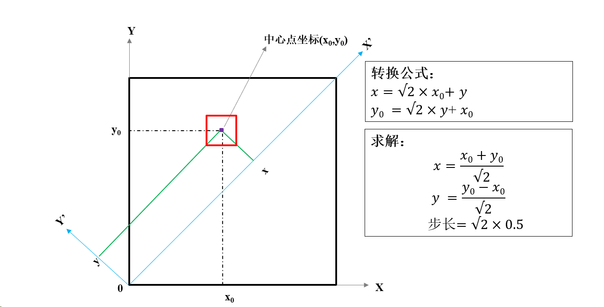
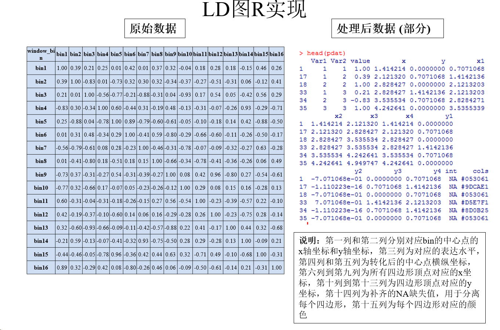
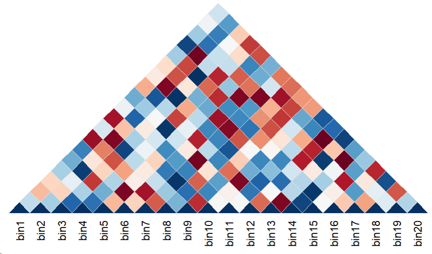
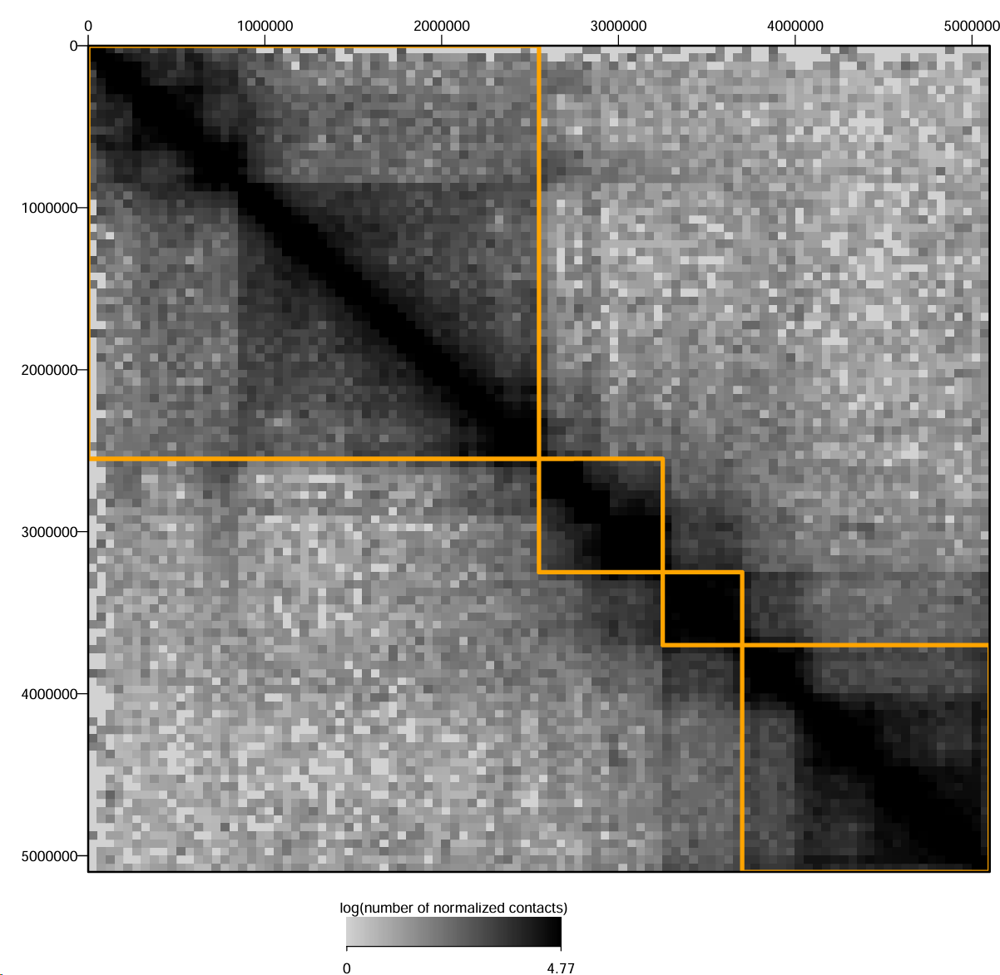

### 0 R绘图过程

#### 0.1 R-数据整理

在绘图中，需要点的坐标，但是对于生物学中的某些概念诸如基因、样本等，需要将这些字符串向量转化为数值型向量，转换方法极其简单，按自己喜好选择一个顺序，然后依次赋值1 2 3即可.


#### 0.2 设置图形参数

`par()`

- 每个device都有他自己的一套图形参数，当不给`par()`传入参数或者 `par(no.readonly = TRUE)`，可获取当前图形的参数（==还能用来备份你辛苦设置好的漂亮的参数==）。当没有设备可以获取时，就会创建一个新的device。
  - device：要在哪里画图，那个就是你的device。如屏幕、PDF文件里面、PNG图片。
  - 修改指定device的参数：先试用`dev.list()`，再用`dev.set()`，最后用`par()`。

```R
graphics:::.Pars #par()的参数
 [1] "xlog"      "ylog"      "adj"       "ann"       "ask"       "bg"
 [7] "bty"       "cex"       "cex.axis"  "cex.lab"   "cex.main"  "cex.sub"
[13] "cin"       "col"       "col.axis"  "col.lab"   "col.main"  "col.sub"
[19] "cra"       "crt"       "csi"       "cxy"       "din"       "err"    
[25] "family"    "fg"        "fig"       "fin"       "font"      "font.axis"
[31] "font.lab"  "font.main" "font.sub"  "lab"       "las"       "lend"     
[37] "lheight"   "ljoin"     "lmitre"    "lty"       "lwd"       "mai"      
[43] "mar"       "mex"       "mfcol"     "mfg"       "mfrow"     "mgp"      
[49] "mkh"       "new"       "oma"       "omd"       "omi"       "page"     
[55] "pch"       "pin"       "plt"       "ps"        "pty"       "smo"      
[61] "srt"       "tck"       "tcl"       "usr"       "xaxp"      "xaxs"     
[67] "xaxt"      "xpd"       "yaxp"      "yaxs"      "yaxt"      "ylbias"  

class(par())
[1] "list"

par()$lwd
[1] 1
```

- `mar`：设置图形边界空白宽度（下左上右）


- `mgp` 就是用三个数字分别控制标题、刻度数字和坐标轴线离图表边缘的距离。


- `mforw`/`mcol`：行数和列数，分别按行和列来填充图，指的是宏观布局，一个大图切格子来方不同的图。例如`par(mfrow = c(3, 3), mar = c(2, 2, 2, 1))`

- `xaxs`, `yaxs`：控制坐标轴两头留不留空隙。
  - 默认（`r`）：会比你的最大/最小数据多留出 4% 的白边，防止数据点贴在画框上，显得不挤。
  
  - `i (internal)`：表示直接使用原始数据范围。数据到哪儿，轴就画到哪儿，一点空隙不留。
  
- `bg`：整个图片的背景底色。

- `cex`：整体缩放倍数。控制图里的字啊、符号啊长多大。默认是 1（原样）。填 1.5 就是放大 1.5 倍，填 0.5 就是缩小一半。

- `col`：画图的主色调（主要控制图里的点和线的颜色）。除了这个总开关，你还可以单独控制各个角落的颜色：

  - `col.axis`：刻度数字的颜色（就是轴上 0, 10, 20 那些数字）。

  - `col.lab`：坐标轴名字的颜色（比如写着 "伪时间"、"年龄阶段" 的那些字）。

  - `col.main`：大标题的颜色（最顶上那个最显眼的）。
  - `col.sub`：副标题的颜色（通常在图最底下那行小字）。


#### 0.3 调用高级函数

**高级绘图函数：**能自主创建应该图形窗口、坐标轴、标题、主图。

高级绘图函数如`barplot 条形图`、`hist 直方图`、`plot 基础函数`，`ggplot2`和`pheatmap`等包也算，但`points()`、`lines()`、`legend()`等不算。

下面函数可以搞个白纸出来，主要是`axes = FALSE`参数。

```R
plot(x=1:10,type='n',xlim=c(1,8),ylim=c(1,26),axes=FALSE,xlab='',ylab='',main='有张白纸')
```

#### 0.4 调用低级函数

`points()`：require x y坐标。

`lines()`：多个点连成线。

- `type`参数：`p l` 等。当为p时，还能用`pch`参数选择点的形状，类似ggplot2中的`shape`。


`segments()`：线段需要两个坐标。

```R
segments(x0, y0, x1 = x0, y1 = y0, col = par("fg"),lty = par("lty"), lwd = par("lwd"), ...)
# lty控制线型，lwd控制线粗细
# 所有参数均可向量输入

plot(1:10,type='n')
segments(x0=1:9,y0=rep(1,times=9),x1=1:9,y1=2:10,col=rainbow(9),lty=1:9,lwd=1:9)
```


`rect()`：矩形，需要左下和右上两个顶点的坐标。

```R
rect(xleft, ybottom, xright, ytop, density = NULL,angle = 45, col = NA, border = NULL, lty = par("lty"),lwd = par("lwd"), ...)
```

- `density`、`angle`：在矩形里面不涂颜色，而是涂阴影线，分别控制线密度和线角度。
- `col`、`border`：矩形的填充和边框颜色。


`polygon()`：多边形，需要四个顶点（不规则图形）。

```R
polygon(x, y = NULL, density = NULL, angle = 45,border = NULL, col = NA, lty = par("lty"), ...,fillOddEven = FALSE)
```

- 避免回到原点：polygon没有这种参数，但是可以通过在xy中设置NA来达到一个"提笔"的作用，让R不知道该画哪里，他就不画，进而笔就到下一个点了，而非连成线，简而言之就是，中间断了笔。

```R
plot(c(1, 9), 1:2, type = "n")
polygon(1:9, c(2,1,2,1,NA,2,1,2,1),
        density = c(10, 20), angle = c(-45, 45)) #density的值为两个，即不同的密度
```


```R
par(mfrow = c(1, 2))

plot(1:10, main='Polygon with NA (断开)', type='n')
# 这里的 NA 让红绿两个方块完全独立
polygon(x=c(2,4,4,2,NA,6,8,8,6), y=c(2,2,4,4,NA,6,6,8,8), 
        col=c('green','red'), border='yellow')

plot(1:10, main='Polygon without NA (连笔)', type='n')
polygon(x=c(2,4,4,2,6,8,8,6), y=c(2,2,4,4,6,6,8,8), 
        col=c('green','red'), border='yellow')
text(x=c(2,4,4,2,6,8,8,6), y=c(2,2,4,4,6,6,8,8), labels=1:8, adj=c(-0.5, -0.5))
```


#### 0.5 热图步骤分解


##### 0.5.1 数据处理

**Matrix2LongMat：**矩阵转长格式数据框，即`宽数据转长数据`。

x：sample，如x=1代表sample_A

y：gene，如y=1代表gene_A

方法

```R
library(reshape2)
mat <- matrix(1:12, 3, dimnames=list(c("G1","G2","G3"), c("S1","S2","S3","S4")))
df <- melt(mat) 
```


```R
m = matrix(rnorm(12), 3)
df = data.frame(
  x   = c(col(m)),                # 列号拉直 -> x坐标
  y   = c(row(m)),                # 行号拉直 -> y坐标
  val = c(m),                     # 值拉直
  col = heat.colors(10)[cut(m, 10)] # 自动切成10份 -> 对应颜色
)
```

```R
  x y        val     col
1 1 1  0.4007715 #FFDB00
2 1 2  0.1106827 #FFB600
3 1 3 -0.5558411 #FF6D00
4 2 1  1.7869131 #FFFFBF
5 2 2  0.4978505 #FFDB00
6 2 3 -1.9666172 #FF0000
```


老师PPT完整代码

```R
library(reshape2)
library(scales)

m <- matrix(rnorm(260), 26, 10, dimnames=list(paste0("Gene_", LETTERS), paste0("Sample_", LETTERS[1:10])))
pdat <- melt(m)
colnames(pdat) <- c("gene", "sample", "value")

pdat$y <- as.numeric(pdat$gene)
pdat$x <- as.numeric(pdat$sample)

wid <- 0.5
pdat$xleft   <- pdat$x - wid
pdat$xright  <- pdat$x + wid
pdat$ybottom <- pdat$y - wid
pdat$ytop    <- pdat$y + wid

pdat$cols <- col_numeric(palette = "RdBu", domain = pdat$value)(pdat$value)

head(pdat)
```

```R
    gene   sample      value y x xleft xright	ybottom ytop    cols
1 Gene_A Sample_A -0.6250393 1 1   0.5    1.5	0.5  	1.5 	#F4A784
2 Gene_B Sample_A -1.6866933 2 1   0.5    1.5	1.5  	2.5 	#B7252F
```


### 1 TAD热图

思路类似普通热图，但是需要把中心点逆时针旋转45°。

#### 1.1 旋转中心点

Q：为什么要转呢？

A：为了把斜着的对角线（$y=x$）变成水平的 X 轴（$y'=0$），将一个正方形矩阵转为一个水平底边的三角形展示，如果不转就是斜着的。


旋转后坐标发生变化



#### 1.2 旋转中心点后处理数据

每个中心点确定好想画一个多边形出来就要有四个点的坐标，每四个点提一次笔，也就是添加一个（NA，NA），以此达到避免`polygon`画乱了最终热图。
$$
\begin{aligned}
X_{list} &= [x1_1, x2_1, x3_1, x4_1, \mathbf{NA}, x1_2, x2_2, x3_2, x4_2, \mathbf{NA}, ...] \\
Y_{list} &= [y1_1, y2_1, y3_1, y4_1, \mathbf{NA}, y1_2, y2_2, y3_2, y4_2, \mathbf{NA}, ...]
\end{aligned}
$$


#### 1.3 代码实现

##### 1.3.1 数据准备

```R
library(scales)
library(reshape2)
set.seed(2026)
n <- 20

# 模拟相关系数矩阵 (-1 到 1)，并设置对角线为 1，因为自己对自己相关性为 1
sim_data <- matrix(runif(n * n, -1, 1), nrow = n, ncol = n)
diag(sim_data) <- 1

# 将下三角设为 NA，只保留上三角
# lower.tri即Lower Triangle，他会返回一个与矩阵dim一模一样的布尔值矩阵，以此来index
sim_data[lower.tri(sim_data)] <- NA

# 设置行列名（对应 bin1, bin2...）
bin.name <- paste0("bin", 1:n)
colnames(sim_data) <- 1:n
rownames(sim_data) <- 1:n
pdat <- melt(sim_data)
pdat <- pdat[!is.na(pdat$value),]
```
- 我们每个中心点画4个顶点，然后提笔移动到下一组4个顶点，以此循环。
- 这里我们有20个bin，两两选择就是$C_{20}^{2} = 190$，加上本身对本身的20个，就是$190 + 20 = 210$个框要画。


##### 1.3.2 获取点坐标

旋转 45 度的坐标变换公式，注意：因为只保留了上三角(Col >= Row)，所以 ==y 恒大于等于 0==。


```R
pdat$x <- (pdat$Var2 + pdat$Var1) / sqrt(2)
pdat$y <- (pdat$Var2 - pdat$Var1) / sqrt(2)

# 步长为1时，旋转后的对角线长度是 sqrt(2)，半长就是 sqrt(2)/2
wid <- sqrt(2) / 2

# 顺序：左 -> 上 -> 右 -> 下
# 并添加 NA 列，用于在 polygon 绘图时提笔
pdat$x1 <- pdat$x - wid
pdat$x2 <- pdat$x
pdat$x3 <- pdat$x + wid
pdat$x4 <- pdat$x
pdat$y1 <- pdat$y
pdat$y2 <- pdat$y + wid
pdat$y3 <- pdat$y
pdat$y4 <- pdat$y - wid
pdat$int <- NA

# 设置颜色梯度：RdBu表示 蓝(-1) -> 白(0) -> 红(1)
pdat$cols <- col_numeric(palette = "RdBu", domain = c(-1, 1))(pdat$value)

# 构造两个坐标向量，as.vector之前转置之后，是x1一行向量，x2一行，y1一行...
# 使用 t() 转置，按行读取，形成 x1, x2, x3, x4, NA, x1, x2... 的序列
whole.x <- as.vector(t(pdat[, c("x1", "x2", "x3", "x4", "int")]))
whole.y <- as.vector(t(pdat[, c("y1", "y2", "y3", "y4", "int")]))

head(whole.x)
# [1] 0.7071068 1.4142136 2.1213203 1.4142136        NA 1.4142136
head(whole.y)
# [1]  0.0000000  0.7071068  0.0000000 -0.7071068         NA  0.7071068
```

- 这里根据图中的坐标转换，我们拿到了两串坐标值，一一对应就是所有要画的点的坐标。


##### 1.3.3 绘图

- 这里`ylim = c(0, max(whole.y, na.rm = TRUE))`与老师的`ylim=range(whole.y,na.rm=TRUE)+c(wid,0)`差不多，range会返回最小值和最大值，最小值出现在bin和bin自己配对，也就是`y-x = 0`，那么`y4`就是`-wid`，加上`wid`后就是0了，另一边也一样。
- 同时也是说明两个bin的位置越近，他的中心点y值就越低，最低为0，而bin的排序bin1、bin2、bin3一般都是根据基因组位置，按照`bin.size`来切割的。

```R
# 设置边距 (下, 左, 上, 右)
par(mar = c(3, 1, 1, 1))

# 使用高级函数 plot 创建画布（type = "n"，即空白）
# asp = 1 保证 x 和 y 轴比例尺一致，让菱形是正的而不是压扁的
# ylim 只取正值，确保不显示下方空白
plot(0, type = 'n', axes = F, xlab = '', ylab = '',
     xlim = range(whole.x, na.rm = TRUE),
     ylim = c(0, max(whole.y, na.rm = TRUE)), 
     xaxs = 'i', yaxs = 'i', asp = 1)

# 绘制多边形
polygon(x = whole.x, y = whole.y, col = pdat$cols, border = 'grey90', lwd = 0.5)

# 添加 X 轴标签
# 标签的位置是 1:n 乘以 sqrt(2)
# e.g., bin1-bin2的距离，即一个完整对角线长度，即sqrt(2)
axis(1, at = (1:n) * sqrt(2), labels = bin.name, 
     cex.axis = 0.8, las = 2, tick = FALSE, line = -0.5)
```


##### 1.3.4 最终20个bin的TAD热图效果




### 2 Hi-C 交互热图

- 这张图展示了基因组上特定区域内，不同位置之间染色质相互作用的频率（斜对角线最深）。

- 对角线上的深色块表示这些区域在三维空间中折叠在一起，形成结构域（TAD）。
  - 远离对角线的黑块信号代表了长距离的染色质相互作用，而非基因组上的接近造成。



代码实现

```R
library(gplots)
library(gtools)
library(plyr)
library(reshape2)
library(RColorBrewer)

setwd("/data/xujun/HiCPlot_test/multiway/")
raw <- "merge_rao_mboi_200M.18.18.50000.kr.fill.nn3.mat"
TADfile <- "total.combined.domaincalls"
outdir <- "/data/xujun/HiCPlot_test/multiway/"
samname <- "test"
start <- 0
end <- 5100000
step <- 1000000
mychr <- 18
mycol <- "orange"

myTAD <- read.table(TADfile, stringsAsFactors = F)
colnames(myTAD) = c("chr", "start", "end") # 后续不用，只是方便理解

# 数据过滤逻辑加了空格，看得更清楚
myTAD <- myTAD[myTAD$V1 == mychr & myTAD$V2 <= end & myTAD$V3 >= start, ]


#cmd1 <- paste("mkdir -p ", outdir, "/whole", sep = "")
#cmd2 <- paste("mkdir -p ", outdir, "/perchr", sep = "")
#system(cmd1)
#system(cmd2)

if (!is.null(raw)) {
  mat <- read.table(raw, stringsAsFactors = F)
  #reso <- as.numeric(gsub("(.*)-(.*)", "\\2", mat$V1, perl = T))[2] - as.numeric(gsub("(.*)-(.*)", "\\2", mat$V1, perl = T))[1]

  reso <- as.numeric(mat$V3[1] - mat$V2[1])

  #genor <- data.frame(ID = 1:length(mat$V1), chr = gsub("(.*)-(.*)", "\\1", mat$V1, perl = T), start = as.numeric(gsub("(.*)-(.*)", "\\2", mat$V1, perl = T)), end = as.numeric(gsub("(.*)-(.*)", "\\2", mat$V1, perl = T)) + reso)
  #geno <- ddply(genor, .(chr), summarize, chrsize = max(end))
  #geno <- geno[mixedorder(geno$chr), ]
  #cum <- cumsum(geno$chrsize)
  #geno$cum <- c(0, cum[-length(cum)])
  #plotrow <- merge(genor, geno, by = "chr")
  #plotrow <- plotrow[order(plotrow$ID), ]
  #plotrow$ps <- plotrow$start + plotrow$cum
  #plotrow$pd <- plotrow$end + plotrow$cum

  mat <- mat[mat$V2 >= start & mat$V3 <= end, c(T, T, T, mat$V2 >= start & mat$V3 <= end)]
  matnew <- mat[, -c(1:3)]

  #names(mat) <- paste(norm$V1, norm$V2, norm$V3, sep = ':')
  #row.names(mat) <- paste(norm$V1, norm$V2, norm$V3, sep = ':')

  names(matnew) <- paste(mat$V1, ':', mat$V2, '-', mat$V3, sep = '')
  row.names(matnew) <- paste(mat$V1, ':', mat$V2, '-', mat$V3, sep = '')
  matnew <- as.matrix(matnew)
  pdata <- melt(matnew)

  #== This is important! ============
  # 这里加了空格，正则部分更容易区分
  pdata$xleft   <- as.numeric(gsub("(.*):(.*)-(.*)", "\\2", pdata$Var1, perl = T))
  pdata$ybottom <- as.numeric(gsub("(.*):(.*)-(.*)", "\\2", pdata$Var2, perl = T))
  pdata$xright  <- as.numeric(gsub("(.*):(.*)-(.*)", "\\3", pdata$Var1, perl = T))
  pdata$ytop    <- as.numeric(gsub("(.*):(.*)-(.*)", "\\3", pdata$Var2, perl = T))


  pdata$chr1 <- gsub("(.*):(.*)-(.*)", "\\1", pdata$Var1, perl = T)
  pdata$chr2 <- gsub("(.*):(.*)-(.*)", "\\1", pdata$Var2, perl = T)

  pdata$value <- log(as.numeric(pdata$value) + 1)

  pdata <- pdata[order(pdata$value), ]
  #numzero <- sum(pdata$value == 0)
  #Col <- c('white', rev(rainbow(1021, end = 4/6)))
  #lencol <- length(Col)

  mycutoff <- as.numeric(quantile(pdata$value, 0.95))

  logi <- 1
  if (logi) {
    #Col <- rev(colorRampPalette(c('red', "red", 'orange', "yellow", 'green', 'cyan', 'blue', 'blue'))(10000))
    Col <- rev(colorRampPalette(c('black', 'lightgray'))(10000))
    lencol <- length(Col)
    pdata$Col[pdata$value < mycutoff] <- rep(Col, table(cut(pdata$value[pdata$value < mycutoff], lencol)))
    pdata$Col[pdata$value == 0] <- "lightgray"
    pdata$Col[pdata$value >= mycutoff] <- "black"
  } else {
    palette <- "RdBu"
    rati <- abs(min(pdata$value) / max(pdata$value))
    minr <- 1 / (1 + rati)
    maxr <- rati / (1 + rati)
    minc <- floor(minr * 10000)
    maxc <- floor(maxr * 10000)
    colzero <- colorRampPalette(brewer.pal(11, palette)[c(11:6)])(minc)
    colgzero <- colorRampPalette(brewer.pal(11, palette)[c(6:1)])(maxc)
    datcol1 <- rep(colzero, table(cut(pdata$value[pdata$value <= 0], length(colzero))))
    datcol2 <- rep(colgzero, table(cut(pdata$value[pdata$value > 0], length(colgzero))))
    pdata$Col <- c(datcol1, datcol2)
    Col <- c(colzero, colgzero)
    ind <- floor(mean(which(Col == "#F7F7F7")))
  }
  lencol <- length(Col)
  #valmin <- min(pdata$value)
  #valmax <- max(pdata$value)
  #colmin <- 1
  #colmax <- length(Col)
  #a <- (colmax - colmin) / (valmax - valmin)
  #b <- colmin - valmin * a
  #index <- (pdata$value * a + b)
  #pdata$Col <- apply(data.frame(V1 = index), 1, function(x){Col[x[1]]})

  breaks <- c(start)
  labels <- c(start)
  for (i in 1:round(nrow(matnew) * reso / step, 0)) {
    breaks <- c(breaks, start + i * step)
    labels <- c(labels, start + i * step)
  }

  outwholepdf <- paste(outdir, "/", samname, ".heatmap.pdf", sep = "")
  pdf(outwholepdf, width = 10, height = 10)
  
  layout(matrix(1:2, nrow = 2), c(8, 0), c(8, 1))
  par(mgp = c(0.2, 0.5, 0), yaxs = 'i', xaxs = 'i', mar = c(0, 5, 5, 2))
  
  # plot 函数分行写，参数一目了然
  plot(x = 1:5, 
       xlim = c(min(pdata$ybottom), max(pdata$ytop)), 
       ylim = c(max(pdata$ytop), min(pdata$ybottom)), 
       axes = F, type = "n", xlab = '', ylab = '')
       
  rect(pdata$xleft, pdata$ybottom, pdata$xright, pdata$ytop, col = pdata$Col, border = pdata$Col, lwd = 0.01)
  
  axis(2, at = breaks, labels = labels, tick = T, cex.axis = 0.8, las = 1)
  axis(3, at = breaks, labels = labels, tick = T, cex.axis = 0.8)

  rect(myTAD$V2, myTAD$V2, myTAD$V3, myTAD$V3, lwd = 4, col = NULL, border = mycol)

  box(lwd = 2)

  par(mar = c(2, 2, 1.5, 2), mgp = c(1, 0.5, 0), yaxs = 'i', xaxs = 'i')
  plot(1:10, ylim = c(0, 1.5), type = 'n', axes = F, xlab = '', ylab = '')
  segments(seq(4, 6, len = length(Col)), 0, seq(4, 6, len = length(Col)), 1, col = Col)
  
  #if (1){axis(1, at = c(4, seq(4, 6, len = length(Col))[ind], 6), labels = c(round(min(pdata$value), 2), 0, round(max(pdata$value), 2)), tck = -0.1, tick = T, cex.axis = 1.3)}else{
  
  if (1) {
    axis(1, at = c(4, 6), labels = c(round(min(pdata$value), 2), round(quantile(pdata$value, 0.95), 2)), tck = -0.1, tick = T, cex.axis = 0.8)
  } else {
    axis(1, at = c(4, 6), labels = c('min', 'max'), tick = F, cex.axis = 0.8)
  }
  
  text(5, 1.3, cex = 0.8, font = 1, expression('log(number of normalized contacts)'))
  dev.off()
}
```

