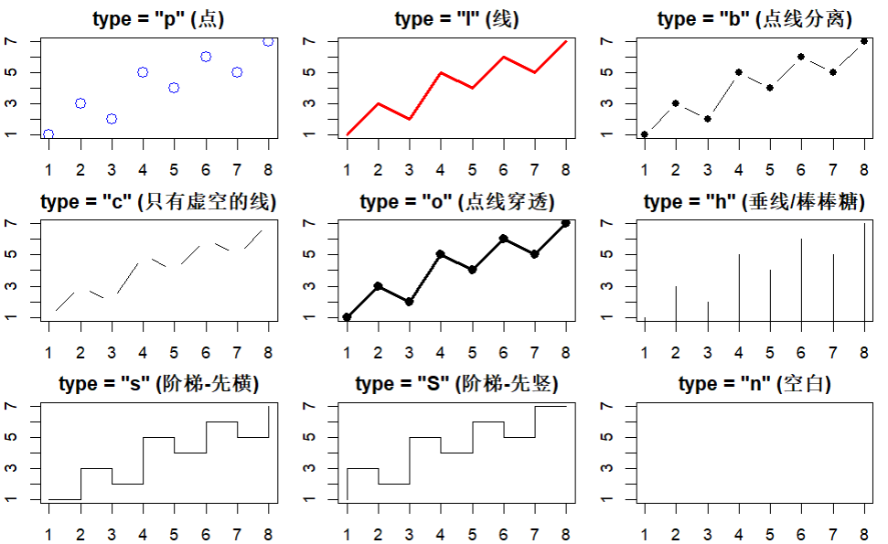
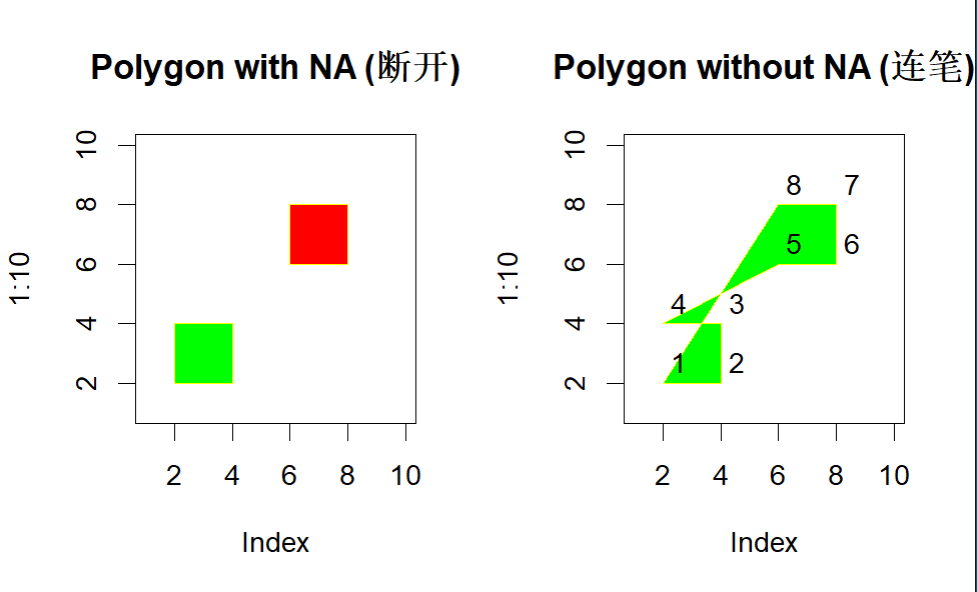
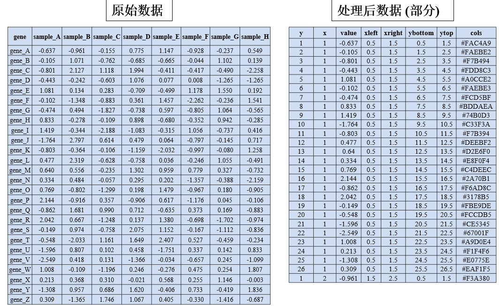
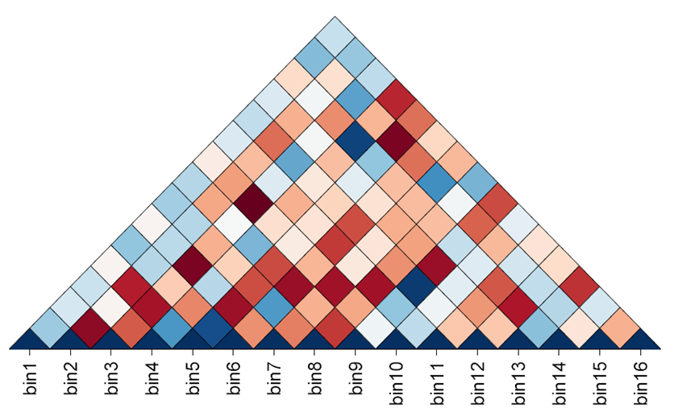

### 0 R绘图过程

#### 0.1 R-数据整理

在绘图中，需要点的坐标，但是对于生物学中的某些概念诸如基因、样本等，需要将这些字符串向量转化为数值型向量，转换方法极其简单，按自己喜好选择一个顺序，然后依次赋值1 2 3即可。


#### 0.2 设置图形参数

`par()`

- 每个device都有他自己的一套图形参数，当不给`par()`传入参数或者 `par(no.readonly = TRUE)`，可获取当前图形的参数（==还能用来备份你辛苦设置好的漂亮的参数==）。当没有设备可以获取时，就会创建一个新的device。
  - device：要在哪里画图，那个就是你的device。如屏幕、PDF文件里面、PNG图片。
  - 修改指定device的参数：先试用`dev.list()`，再用`dev.set()`，最后用`par()`。

```R
graphics:::.Pars #par()的参数
 [1] "xlog"      "ylog"      "adj"       "ann"       "ask"       "bg"
 [7] "bty"       "cex"       "cex.axis"  "cex.lab"   "cex.main"  "cex.sub"
[13] "cin"       "col"       "col.axis"  "col.lab"   "col.main"  "col.sub"
[19] "cra"       "crt"       "csi"       "cxy"       "din"       "err"    
[25] "family"    "fg"        "fig"       "fin"       "font"      "font.axis"
[31] "font.lab"  "font.main" "font.sub"  "lab"       "las"       "lend"     
[37] "lheight"   "ljoin"     "lmitre"    "lty"       "lwd"       "mai"      
[43] "mar"       "mex"       "mfcol"     "mfg"       "mfrow"     "mgp"      
[49] "mkh"       "new"       "oma"       "omd"       "omi"       "page"     
[55] "pch"       "pin"       "plt"       "ps"        "pty"       "smo"      
[61] "srt"       "tck"       "tcl"       "usr"       "xaxp"      "xaxs"     
[67] "xaxt"      "xpd"       "yaxp"      "yaxs"      "yaxt"      "ylbias"  

class(par())
[1] "list"

par()$lwd
[1] 1
```

- `mar`：设置图形边界空白宽度（下左上右）


- `mgp` 就是用三个数字分别控制标题、刻度数字和坐标轴线离图表边缘的距离。


- `mforw`/`mcol`：行数和列数，分别按行和列来填充图，指的是宏观布局，一个大图切格子来方不同的图。例如`par(mfrow = c(3, 3), mar = c(2, 2, 2, 1))`

- `xaxs`, `yaxs`：控制坐标轴两头留不留空隙。
  - 默认（`r`）：会比你的最大/最小数据多留出 4% 的白边，防止数据点贴在画框上，显得不挤。
  
  - `i (internal)`：表示直接使用原始数据范围。数据到哪儿，轴就画到哪儿，一点空隙不留。
  
- `bg`：整个图片的背景底色。

- `cex`：整体缩放倍数。控制图里的字啊、符号啊长多大。默认是 1（原样）。填 1.5 就是放大 1.5 倍，填 0.5 就是缩小一半。

- `col`：画图的主色调（主要控制图里的点和线的颜色）。除了这个总开关，你还可以单独控制各个角落的颜色：

  - `col.axis`：刻度数字的颜色（就是轴上 0, 10, 20 那些数字）。

  - `col.lab`：坐标轴名字的颜色（比如写着 "伪时间"、"年龄阶段" 的那些字）。

  - `col.main`：大标题的颜色（最顶上那个最显眼的）。
  - `col.sub`：副标题的颜色（通常在图最底下那行小字）。


#### 0.3 调用高级函数

**高级绘图函数：**能自主创建应该图形窗口、坐标轴、标题、主图。

高级绘图函数如`barplot 条形图`、`hist 直方图`、`plot 基础函数`，`ggplot2`和`pheatmap`等包也算，但`points()`、`lines()`、`legend()`等不算。

下面函数可以搞个白纸出来，主要是`axes = FALSE`参数。

```R
plot(x=1:10,type='n',xlim=c(1,8),ylim=c(1,26),axes=FALSE,xlab='',ylab='',main='有张白纸')
```

#### 0.4 调用低级函数

`points()`：require x y坐标。

`lines()`：多个点连成线。

- `type`参数：`p l` 等。当为p时，还能用`pch`参数选择点的形状，类似ggplot2中的`shape`。



`segments()`：线段需要两个坐标。

```R
segments(x0, y0, x1 = x0, y1 = y0, col = par("fg"),lty = par("lty"), lwd = par("lwd"), ...)
# lty控制线型，lwd控制线粗细
# 所有参数均可向量输入

plot(1:10,type='n')
segments(x0=1:9,y0=rep(1,times=9),x1=1:9,y1=2:10,col=rainbow(9),lty=1:9,lwd=1:9)
```


`rect()`：矩形，需要左下和右上两个顶点的坐标。

```R
rect(xleft, ybottom, xright, ytop, density = NULL,angle = 45, col = NA, border = NULL, lty = par("lty"),lwd = par("lwd"), ...)
```

- `density`、`angle`：在矩形里面不涂颜色，而是涂阴影线，分别控制线密度和线角度。
- `col`、`border`：矩形的填充和边框颜色。


`polygon()`：多边形，需要四个顶点（不规则图形）。

```R
polygon(x, y = NULL, density = NULL, angle = 45,border = NULL, col = NA, lty = par("lty"), ...,fillOddEven = FALSE)
```

- 避免回到原点：polygon没有这种参数，但是可以通过在xy中设置NA来达到一个"提笔"的作用，让R不知道该画哪里，他就不画，进而笔就到下一个点了，而非连成线，简而言之就是，中间断了笔。

```R
plot(c(1, 9), 1:2, type = "n")
polygon(1:9, c(2,1,2,1,NA,2,1,2,1),
        density = c(10, 20), angle = c(-45, 45)) #density的值为两个，即不同的密度
```


```R
par(mfrow = c(1, 2))

plot(1:10, main='Polygon with NA (断开)', type='n')
# 这里的 NA 让红绿两个方块完全独立
polygon(x=c(2,4,4,2,NA,6,8,8,6), y=c(2,2,4,4,NA,6,6,8,8), 
        col=c('green','red'), border='yellow')

plot(1:10, main='Polygon without NA (连笔)', type='n')
polygon(x=c(2,4,4,2,6,8,8,6), y=c(2,2,4,4,6,6,8,8), 
        col=c('green','red'), border='yellow')
text(x=c(2,4,4,2,6,8,8,6), y=c(2,2,4,4,6,6,8,8), labels=1:8, adj=c(-0.5, -0.5))
```




#### 0.5 热图步骤分解


##### 0.5.1 数据处理

**Matrix2LongMat：**矩阵转长格式数据框，即`宽数据转长数据`。

x：sample，如x=1代表sample_A

y：gene，如y=1代表gene_A

方法

```R
library(reshape2)
mat <- matrix(1:12, 3, dimnames=list(c("G1","G2","G3"), c("S1","S2","S3","S4")))
df <- melt(mat) 
```



```R
m = matrix(rnorm(12), 3)
df = data.frame(
  x   = c(col(m)),                # 列号拉直 -> x坐标
  y   = c(row(m)),                # 行号拉直 -> y坐标
  val = c(m),                     # 值拉直
  col = heat.colors(10)[cut(m, 10)] # 自动切成10份 -> 对应颜色
)
```

```R
  x y        val     col
1 1 1  0.4007715 #FFDB00
2 1 2  0.1106827 #FFB600
3 1 3 -0.5558411 #FF6D00
4 2 1  1.7869131 #FFFFBF
5 2 2  0.4978505 #FFDB00
6 2 3 -1.9666172 #FF0000
```


老师PPT完整代码

```R
library(reshape2)
library(scales)

m <- matrix(rnorm(260), 26, 10, dimnames=list(paste0("Gene_", LETTERS), paste0("Sample_", LETTERS[1:10])))
pdat <- melt(m)
colnames(pdat) <- c("gene", "sample", "value")

pdat$y <- as.numeric(pdat$gene)
pdat$x <- as.numeric(pdat$sample)

wid <- 0.5
pdat$xleft   <- pdat$x - wid
pdat$xright  <- pdat$x + wid
pdat$ybottom <- pdat$y - wid
pdat$ytop    <- pdat$y + wid

pdat$cols <- col_numeric(palette = "RdBu", domain = pdat$value)(pdat$value)

head(pdat)
```

```R
    gene   sample      value y x xleft xright	ybottom ytop    cols
1 Gene_A Sample_A -0.6250393 1 1   0.5    1.5	0.5  	1.5 	#F4A784
2 Gene_B Sample_A -1.6866933 2 1   0.5    1.5	1.5  	2.5 	#B7252F
```


### 1、TAD热图

思路类似普通热图，但是需要把中心点逆时针旋转45°。

Q：为什么要转呢？

A：为了把斜着的对角线（$y=x$）变成水平的 X 轴（$y'=0$）



