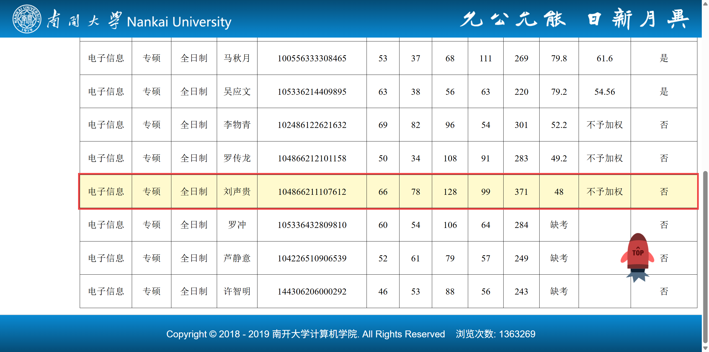
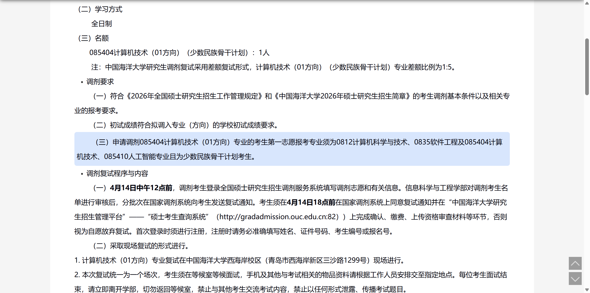
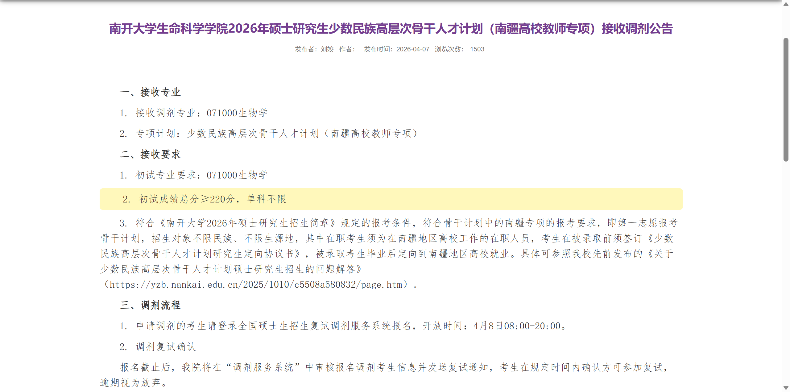
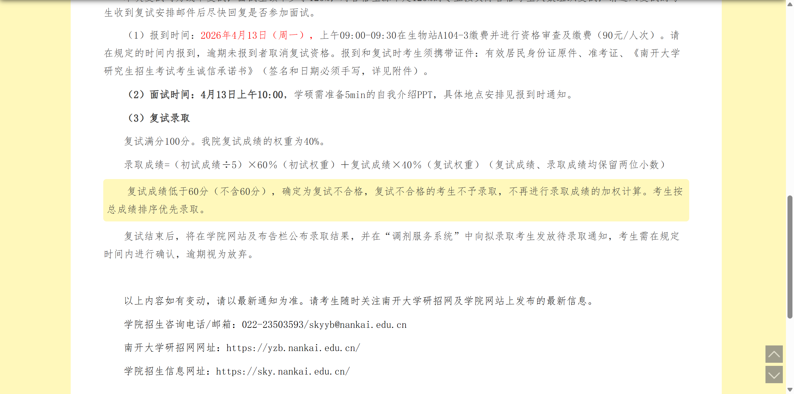
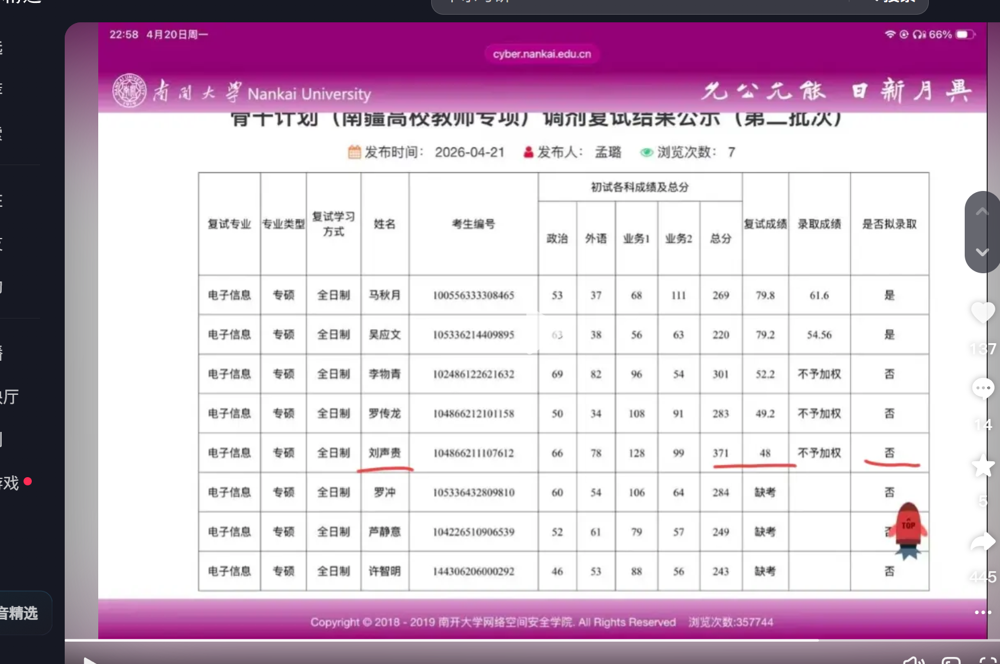

这两天反复在看“考研卡尔”的事，看着看着，心里越来越闷。

五战考研失败，本来只是一个人的经历，可放在现在这个年份里看，它又像很多普通人的缩影。学历越来越难，研究生一年年扩招，就业却没有同步变宽，反而越来越卷。门槛在抬，岗位在缩，程序员有 `35` 岁危机，AI 还在往下冲击白领岗位，大家从小被教育“读书改变命运”，可真走到二十多岁、三十岁这个关口，才发现命运这扇门根本不是你考试次数够多、证书够厚，它就一定肯开。

有时候真会生出一种说不清的荒诞感。我们这代人读到本科，本科像以前的高中；读到硕士，硕士又像以前一个稍微体面点的敲门砖。可问题在于，学历在扩，体面的岗位没有按比例扩，结果就是文凭越来越像“不得不有”的门票，却越来越不像真正能兜底的人生保障。再看看更早几十年出生的人，很多人高中毕业就能进厂、进单位、拿稳定工资，甚至还能碰上包分配的尾巴。越对比，越让人觉得不是自己不够拼，而是真的有一种生不逢时的钝痛。

### 1、把这五年摊开来看

卡尔本名刘声贵，本科是湖南工业大学物理专业，后来连续五年跨考计算机。很多人只记住了“五战失败”这四个字，可真把这五年摊开，才知道有多沉。

#### 一战，2022 年考研

- 一志愿是长沙理工大学计算机专业。
- 初试各科和总分没有公开。
- 结果是一志愿复试没过，也没有后续调剂。
- 这时候还属于典型的“第一次跨考”：热情很足，基础却明显不够。

#### 二战，2023 年考研

- 一志愿换成了苏州大学计算机专业。
- 具体分数仍未公开，但英语一直是他的明显短板，这一点很多报道里都提到过。
- 结果还是一志愿复试失利，没有调剂成功。
- 从这时候开始，他已经不是“试一试”，而是真的把整个人生往这个方向押了。

#### 三战，2024 年考研

- 一志愿直接冲到了复旦大学计算机专业。
- 具体初试和复试分数同样没有公开。
- 结果还是没有上岸。
- 那时候他已经开始靠送外卖维持生活，白天送单，晚上备考。看到这里时我其实已经有点不敢往下看了，因为这已经不是普通意义上的努力了，而是一种带着执念的硬扛。

#### 四战，2025 年考研

- 一志愿是南京大学计算机专业。
- 总分没有完整公开，只知道是擦线进了复试。
- 复试没有通过，之后调剂去了上海应用技术大学的商科专业，甚至连入学手续都办了。
- 可最后他还是退学了，又回去考第五次。

说实话，看到这里，我第一反应不是“这人太执拗了”，而是有点难受。因为我们从小被灌输的是，失败一次再来一次，失败两次再坚持一下，好像只要你足够能熬，命运总会在某个时刻松口。可现实不是这样，现实经常是你把几年最值钱的时间都押进去了，它还是一句“未录取”。

#### 五战，2026 年考研

第五次是最完整、也最扎心的一次。

- 一志愿是武汉大学计算机技术专业，走少数民族骨干计划。
- 初试总分 `371`。
- 其中政治 `53`，数学二 `128`，`408` 计算机专业基础综合 `99`，英语二 `91`。
- 面试成绩 `81.6`。
- 机试成绩 `0`。
- 最终复试总分 `48`，因为没有达到 `60` 分及格线，被刷掉。

这一串数字摆在一起时，真的很刺眼。你能明显看出来，他不是那种“初试没考明白”的状态。真正致命的是复试，尤其是机试 `0` 分。平时只在力扣那种函数式答题环境里刷题，不会写完整输入输出，不会处理实际运行环境，到了真正的上机考试里，直接断电。很多时候把人打倒的，不是努力不够，而是努力方向和规则之间，刚好隔着一道最致命的缝。

这张图是我看到最难受的一张。南开大学第二批次调剂复试结果公示里，刘声贵这一行写得很直白: **总分 `371`，复试 `48`，不予加权，未拟录取。**

#### 五战之后的调剂

一志愿失利后，他又去调剂，几乎是把最后一口气也用上了。

##### 北京邮电大学软件工程

- 初试 `371`，在调剂名单里排名第一。
- 第二名只有 `311`。
- 复试成绩 `48.48`。
- 结果还是不及格，被淘汰。

##### 厦门大学人工智能

- 初试依旧是 `371`，也是名单第一。
- 复试成绩没有看到完整公示数字，但结论仍然是复试不及格。
- 最终上岸的是初试 `304` 和 `325` 的考生。

##### 中国海洋大学计算机技术

- 这次连真正进入复试都没有。
- 按学校调剂要求，直接被拒。

##### 南开大学南疆高校教师专项

- 初试还是 `371`。
- 同批里还能看到 `301` 和 `220` 这样的分数。
- 他自己的复试成绩又是 `48`。
- 最后还是被淘汰。

这两张南开的公告也很能说明问题。门槛写得明明白白，`220` 可以进，复试低于 `60` 分直接不录。规则本身没有给谁开后门，可它残酷的地方就在这里: 你可以在初试里把分堆得很高，只要复试不过线，一样归零。

抖音上流传最广的也是这张图。`371`、`48`、`220`、`301` 这些数字挤在一起的时候，会让人一种非常不舒服的眩晕感。你会突然意识到，现在很多人的人生，就是被这些数字压缩、切割、裁定的。

### 2、学历越来越多，出路却没有一起变宽

我之所以看这个故事会这么难受，不只是因为他五战失败，而是因为它太像这个时代的病症了。

这些年研究生扩招得很快，学历数量越来越多，可社会能承接这批学历的好岗位并没有同速度增加。于是就出现一个很拧巴的局面: 一方面大家被迫继续往上读，因为本科已经不够看了；另一方面，读到硕士、甚至读到博士，也未必能换来和投入相匹配的工作与生活。学历像是不断涨价的门票，可进场之后才发现，里面的座位并没有变多。

更让人焦虑的是，就业市场现在又恰好碰上几个问题叠在一起:

- 互联网和计算机不再像前几年那样疯狂招人，程序员不再是“闭眼进”的职业。
- 传统白领岗位越来越强调复合能力，光有学历不行，光有一点点技能也不行。
- AI 把很多基础性的脑力劳动挤压得更廉价，尤其是那些可流程化、可模板化的岗位。

于是很多普通人就卡在中间。继续读吧，怕读出来还是找不到合适工作；不继续读吧，又眼看着门槛越来越高。最后学历本身成了一种防御动作，不一定因为它真有那么强的价值，而是因为不读更危险。

再回头看上一代、再上一代，确实像另一个世界。那时候经济上行，岗位在增加，城市在扩张，学历稀缺，组织也还愿意长期培养人。今天不是这样了。今天是岗位更精细，筛选更严，容错更低，连“试错”本身都变贵了。一个人二十多岁最值钱的几年，很容易就消耗在各种考试、面试、等待、公示、落榜、重来里面。

### 3、那我这种专业，以后又该往哪里去

其实看完卡尔之后，我想到的不只是考研本身，还有我自己。

我这种方向，说白了也不算轻松。偏生物，偏生信，手里又沾着实验、数据、论文、代码，多组学、空间转录组、`Hi-C`、单细胞这些东西看上去很“前沿”，可真正落到就业上，并不是一句“做的是热门方向”就能解决问题。生物口很卷，计算口也卷，夹在中间的交叉方向，好的地方是门槛高，坏的地方是岗位并没有想象中那么多。

有时候我也会担心，我们这种人会不会最容易掉进一个尴尬区间: 比纯实验的人多会一点代码，比纯计算的人多懂一点生物，但两边都没有深到足以一锤定音。再加上 AI 现在写代码、改代码、读文献、总结文章都越来越快，如果一个人只是会跑流程、会点软件、会复制命令，那确实会越来越危险。

可换个角度想，AI 也不是把这条路完全堵死了。它能替代的是重复劳动、模板劳动、浅层整理，但真正难替代的还是那些需要判断的问题:

- 这个实验设计到底合不合理。
- 这个数据质量到底能不能信。
- 这个结果为什么和生物学事实对不上。
- 这个故事值不值得继续往下做实验验证。

所以我现在越来越觉得，我这种专业以后真要活下来，路子大概只剩两条，而且最好别停在中间。

一条是继续往交叉深处走。把生物问题、统计思维、编程能力、论文表达都尽量练扎实，真正变成那种能把问题从实验台带到数据，再从数据带回机制解释的人。这条路很苦，但至少不容易被一句“会不会用某个软件”替代掉。

另一条是尽早把能力做成可迁移的。别把自己死锁在某一个太窄的标签上。生信里练出来的东西，比如数据清洗、统计分析、自动化流程、可视化、代码管理、结果表达，本质上也可以外溢到医院、测序公司、算法支持、数据分析，甚至更广一点的开发岗位。未必要把自己一辈子绑死在一个最窄的赛道上。

我现在最怕的，其实不是行业难，也不是 AI 来了，而是自己最后活成一个“只会按按钮的人”。那种人不管在哪个时代都危险。反而如果真能把问题意识、判断力、写作能力、代码能力、对实验的理解一点点积出来，哪怕时代很差，至少还能给自己留几条路。

### 4、可人生真的只剩上岸吗

可就在我看得越来越灰的时候，又刷到一句话，突然有点安静下来。

另一种声音

看到三甲医院的一段话: 人只有在即将死亡的时候，才能明白很多东西。人生其实像一场骗局，最主要的任务根本不是买房买车，也不是即时行乐。那些更多只是欲望，不是真相。

人生就是一个梦，虚无缥缈，并不真实。我们不要给自己那么多使命感，也不要给自己那么多过剩的责任感。在这个世界上，活着的我们，和一只蚂蚁、一只昆虫、一只蚊子、一只甲壳虫，并没有本质区别。

走到生命尾声再回头看，很多曾经拼命追逐的东西都会恍若云烟。功名利禄会变成尘土，恩怨情仇也终将随风散去。我们在这世间最真实的需要，不过是内心的感受而已。最根本的任务，不是买房买车，不是让别人羡慕，不是一定要过得比别人好，而是能够按照自己喜欢的方式度过一生。

请记住，你透支健康换来的“优秀”，很多时候不过是档案里几行随时可以被替换的宋体字。单位的齿轮不会因为你停下，红头文件也量不尽一个人的人生。真正补录不回来的，反而是那些看见花开、听见雨声、赶上晚霞、赴成晚餐、牵住想牵的手的瞬间。

这段话当然也不是绝对真理，甚至有点重，可它确实把我从那种只盯着名单和分数的情绪里拉出来一点。

卡尔这个故事最让人难受的地方，是它会逼你去想: 要是一个人已经这么努力了，还是没有结果，那我们到底该怎么活。可也正因为这样，我反而觉得不能把全部人生都押在一个结果上。考研也好，工作也好，升学也好，当然都重要，可它们都不该重要到把一个人整块吞掉。

我们可以认真学，认真考，认真争取，但不能把尊严、健康、感受、关系、生活，全都抵押给一个“上岸”或者“体面”的想象。因为最后真正让人崩掉的，往往不是一次失败，而是你在追一个结果的时候，把自己其他所有部分都弄丢了。

分数、名单、学历、岗位，都只是人生的一个切面。真正的人生正文，是那些一旦错过，就再也无法补录的部分。

### 5、顺手存几条我翻到的链接

写到这里，还是把几条关键页面顺手存一下，免得以后再找时翻不出来。

1. [南开大学密码与网络空间安全学院: 少数民族高层次骨干人才计划（南疆高校教师专项）接收调剂公告（第二批次）](https://cyber.nankai.edu.cn/2026/0415/c13348a593008/page.htm)
2. [南开大学密码与网络空间安全学院: 少数民族高层次骨干人才计划（南疆高校教师专项）调剂复试结果公示（第二批次）](https://cc.nankai.edu.cn/2026/0421/c13297a593385/page.htm)
3. [南开大学生命科学学院: 少数民族高层次骨干人才计划（南疆高校教师专项）接收调剂公告](https://sky.nankai.edu.cn/2026/0407/c7809a592388/page.htm)
4. [中国海洋大学信息科学与工程学部: 2026年接收第二轮硕士调剂考生的通知](https://it.ouc.edu.cn/2026/0413/c21608a524202/page.htm)
5. [抖音图文: 卡尔南开再次下岸，复试又是48](https://www.douyin.com/note/7630985170481009390)
6. [搜狐移动端报道: 武大复试 81.6、机试 0 分、总分 48 的梳理](https://m.sohu.com/a/1009007152_120960385/)
