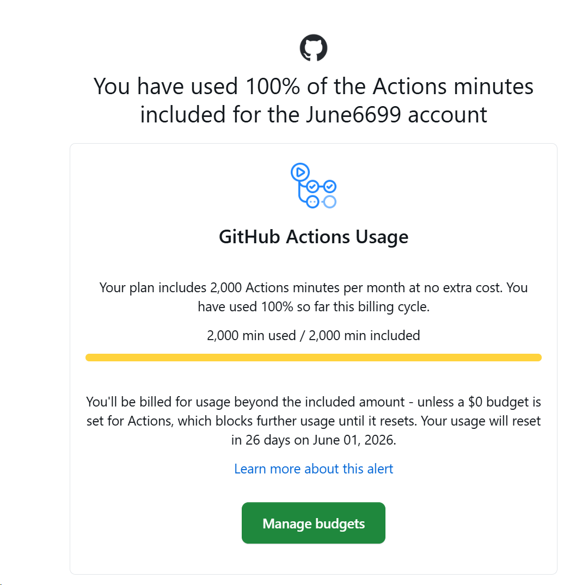

最近两天，fork了之前用的一个仓库，https://github.com/xiaoyaocz/dart_simple_live，是一个聚合了抖音、虎牙、斗鱼、B站的直播平台，没有广告，支持本地关注，是一个比较纯净的观看直播的平台。后来他不更新了，最近把他fork进来重新修复了很多问题，然后build了windows、Android、macOS、linux、Android TV的release。stars每天涨个几个，还可以，收到了一部分用户的支持。

但是最近两天，issue疯狂的来，各种问题，要我build macOS和iOS版本（[issue](https://github.com/June6699/dart_simple_live/issues/4)），要我支持老电视（[issue](https://github.com/June6699/dart_simple_live/issues/3)）、要我支持windows7这种老版本（[issue](https://github.com/June6699/dart_simple_live/issues/7)），flutter都不支持这个平台了都。难道我真的要像windows系统一样，为了兼容，搞得这么臃肿吗？windows自己都受不了这么多的兼容问题要做，把每个版本都做了最多支持到什么时候的限制了。唉~！！！

而且很多人提了[issue](https://github.com/June6699/dart_simple_live/issues/6)，语气也不好，连个star都不给！！！给的视频里面，他关注了那么多主播，很明显就是用了我软件很长时间了，真的无语。@[Aze501](https://github.com/Aze501)

不知道自己还能撑多久，还好现在action限额了，不然还真没理由不继续开发，继续给一部分伸手党、白眼狼当黑奴牛马呢！！

