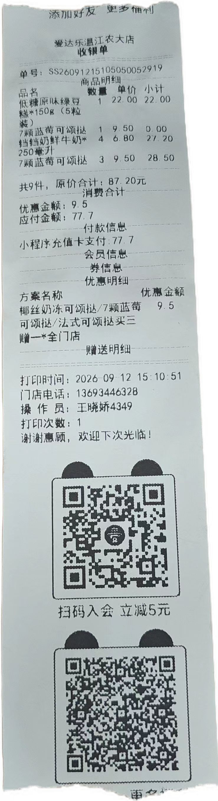

2026年9月10日，是教师节，我们24-26级的同学们，一起给老师买了一束花，避免出现以前送礼物老师不喜欢的事情出现。

这次老师给了`爱达乐`购物卡880*2 = 1760元，活动经费200元，公平起见，在此公开花费和小票。

### 1、爱达乐购物明细

#### 1.1 9.12 `77.7`

| 商品                           | 单价 | 数量          | 小计     |
| ------------------------------ | ---- | ------------- | -------- |
| 低糖原味绿豆糕 * 150g（5粒装） | 22   | 1             | 22       |
| 7颗蓝莓可颂挞                  | 9.5  | 4（买三赠一） | 28.5     |
| 铛铛奶鲜牛奶250ml              | 6.8  | 4             | 27.2     |
| 原价                           |      |               | 87.2     |
| 优惠金额                       |      |               | 9.5      |
| 应付金额                       |      |               | ==77.7== |

