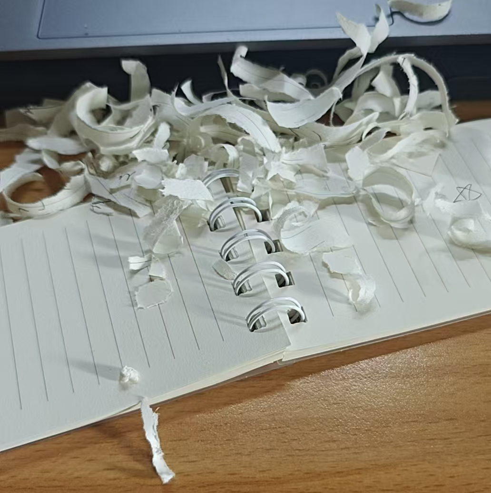

又是一次开会后，辛辛苦苦这么多天，永远得到的评论只有`你做的这些毫无意义`，`那你为什么这种基础的东西都做不好呢？`

可笑，吐槽都不敢发朋友圈，只敢发在自己的博客，甚至博客都不敢发`posts`，只敢龟缩在`moments`，我做的真的有那么差吗？我只是没有加P值，我只是学了那个文章的做法，做了个热图，没有比较组间的差异，就被如此的骂。

每次开会，不是迟到就是提前，我的成果堆了又堆，做了这么多事情，到了研三还是0文章，没法申请博士，也不知道该不该找工作，真的太迷茫了，我到底在干嘛？想干嘛？能干嘛？心态爆炸

我已经拿出了这么多的轴，结果实验验证同学跟死了一样，每个月七八千的拿，我每个月900 900的拿，我真的撑不住了。我现在也许真的理解了你王晨，我理解了你为什么会做出那种选择，HiC实在是太难了，更何况要跟那么多组学进行统一分析。

犹记研一研二，只需要跑个包，把结果画个图就结束了，现在是给你数据，让你找到最后的验证靶标，期间上万个细节，你全部要自己去考虑，如果老师讲了你没做对，你将被疯狂压力；如果老师没讲你没做对，你将被继续压力；如果老师没讲但是是老师`认为`的基础知识，你还是会被死命压力。

```javascript
那你做的这些有什么意义呢？
你连原理都不知道？
你能跑流程，但是一些基础的知识你还是做不到，那你以后读博怎么办呢？
```

谁想读博？为什么活着这么累


