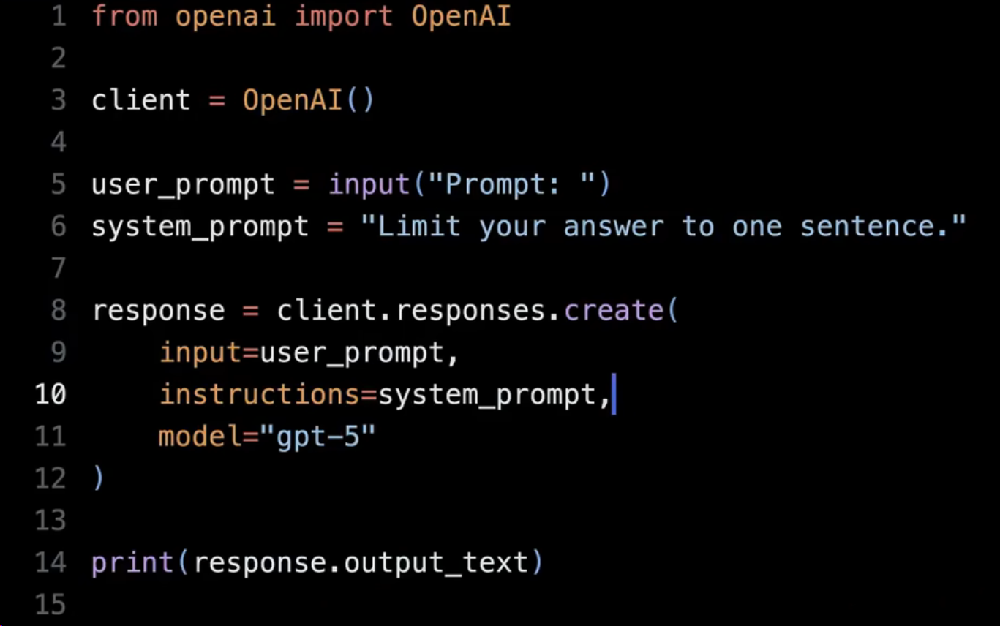

[哈佛大学【中英⚡计算机科学导论(2026)|CS50x Introduction to Computer Science】_哔哩哔哩_bilibili](https://www.bilibili.com/video/BV1XQ6mBWEoS/?spm_id_from=333.337.search-card.all.click&vd_source=76a6f89f0900bd443ef08648e4c92f12)

## Lecture 0 Scratch

### 1、使用系统提示词

`user_prompt`和`system_prompt` 