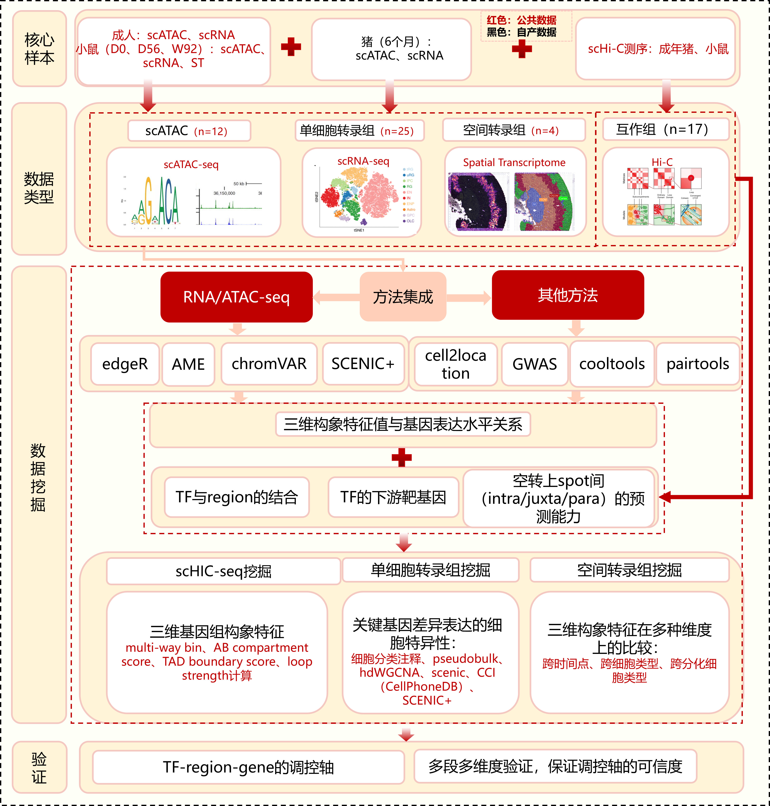
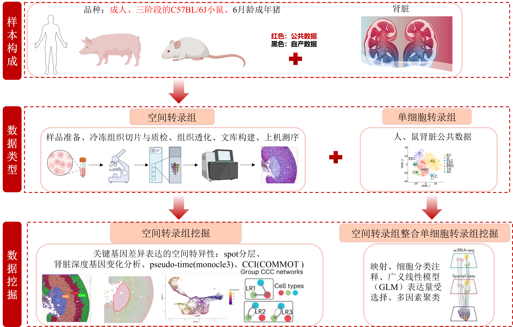
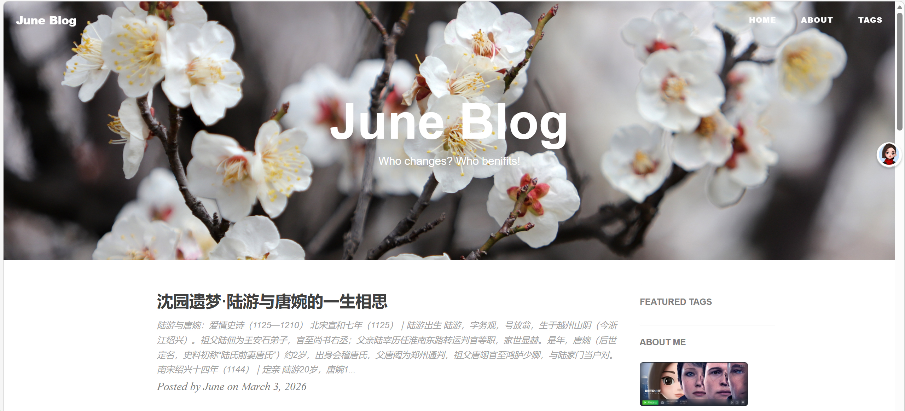

### 研究生学习

2026年贯穿了我研一下半学期与研二上半学期，这一年在科研与学习上稳步推进，也迎来了不少新的挑战与突破。

在猪心脏相关课题上，我对原有内容做了进一步完善，重点修正了 `SnapATAC` 分析流程。流程的核心问题出在**细胞类型命名**上：若 `Seurat` 对象中的细胞类型名称包含 `/` 符号（如 `Macrophage/Myeloid`），系统会将其识别为路径层级，导致保存异常。修正后，对最终DAR结果的提升虽不显著，但分析逻辑更严谨、结果更可靠。

同时，我将**差异表达分析、BETA、AME**等核心流程重新完整跑通一遍。其中 AME 分析采用了2026版 `JASPAR` 数据库，与此前王晨的结果对比后发现：差异表达结果完全一致，BETA 存在小幅差异，AME 仅在部分 q 值上有极细微差别。统一重跑、统一目录管理，也为后续结果查阅与复现提供了极大便利。

这一年我还接手了一个难度与体量都极具挑战的课题——王晨留下的**小鼠肾脏衰老与发育研究**。项目数据十分丰富：涵盖小鼠 D0、D56、W92 三个时间点，共12个 `scATAC` 样本、25个单细胞转录组样本、4个空间转录组样本、17个 `scHi-C` 样本，同时整合6月龄猪、成年人的公共数据与部分自测数据，后续还需衔接实验验证。我以此课题作为开题方向，从对空间转录组、Hi-C 完全陌生开始，在唐老师一小时的细致讲解后，仅用6天便完成开题报告。尽管内容仍有不足，但已是当时能力范围内的最大努力。感谢唐老师的指导，也感谢知乎、`Claude`、`ChatGPT` 等工具在这段时间里给予的助力。开题后，经过近一年的摸索与分析，我对空间转录组有了更深入的理解，而 Hi-C 数据分析仍需继续深耕。

此外，我利用课余时间学习了前端相关知识，包括 `JavaScript`、`CSS`、`Django` 等，在实践中越发体会到 `Cursor` 的高效便捷，也深刻意识到：**审美是页面设计的前提**，没有见过足够简洁、大气、优雅的界面，就很难做出真正好用又好看的页面。在此基础上，我搭建了自己的第一个[个人博客](https://june6699.github.io/)，参考教程来自 https://github.com/qiubaiying/qiubaiying.github.io。

（忽略调皮豆包）

机器学习与深度学习方面，我也有所涉猎，对 `MLP 多层感知机`、`SVM 支持向量机`、`神经网络结构`及多种学习率优化策略有了基础认知，并实战了pytorch，做了几个简单的项目，但是HIC的域适应课题仍为做出来，唉，菜！由于长时间未实战应用，相关知识已逐渐生疏，此前学过的域适应、对抗模型等内容更是遗忘大半。

AI 领域发展日新月异，需要学习的内容层出不穷。在海量知识面前，找到真正热爱的方向并坚持深耕，既重要又可贵，也绝非易事。

