毕业季很容易被写成一串宏大的词：未来、理想、选择、远方。可真正能留下来的，往往不是一整篇演讲，而是某一句话突然打中你。

这次我把 12 场毕业演讲和获奖发言做成了朋友圈竖版图卡。它们来自工程师、创业者、作家、演员和科技公司 CEO，有的是典礼现场，有的是线上告别，有的甚至不是严格意义上的毕业演讲，但都很适合放在毕业季：把一个人走过的路，压缩成一句可以带走的话。

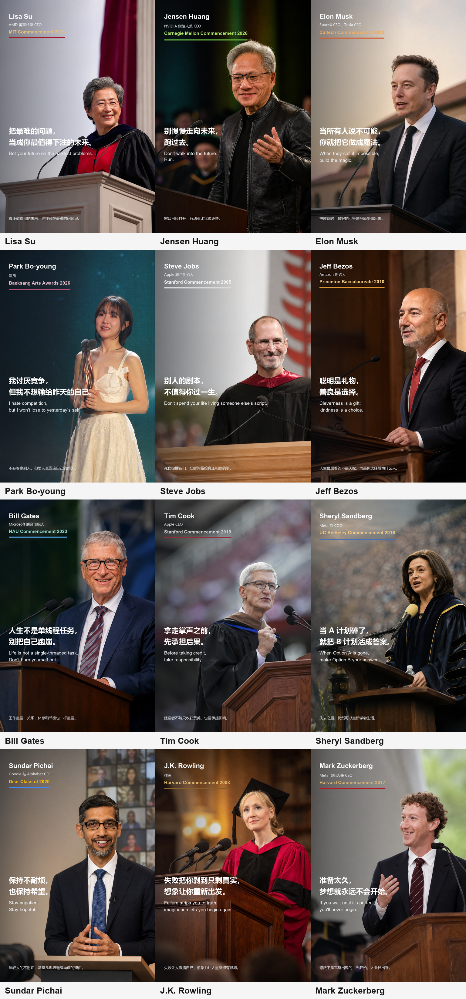

## Lisa Su：把未来押在最难的问题上

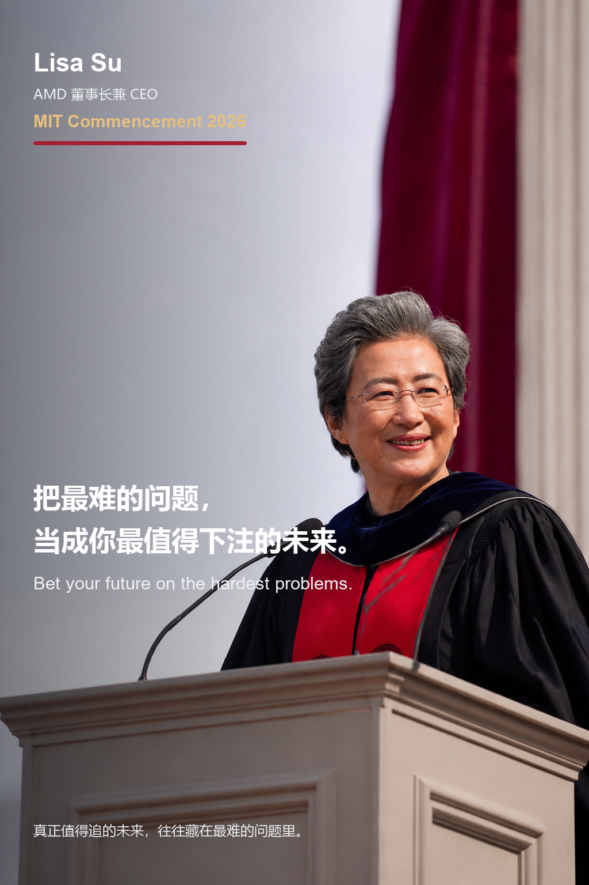

Lisa Su 是 AMD 董事长兼 CEO，她将为 MIT 2026 届毕业生做毕业典礼演讲。我给这张卡片写的句子是：

> 把最难的问题，当成你最值得下注的未来。  
> Bet your future on the hardest problems.

这句话的底色是工程信念。它不是简单的“要努力”，而是把长期主义、技术变革和个人选择放在一起看：容易的问题当然也能解决，但真正能改变世界、也真正能改变自己的，往往是那些一开始看起来最难、最不确定、最需要耐心的问题。

来源链接：[MIT News - Lisa Su to deliver MIT's 2026 Commencement address](https://news.mit.edu/2026/commencement-address-lisa-su-0528)

<!-- speech-excerpt-panel:start:lisa-su -->
<section class="speech-excerpt" data-speech-panel data-speech-id="lisa-su" data-speech-lang="zh">
  <button class="speech-excerpt__toggle" id="speech-panel-lisa-su-toggle" type="button" aria-expanded="false" aria-controls="speech-panel-lisa-su-body" data-speech-toggle>
    <span class="speech-excerpt__toggle-copy">
      <span class="speech-excerpt__eyebrow">演讲内容</span>
      <strong class="speech-excerpt__title">Lisa Su</strong>
      <span class="speech-excerpt__meta">MIT Commencement 2026</span>
    </span>
    <span class="speech-excerpt__toggle-icon" aria-hidden="true">展开</span>
  </button>
  <div class="speech-excerpt__body" id="speech-panel-lisa-su-body" role="region" aria-labelledby="speech-panel-lisa-su-toggle" hidden>
    <div class="speech-excerpt__toolbar" role="group" aria-label="语言切换">
      <button class="speech-excerpt__lang is-active" type="button" data-speech-lang-button="zh" aria-pressed="true">中文</button>
      <button class="speech-excerpt__lang" type="button" data-speech-lang-button="en" aria-pressed="false">English</button>
    </div>
    <div class="speech-excerpt__content" data-speech-content="zh">
      <p class="speech-excerpt__label">中文短译</p>
      <blockquote class="speech-excerpt__quote">技术本身不会决定未来的样子。</blockquote>
      <p class="speech-excerpt__note">短摘录来源：MIT News。完整语境请阅读下方来源链接。</p>
    </div>
    <div class="speech-excerpt__content" data-speech-content="en" lang="en" hidden aria-hidden="true">
      <p class="speech-excerpt__label">English excerpt</p>
      <blockquote class="speech-excerpt__quote">Technology itself does not decide what the future looks like.</blockquote>
      <p class="speech-excerpt__note">Short excerpt source: MIT News. Read the linked source for full context.</p>
    </div>
    <ul class="speech-excerpt__sources" aria-label="来源链接">
    <li class="speech-excerpt__source-item"><a class="speech-excerpt__source-link" href="https://news.mit.edu/2026/commencement-address-lisa-su-0528" target="_blank" rel="noopener noreferrer">MIT News</a><span class="speech-excerpt__source-meta">MIT News | Massachusetts Institute of Technology · 发布时间未标注</span><span class="speech-excerpt__source-title">Commencement address by Lisa Su ’90, SM ’91, PhD ’94</span></li>
    </ul>
  </div>
</section>
<!-- speech-excerpt-panel:end:lisa-su -->


## Jensen Huang：不要走向未来，要跑过去

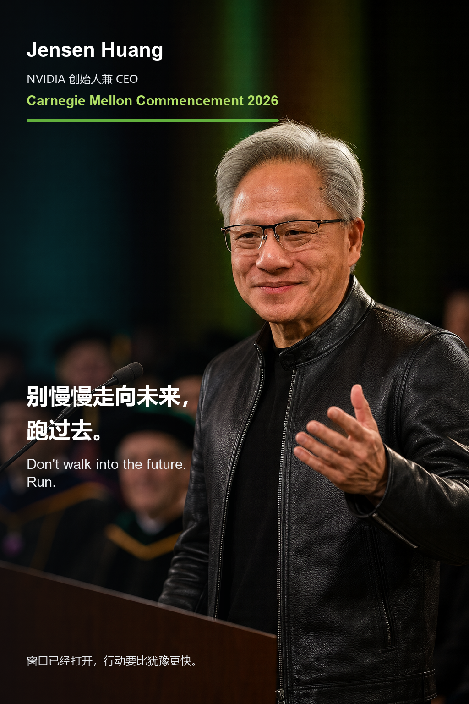

Jensen Huang 是 NVIDIA 创始人兼 CEO，他在 Carnegie Mellon University 2026 毕业典礼上的主题很适合做成一张有速度感的图。卡片上的句子是：

> 别慢慢走向未来，跑过去。  
> Don't walk into the future. Run.

这张的核心不是制造 AI 焦虑，而是提醒毕业生：窗口已经打开，下一轮技术浪潮不会等你慢慢准备好。与其站在岸上看浪，不如亲手去塑造接下来会发生的事。

来源链接：[CMU News - Jensen Huang to Carnegie Mellon graduates: shape what comes next](https://www.cmu.edu/news/stories/archives/2026/may/nvidia-founder-ceo-jensen-huang-to-carnegie-mellon-university-graduates-shape-what-comes-next)、[NVIDIA Blog - Jensen Huang's Carnegie Mellon commencement address](https://blogs.nvidia.com/blog/nvidia-ceo-carnegie-mellon-commencement-address/)

<!-- speech-excerpt-panel:start:jensen-huang -->
<section class="speech-excerpt" data-speech-panel data-speech-id="jensen-huang" data-speech-lang="zh">
  <button class="speech-excerpt__toggle" id="speech-panel-jensen-huang-toggle" type="button" aria-expanded="false" aria-controls="speech-panel-jensen-huang-body" data-speech-toggle>
    <span class="speech-excerpt__toggle-copy">
      <span class="speech-excerpt__eyebrow">演讲内容</span>
      <strong class="speech-excerpt__title">Jensen Huang</strong>
      <span class="speech-excerpt__meta">Carnegie Mellon Commencement 2026</span>
    </span>
    <span class="speech-excerpt__toggle-icon" aria-hidden="true">展开</span>
  </button>
  <div class="speech-excerpt__body" id="speech-panel-jensen-huang-body" role="region" aria-labelledby="speech-panel-jensen-huang-toggle" hidden>
    <div class="speech-excerpt__toolbar" role="group" aria-label="语言切换">
      <button class="speech-excerpt__lang is-active" type="button" data-speech-lang-button="zh" aria-pressed="true">中文</button>
      <button class="speech-excerpt__lang" type="button" data-speech-lang-button="en" aria-pressed="false">English</button>
    </div>
    <div class="speech-excerpt__content" data-speech-content="zh">
      <p class="speech-excerpt__label">中文短译</p>
      <blockquote class="speech-excerpt__quote">塑造接下来会发生的事。</blockquote>
      <p class="speech-excerpt__note">短摘录来源：CMU News。完整语境请阅读下方来源链接。</p>
    </div>
    <div class="speech-excerpt__content" data-speech-content="en" lang="en" hidden aria-hidden="true">
      <p class="speech-excerpt__label">English excerpt</p>
      <blockquote class="speech-excerpt__quote">Shape what comes next.</blockquote>
      <p class="speech-excerpt__note">Short excerpt source: CMU News. Read the linked source for full context.</p>
    </div>
    <ul class="speech-excerpt__sources" aria-label="来源链接">
    <li class="speech-excerpt__source-item"><a class="speech-excerpt__source-link" href="https://www.cmu.edu/news/stories/archives/2026/may/nvidia-founder-ceo-jensen-huang-to-carnegie-mellon-university-graduates-shape-what-comes-next" target="_blank" rel="noopener noreferrer">CMU News</a><span class="speech-excerpt__source-meta">News · 2026-05-10</span><span class="speech-excerpt__source-title">NVIDIA Founder, CEO Jensen Huang to Carnegie Mellon University Graduates: ‘Shape What Comes Next’</span></li>
    <li class="speech-excerpt__source-item"><a class="speech-excerpt__source-link" href="https://blogs.nvidia.com/blog/nvidia-ceo-carnegie-mellon-commencement-address/" target="_blank" rel="noopener noreferrer">NVIDIA Blog</a><span class="speech-excerpt__source-meta">NVIDIA Blog · 2026-05-10</span><span class="speech-excerpt__source-title">‘Your Career Starts at the Beginning of the AI Revolution,’ NVIDIA CEO Tells Graduates</span></li>
    </ul>
  </div>
</section>
<!-- speech-excerpt-panel:end:jensen-huang -->


## Elon Musk：把不可能做成现实

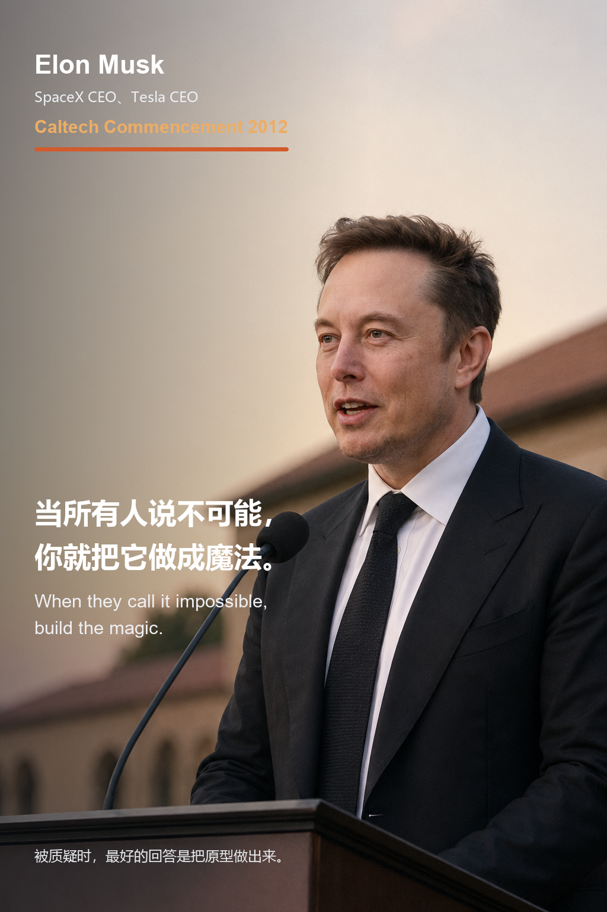

Elon Musk 在 Caltech 2012 毕业典礼上讲到了互联网、电动车、火箭和太空探索。卡片上的句子是：

> 当所有人说不可能，你就把它做成魔法。  
> When they call it impossible, build the magic.

我喜欢这场演讲里那种非常粗粝的推进感：被怀疑、失败、继续做、再失败、再做。它不是“天才叙事”，更像是一个人用原型、迭代和现实结果一点点把“不可能”磨成“已经发生”。

来源链接：[C-SPAN - California Institute of Technology Commencement Address](https://www.c-span.org/video/?306109-1/california-institute-technology-commencement-address)

<!-- speech-excerpt-panel:start:elon-musk -->
<section class="speech-excerpt" data-speech-panel data-speech-id="elon-musk" data-speech-lang="zh">
  <button class="speech-excerpt__toggle" id="speech-panel-elon-musk-toggle" type="button" aria-expanded="false" aria-controls="speech-panel-elon-musk-body" data-speech-toggle>
    <span class="speech-excerpt__toggle-copy">
      <span class="speech-excerpt__eyebrow">演讲内容</span>
      <strong class="speech-excerpt__title">Elon Musk</strong>
      <span class="speech-excerpt__meta">Caltech Commencement 2012</span>
    </span>
    <span class="speech-excerpt__toggle-icon" aria-hidden="true">展开</span>
  </button>
  <div class="speech-excerpt__body" id="speech-panel-elon-musk-body" role="region" aria-labelledby="speech-panel-elon-musk-toggle" hidden>
    <div class="speech-excerpt__toolbar" role="group" aria-label="语言切换">
      <button class="speech-excerpt__lang is-active" type="button" data-speech-lang-button="zh" aria-pressed="true">中文</button>
      <button class="speech-excerpt__lang" type="button" data-speech-lang-button="en" aria-pressed="false">English</button>
    </div>
    <div class="speech-excerpt__content" data-speech-content="zh">
      <p class="speech-excerpt__label">中文短译</p>
      <blockquote class="speech-excerpt__quote">暂无可验证短摘录；请打开来源链接阅读完整语境。</blockquote>
      <p class="speech-excerpt__note">短摘录来源：来源页。完整语境请阅读下方来源链接。</p>
    </div>
    <div class="speech-excerpt__content" data-speech-content="en" lang="en" hidden aria-hidden="true">
      <p class="speech-excerpt__label">English excerpt</p>
      <blockquote class="speech-excerpt__quote">No verified short excerpt was collected. Please read the linked source for the full context.</blockquote>
      <p class="speech-excerpt__note">Short excerpt source: 来源页. Read the linked source for full context.</p>
    </div>
    <ul class="speech-excerpt__sources" aria-label="来源链接">
    <li class="speech-excerpt__source-item"><a class="speech-excerpt__source-link" href="https://www.c-span.org/program/public-affairs-event/california-institute-of-technology-commencement-address/277397" target="_blank" rel="noopener noreferrer">C-SPAN</a><span class="speech-excerpt__source-meta">C-SPAN.org · 发布时间未标注</span><span class="speech-excerpt__source-title">California Institute of Technology Commencement Address</span></li>
    </ul>
  </div>
</section>
<!-- speech-excerpt-panel:end:elon-musk -->


## Mark Zuckerberg：先开始，想法才会长出来

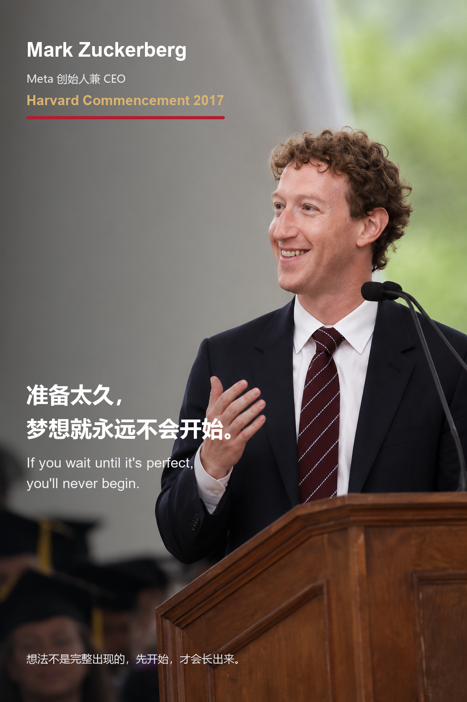

Mark Zuckerberg 在 Harvard 2017 毕业典礼上讲了使命、社区和年轻人的行动。卡片上的句子是：

> 准备太久，梦想就永远不会开始。  
> If you wait until it's perfect, you'll never begin.

这场演讲里最适合毕业季的一点，是他讲“想法不是完整出现的”。很多人会想等规划完整、能力完整、风险消失之后再开始，可现实往往相反：先动起来，想法才会在行动里长出真正的形状。

来源链接：[Harvard Gazette - Mark Zuckerberg's speech as written for Harvard's Class of 2017](https://news.harvard.edu/gazette/story/2017/05/mark-zuckerbergs-speech-as-written-for-harvards-class-of-2017/)

<!-- speech-excerpt-panel:start:mark-zuckerberg -->
<section class="speech-excerpt" data-speech-panel data-speech-id="mark-zuckerberg" data-speech-lang="zh">
  <button class="speech-excerpt__toggle" id="speech-panel-mark-zuckerberg-toggle" type="button" aria-expanded="false" aria-controls="speech-panel-mark-zuckerberg-body" data-speech-toggle>
    <span class="speech-excerpt__toggle-copy">
      <span class="speech-excerpt__eyebrow">演讲内容</span>
      <strong class="speech-excerpt__title">Mark Zuckerberg</strong>
      <span class="speech-excerpt__meta">Harvard Commencement 2017</span>
    </span>
    <span class="speech-excerpt__toggle-icon" aria-hidden="true">展开</span>
  </button>
  <div class="speech-excerpt__body" id="speech-panel-mark-zuckerberg-body" role="region" aria-labelledby="speech-panel-mark-zuckerberg-toggle" hidden>
    <div class="speech-excerpt__toolbar" role="group" aria-label="语言切换">
      <button class="speech-excerpt__lang is-active" type="button" data-speech-lang-button="zh" aria-pressed="true">中文</button>
      <button class="speech-excerpt__lang" type="button" data-speech-lang-button="en" aria-pressed="false">English</button>
    </div>
    <div class="speech-excerpt__content" data-speech-content="zh">
      <p class="speech-excerpt__label">中文短译</p>
      <blockquote class="speech-excerpt__quote">想法不会一开始就完整成形。</blockquote>
      <p class="speech-excerpt__note">短摘录来源：Harvard Gazette。完整语境请阅读下方来源链接。</p>
    </div>
    <div class="speech-excerpt__content" data-speech-content="en" lang="en" hidden aria-hidden="true">
      <p class="speech-excerpt__label">English excerpt</p>
      <blockquote class="speech-excerpt__quote">Ideas don&#x27;t come out fully formed.</blockquote>
      <p class="speech-excerpt__note">Short excerpt source: Harvard Gazette. Read the linked source for full context.</p>
    </div>
    <ul class="speech-excerpt__sources" aria-label="来源链接">
    <li class="speech-excerpt__source-item"><a class="speech-excerpt__source-link" href="https://news.harvard.edu/gazette/story/2017/05/mark-zuckerbergs-speech-as-written-for-harvards-class-of-2017/" target="_blank" rel="noopener noreferrer">Harvard Gazette</a><span class="speech-excerpt__source-meta">Harvard Gazette · 2017-05-25</span><span class="speech-excerpt__source-title">Mark Zuckerberg&#x27;s speech as written for Harvard&#x27;s Class of 2017</span></li>
    </ul>
  </div>
</section>
<!-- speech-excerpt-panel:end:mark-zuckerberg -->


## Park Bo-young：不卷别人，也不输给昨天


Park Bo-young 这条来自 Baeksang Arts Awards 2026 获奖感言，严格说它不是毕业演讲，但我还是把它放进了这组图里。卡片上的句子是：

> 我讨厌竞争，但我不想输给昨天的自己。  
> I hate competition, but I won't lose to yesterday's self.

这句话像是给毕业季加了一点缓冲。很多人已经厌倦了排名、比较和外部竞争，但这不等于放弃认真生活。它说的是另一种温柔的自我要求：不用卷赢所有人，但至少想认真回应昨天的自己。

来源链接：[MK English - Park Bo-young's Baeksang acceptance speech](https://www.mk.co.kr/en/entertain/12044203)

<!-- speech-excerpt-panel:start:park-bo-young -->
<section class="speech-excerpt" data-speech-panel data-speech-id="park-bo-young" data-speech-lang="zh">
  <button class="speech-excerpt__toggle" id="speech-panel-park-bo-young-toggle" type="button" aria-expanded="false" aria-controls="speech-panel-park-bo-young-body" data-speech-toggle>
    <span class="speech-excerpt__toggle-copy">
      <span class="speech-excerpt__eyebrow">演讲内容</span>
      <strong class="speech-excerpt__title">Park Bo-young</strong>
      <span class="speech-excerpt__meta">Baeksang Arts Awards 2026</span>
    </span>
    <span class="speech-excerpt__toggle-icon" aria-hidden="true">展开</span>
  </button>
  <div class="speech-excerpt__body" id="speech-panel-park-bo-young-body" role="region" aria-labelledby="speech-panel-park-bo-young-toggle" hidden>
    <div class="speech-excerpt__toolbar" role="group" aria-label="语言切换">
      <button class="speech-excerpt__lang is-active" type="button" data-speech-lang-button="zh" aria-pressed="true">中文</button>
      <button class="speech-excerpt__lang" type="button" data-speech-lang-button="en" aria-pressed="false">English</button>
    </div>
    <div class="speech-excerpt__content" data-speech-content="zh">
      <p class="speech-excerpt__label">中文短译</p>
      <blockquote class="speech-excerpt__quote">暂无可验证短摘录；请打开来源链接阅读完整语境。</blockquote>
      <p class="speech-excerpt__note">短摘录来源：来源页。完整语境请阅读下方来源链接。</p>
    </div>
    <div class="speech-excerpt__content" data-speech-content="en" lang="en" hidden aria-hidden="true">
      <p class="speech-excerpt__label">English excerpt</p>
      <blockquote class="speech-excerpt__quote">No verified short excerpt was collected. Please read the linked source for the full context.</blockquote>
      <p class="speech-excerpt__note">Short excerpt source: 来源页. Read the linked source for full context.</p>
    </div>
    <ul class="speech-excerpt__sources" aria-label="来源链接">
    <li class="speech-excerpt__source-item"><a class="speech-excerpt__source-link" href="https://www.mk.co.kr/en/entertain/12044203" target="_blank" rel="noopener noreferrer">MK English</a><span class="speech-excerpt__source-meta">매일경제 · 2026-05-12</span><span class="speech-excerpt__source-title">Actor Park Bo-young drew smiles from fans with her lovely daily life.Park Bo-young released several .. - MK</span></li>
    </ul>
  </div>
</section>
<!-- speech-excerpt-panel:end:park-bo-young -->


## Steve Jobs：不要活在别人的剧本里

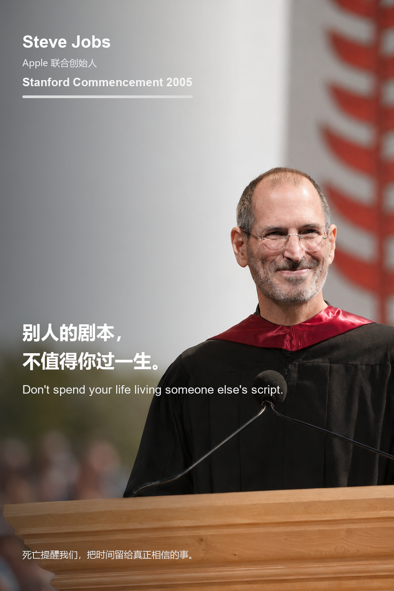

Steve Jobs 在 Stanford 2005 的演讲已经是毕业演讲里的经典样本。卡片上的句子是：

> 别人的剧本，不值得你过一生。  
> Don't spend your life living someone else's script.

他讲连点成线，讲热爱与失去，也讲死亡意识。它最重的地方不是煽情，而是那句非常朴素的提醒：你的时间有限。毕业季看到这张图，我希望它更安静一点，像是把人生重新交还给自己。

来源链接：[Stanford News - You've got to find what you love, Jobs says](https://news.stanford.edu/stories/2005/06/youve-got-find-love-jobs-says)、[YouTube - Steve Jobs' 2005 Stanford Commencement Address](https://www.youtube.com/watch?v=UF8uR6Z6KLc)

<!-- speech-excerpt-panel:start:steve-jobs -->
<section class="speech-excerpt" data-speech-panel data-speech-id="steve-jobs" data-speech-lang="zh">
  <button class="speech-excerpt__toggle" id="speech-panel-steve-jobs-toggle" type="button" aria-expanded="false" aria-controls="speech-panel-steve-jobs-body" data-speech-toggle>
    <span class="speech-excerpt__toggle-copy">
      <span class="speech-excerpt__eyebrow">演讲内容</span>
      <strong class="speech-excerpt__title">Steve Jobs</strong>
      <span class="speech-excerpt__meta">Stanford Commencement 2005</span>
    </span>
    <span class="speech-excerpt__toggle-icon" aria-hidden="true">展开</span>
  </button>
  <div class="speech-excerpt__body" id="speech-panel-steve-jobs-body" role="region" aria-labelledby="speech-panel-steve-jobs-toggle" hidden>
    <div class="speech-excerpt__toolbar" role="group" aria-label="语言切换">
      <button class="speech-excerpt__lang is-active" type="button" data-speech-lang-button="zh" aria-pressed="true">中文</button>
      <button class="speech-excerpt__lang" type="button" data-speech-lang-button="en" aria-pressed="false">English</button>
    </div>
    <div class="speech-excerpt__content" data-speech-content="zh">
      <p class="speech-excerpt__label">中文短译</p>
      <blockquote class="speech-excerpt__quote">暂无可验证短摘录；请打开来源链接阅读完整语境。</blockquote>
      <p class="speech-excerpt__note">短摘录来源：来源页。完整语境请阅读下方来源链接。</p>
    </div>
    <div class="speech-excerpt__content" data-speech-content="en" lang="en" hidden aria-hidden="true">
      <p class="speech-excerpt__label">English excerpt</p>
      <blockquote class="speech-excerpt__quote">No verified short excerpt was collected. Please read the linked source for the full context.</blockquote>
      <p class="speech-excerpt__note">Short excerpt source: 来源页. Read the linked source for full context.</p>
    </div>
    <ul class="speech-excerpt__sources" aria-label="来源链接">
    <li class="speech-excerpt__source-item"><a class="speech-excerpt__source-link" href="https://news.stanford.edu/stories/2005/06/youve-got-find-love-jobs-says" target="_blank" rel="noopener noreferrer">Stanford Report</a><span class="speech-excerpt__source-meta">Stanford Report · 发布时间未标注</span><span class="speech-excerpt__source-title">Stanford Report</span></li>
    </ul>
  </div>
</section>
<!-- speech-excerpt-panel:end:steve-jobs -->


## Jeff Bezos：聪明是礼物，善良是选择

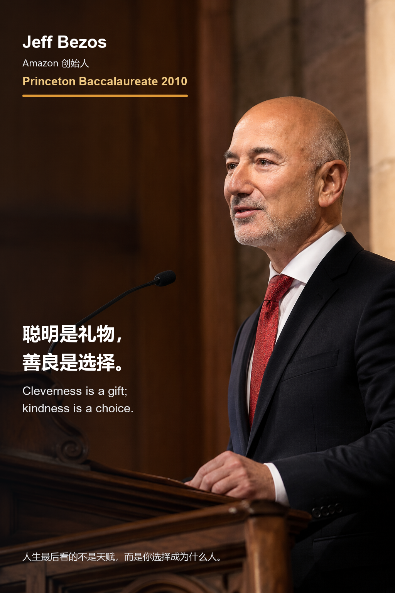

Jeff Bezos 在 Princeton 2010 Baccalaureate 演讲里没有把重点放在商业成功上，而是讲选择。卡片上的句子是：

> 聪明是礼物，善良是选择。  
> Cleverness is a gift; kindness is a choice.

这场演讲很适合毕业生，因为它把人生评价标准从“你有多聪明”转向“你做过什么选择”。天赋会让人走得快，但最后定义一个人的，还是那些一次次由自己做出的选择。

来源链接：[Princeton - 2010 Baccalaureate remarks](https://www.princeton.edu/news/2010/05/30/2010-baccalaureate-remarks)

<!-- speech-excerpt-panel:start:jeff-bezos -->
<section class="speech-excerpt" data-speech-panel data-speech-id="jeff-bezos" data-speech-lang="zh">
  <button class="speech-excerpt__toggle" id="speech-panel-jeff-bezos-toggle" type="button" aria-expanded="false" aria-controls="speech-panel-jeff-bezos-body" data-speech-toggle>
    <span class="speech-excerpt__toggle-copy">
      <span class="speech-excerpt__eyebrow">演讲内容</span>
      <strong class="speech-excerpt__title">Jeff Bezos</strong>
      <span class="speech-excerpt__meta">Princeton Baccalaureate 2010</span>
    </span>
    <span class="speech-excerpt__toggle-icon" aria-hidden="true">展开</span>
  </button>
  <div class="speech-excerpt__body" id="speech-panel-jeff-bezos-body" role="region" aria-labelledby="speech-panel-jeff-bezos-toggle" hidden>
    <div class="speech-excerpt__toolbar" role="group" aria-label="语言切换">
      <button class="speech-excerpt__lang is-active" type="button" data-speech-lang-button="zh" aria-pressed="true">中文</button>
      <button class="speech-excerpt__lang" type="button" data-speech-lang-button="en" aria-pressed="false">English</button>
    </div>
    <div class="speech-excerpt__content" data-speech-content="zh">
      <p class="speech-excerpt__label">中文短译</p>
      <blockquote class="speech-excerpt__quote">暂无可验证短摘录；请打开来源链接阅读完整语境。</blockquote>
      <p class="speech-excerpt__note">短摘录来源：来源页。完整语境请阅读下方来源链接。</p>
    </div>
    <div class="speech-excerpt__content" data-speech-content="en" lang="en" hidden aria-hidden="true">
      <p class="speech-excerpt__label">English excerpt</p>
      <blockquote class="speech-excerpt__quote">No verified short excerpt was collected. Please read the linked source for the full context.</blockquote>
      <p class="speech-excerpt__note">Short excerpt source: 来源页. Read the linked source for full context.</p>
    </div>
    <ul class="speech-excerpt__sources" aria-label="来源链接">
    <li class="speech-excerpt__source-item"><a class="speech-excerpt__source-link" href="https://www.princeton.edu/news/2010/05/30/2010-baccalaureate-remarks" target="_blank" rel="noopener noreferrer">Princeton</a><span class="speech-excerpt__source-meta">Princeton · 发布时间未标注</span><span class="speech-excerpt__source-title">Princeton</span></li>
    </ul>
  </div>
</section>
<!-- speech-excerpt-panel:end:jeff-bezos -->


## Bill Gates：人生不是单线程任务

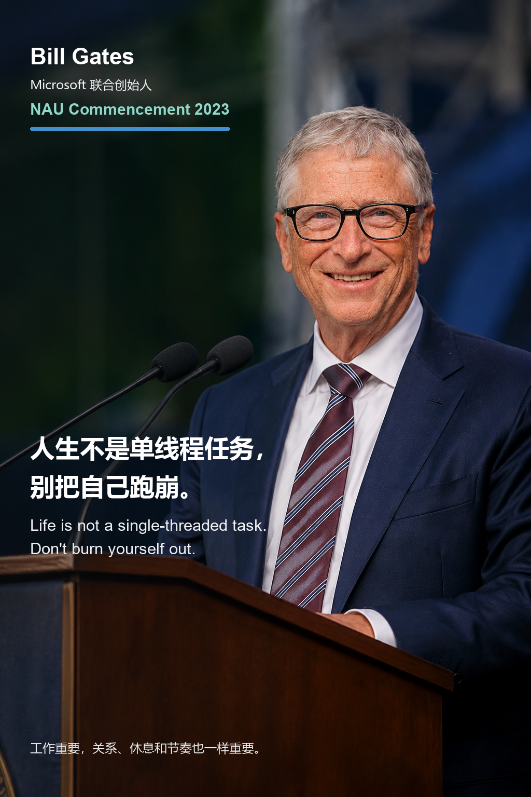

Bill Gates 在 Northern Arizona University 2023 毕业典礼上讲了几件“希望年轻时有人告诉我”的事。卡片上的句子是：

> 人生不是单线程任务，别把自己跑崩。  
> Life is not a single-threaded task. Don't burn yourself out.

这场演讲难得的地方，是它不像“成功人士教你拼命”。他谈到自己年轻时过于单线程的工作方式，也提醒毕业生：工作和成绩很重要，但关系、身体、好奇心、休息和节奏也同样会塑造一个人。

来源链接：[GatesNotes - 5 things I wish I heard at the graduation I never had](https://www.gatesnotes.com/NAU-Commencement-Speech)

<!-- speech-excerpt-panel:start:bill-gates -->
<section class="speech-excerpt" data-speech-panel data-speech-id="bill-gates" data-speech-lang="zh">
  <button class="speech-excerpt__toggle" id="speech-panel-bill-gates-toggle" type="button" aria-expanded="false" aria-controls="speech-panel-bill-gates-body" data-speech-toggle>
    <span class="speech-excerpt__toggle-copy">
      <span class="speech-excerpt__eyebrow">演讲内容</span>
      <strong class="speech-excerpt__title">Bill Gates</strong>
      <span class="speech-excerpt__meta">NAU Commencement 2023</span>
    </span>
    <span class="speech-excerpt__toggle-icon" aria-hidden="true">展开</span>
  </button>
  <div class="speech-excerpt__body" id="speech-panel-bill-gates-body" role="region" aria-labelledby="speech-panel-bill-gates-toggle" hidden>
    <div class="speech-excerpt__toolbar" role="group" aria-label="语言切换">
      <button class="speech-excerpt__lang is-active" type="button" data-speech-lang-button="zh" aria-pressed="true">中文</button>
      <button class="speech-excerpt__lang" type="button" data-speech-lang-button="en" aria-pressed="false">English</button>
    </div>
    <div class="speech-excerpt__content" data-speech-content="zh">
      <p class="speech-excerpt__label">中文短译</p>
      <blockquote class="speech-excerpt__quote">暂无可验证短摘录；请打开来源链接阅读完整语境。</blockquote>
      <p class="speech-excerpt__note">短摘录来源：来源页。完整语境请阅读下方来源链接。</p>
    </div>
    <div class="speech-excerpt__content" data-speech-content="en" lang="en" hidden aria-hidden="true">
      <p class="speech-excerpt__label">English excerpt</p>
      <blockquote class="speech-excerpt__quote">No verified short excerpt was collected. Please read the linked source for the full context.</blockquote>
      <p class="speech-excerpt__note">Short excerpt source: 来源页. Read the linked source for full context.</p>
    </div>
    <ul class="speech-excerpt__sources" aria-label="来源链接">
    <li class="speech-excerpt__source-item"><a class="speech-excerpt__source-link" href="https://www.gatesnotes.com/NAU-Commencement-Speech" target="_blank" rel="noopener noreferrer">GatesNotes</a><span class="speech-excerpt__source-meta">GatesNotes · 发布时间未标注</span><span class="speech-excerpt__source-title">GatesNotes</span></li>
    </ul>
  </div>
</section>
<!-- speech-excerpt-panel:end:bill-gates -->


## Tim Cook：建设者要承担后果

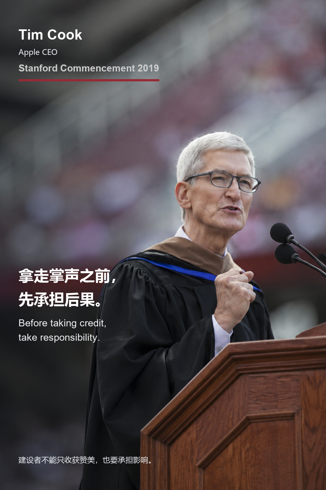

Tim Cook 在 Stanford 2019 毕业典礼上谈到了科技行业、隐私、权力和责任。卡片上的句子是：

> 拿走掌声之前，先承担后果。  
> Before taking credit, take responsibility.

这张图卡的情绪更冷静。它不像热血创业演讲，而像是写给未来掌权者的一封提醒：真正的建设者不能只享受成果，也必须承担创造带来的影响。

来源链接：[Stanford Report - Remarks by Tim Cook at 2019 Stanford Commencement](https://news.stanford.edu/2019/06/16/remarks-tim-cook-2019-stanford-commencement/)

<!-- speech-excerpt-panel:start:tim-cook -->
<section class="speech-excerpt" data-speech-panel data-speech-id="tim-cook" data-speech-lang="zh">
  <button class="speech-excerpt__toggle" id="speech-panel-tim-cook-toggle" type="button" aria-expanded="false" aria-controls="speech-panel-tim-cook-body" data-speech-toggle>
    <span class="speech-excerpt__toggle-copy">
      <span class="speech-excerpt__eyebrow">演讲内容</span>
      <strong class="speech-excerpt__title">Tim Cook</strong>
      <span class="speech-excerpt__meta">Stanford Commencement 2019</span>
    </span>
    <span class="speech-excerpt__toggle-icon" aria-hidden="true">展开</span>
  </button>
  <div class="speech-excerpt__body" id="speech-panel-tim-cook-body" role="region" aria-labelledby="speech-panel-tim-cook-toggle" hidden>
    <div class="speech-excerpt__toolbar" role="group" aria-label="语言切换">
      <button class="speech-excerpt__lang is-active" type="button" data-speech-lang-button="zh" aria-pressed="true">中文</button>
      <button class="speech-excerpt__lang" type="button" data-speech-lang-button="en" aria-pressed="false">English</button>
    </div>
    <div class="speech-excerpt__content" data-speech-content="zh">
      <p class="speech-excerpt__label">中文短译</p>
      <blockquote class="speech-excerpt__quote">暂无可验证短摘录；请打开来源链接阅读完整语境。</blockquote>
      <p class="speech-excerpt__note">短摘录来源：来源页。完整语境请阅读下方来源链接。</p>
    </div>
    <div class="speech-excerpt__content" data-speech-content="en" lang="en" hidden aria-hidden="true">
      <p class="speech-excerpt__label">English excerpt</p>
      <blockquote class="speech-excerpt__quote">No verified short excerpt was collected. Please read the linked source for the full context.</blockquote>
      <p class="speech-excerpt__note">Short excerpt source: 来源页. Read the linked source for full context.</p>
    </div>
    <ul class="speech-excerpt__sources" aria-label="来源链接">
    <li class="speech-excerpt__source-item"><a class="speech-excerpt__source-link" href="https://news.stanford.edu/2019/06/16/remarks-tim-cook-2019-stanford-commencement/" target="_blank" rel="noopener noreferrer">Stanford Report</a><span class="speech-excerpt__source-meta">Stanford Report · 发布时间未标注</span><span class="speech-excerpt__source-title">Stanford Report</span></li>
    </ul>
  </div>
</section>
<!-- speech-excerpt-panel:end:tim-cook -->


## Sheryl Sandberg：把 B 计划活成答案

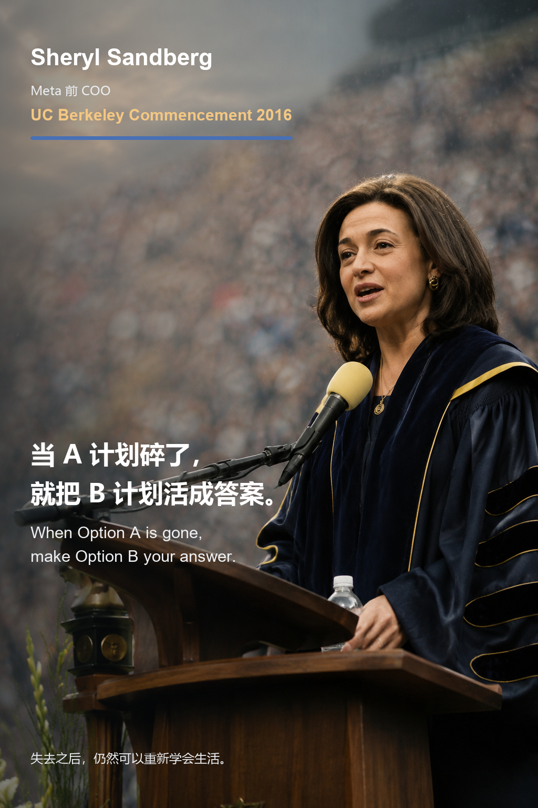

Sheryl Sandberg 在 UC Berkeley 2016 毕业典礼上的演讲，最动人的地方是她不是站在“成功者”的位置讲成功，而是站在失去之后讲如何继续生活。卡片上的句子是：

> 当 A 计划碎了，就把 B 计划活成答案。  
> When Option A is gone, make Option B your answer.

她谈到丈夫去世后的悲伤、复原力和 Option B。有些路不是你选的，有些断裂也不会提前征求同意，但人在剩下的路里，仍然可以重新长出力量。

来源链接：[Los Angeles Times - Sheryl Sandberg commencement address transcript](https://www.latimes.com/local/california/la-sheryl-sandberg-commencement-address-transcript-20160514-story.html)

<!-- speech-excerpt-panel:start:sheryl-sandberg -->
<section class="speech-excerpt" data-speech-panel data-speech-id="sheryl-sandberg" data-speech-lang="zh">
  <button class="speech-excerpt__toggle" id="speech-panel-sheryl-sandberg-toggle" type="button" aria-expanded="false" aria-controls="speech-panel-sheryl-sandberg-body" data-speech-toggle>
    <span class="speech-excerpt__toggle-copy">
      <span class="speech-excerpt__eyebrow">演讲内容</span>
      <strong class="speech-excerpt__title">Sheryl Sandberg</strong>
      <span class="speech-excerpt__meta">UC Berkeley Commencement 2016</span>
    </span>
    <span class="speech-excerpt__toggle-icon" aria-hidden="true">展开</span>
  </button>
  <div class="speech-excerpt__body" id="speech-panel-sheryl-sandberg-body" role="region" aria-labelledby="speech-panel-sheryl-sandberg-toggle" hidden>
    <div class="speech-excerpt__toolbar" role="group" aria-label="语言切换">
      <button class="speech-excerpt__lang is-active" type="button" data-speech-lang-button="zh" aria-pressed="true">中文</button>
      <button class="speech-excerpt__lang" type="button" data-speech-lang-button="en" aria-pressed="false">English</button>
    </div>
    <div class="speech-excerpt__content" data-speech-content="zh">
      <p class="speech-excerpt__label">中文短译</p>
      <blockquote class="speech-excerpt__quote">我理解了悲伤的深度，也理解了失去的残酷。</blockquote>
      <p class="speech-excerpt__note">短摘录来源：Los Angeles Times。完整语境请阅读下方来源链接。</p>
    </div>
    <div class="speech-excerpt__content" data-speech-content="en" lang="en" hidden aria-hidden="true">
      <p class="speech-excerpt__label">English excerpt</p>
      <blockquote class="speech-excerpt__quote">I learned about the depths of sadness and the brutality of loss.</blockquote>
      <p class="speech-excerpt__note">Short excerpt source: Los Angeles Times. Read the linked source for full context.</p>
    </div>
    <ul class="speech-excerpt__sources" aria-label="来源链接">
    <li class="speech-excerpt__source-item"><a class="speech-excerpt__source-link" href="https://www.latimes.com/local/california/la-sheryl-sandberg-commencement-address-transcript-20160514-story.html" target="_blank" rel="noopener noreferrer">Los Angeles Times</a><span class="speech-excerpt__source-meta">Los Angeles Times · 2016-05-14</span><span class="speech-excerpt__source-title">Transcript: Sheryl Sandberg&#x27;s 2016 Commencement Address at University of California, Berkeley</span></li>
    </ul>
  </div>
</section>
<!-- speech-excerpt-panel:end:sheryl-sandberg -->


## Sundar Pichai：保持不耐烦，也保持希望


Sundar Pichai 的 Dear Class of 2020 面向的是一届被迫在线上告别校园的毕业生。卡片上的句子是：

> 保持不耐烦，也保持希望。  
> Stay impatient. Stay hopeful.

他讲自己的成长和技术变迁，也把重点落在年轻人的“不耐烦”上：不要太快适应一个不够好的世界。希望不是安慰剂，不耐烦也不是坏脾气，它们合在一起，才像是一个年轻人想改变世界的冲动。

来源链接：[Google Blog - Sundar Pichai's message to the Class of 2020](https://blog.google/products/youtube/sundar-pichai-message-class-2020/)

<!-- speech-excerpt-panel:start:sundar-pichai -->
<section class="speech-excerpt" data-speech-panel data-speech-id="sundar-pichai" data-speech-lang="zh">
  <button class="speech-excerpt__toggle" id="speech-panel-sundar-pichai-toggle" type="button" aria-expanded="false" aria-controls="speech-panel-sundar-pichai-body" data-speech-toggle>
    <span class="speech-excerpt__toggle-copy">
      <span class="speech-excerpt__eyebrow">演讲内容</span>
      <strong class="speech-excerpt__title">Sundar Pichai</strong>
      <span class="speech-excerpt__meta">Dear Class of 2020</span>
    </span>
    <span class="speech-excerpt__toggle-icon" aria-hidden="true">展开</span>
  </button>
  <div class="speech-excerpt__body" id="speech-panel-sundar-pichai-body" role="region" aria-labelledby="speech-panel-sundar-pichai-toggle" hidden>
    <div class="speech-excerpt__toolbar" role="group" aria-label="语言切换">
      <button class="speech-excerpt__lang is-active" type="button" data-speech-lang-button="zh" aria-pressed="true">中文</button>
      <button class="speech-excerpt__lang" type="button" data-speech-lang-button="en" aria-pressed="false">English</button>
    </div>
    <div class="speech-excerpt__content" data-speech-content="zh">
      <p class="speech-excerpt__label">中文短译</p>
      <blockquote class="speech-excerpt__quote">保持不耐烦，它会创造世界需要的进步。</blockquote>
      <p class="speech-excerpt__note">短摘录来源：Google Blog。完整语境请阅读下方来源链接。</p>
    </div>
    <div class="speech-excerpt__content" data-speech-content="en" lang="en" hidden aria-hidden="true">
      <p class="speech-excerpt__label">English excerpt</p>
      <blockquote class="speech-excerpt__quote">Be impatient. It will create the progress the world needs.</blockquote>
      <p class="speech-excerpt__note">Short excerpt source: Google Blog. Read the linked source for full context.</p>
    </div>
    <ul class="speech-excerpt__sources" aria-label="来源链接">
    <li class="speech-excerpt__source-item"><a class="speech-excerpt__source-link" href="https://blog.google/products-and-platforms/products/youtube/sundar-pichai-message-class-2020/" target="_blank" rel="noopener noreferrer">Google Blog</a><span class="speech-excerpt__source-meta">Google · 2020-06-07</span><span class="speech-excerpt__source-title">You Will Prevail - A message to the Class of 2020</span></li>
    </ul>
  </div>
</section>
<!-- speech-excerpt-panel:end:sundar-pichai -->


## J.K. Rowling：失败之后，想象力让人重新开始

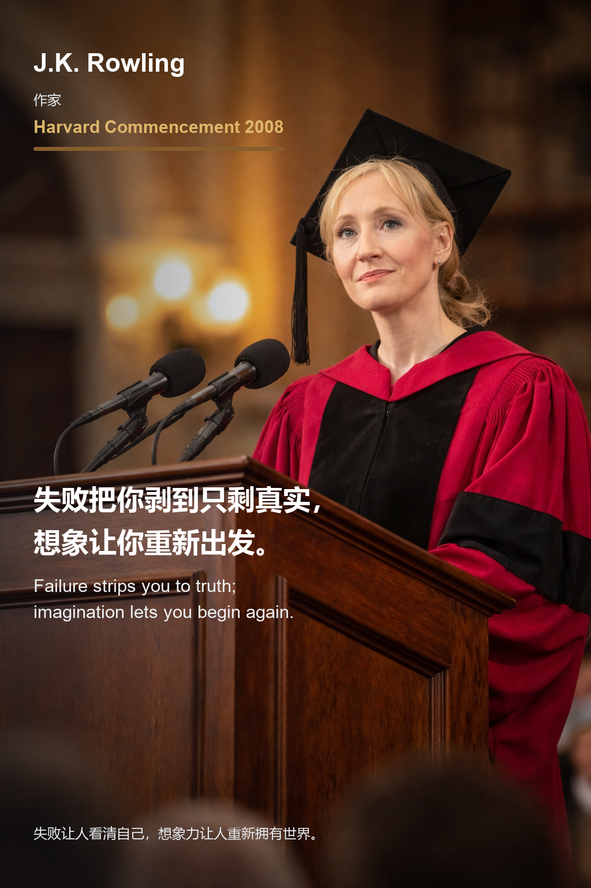

J.K. Rowling 在 Harvard 2008 的演讲，很适合作为这组图卡的收尾。卡片上的句子是：

> 失败把你剥到只剩真实，想象让你重新出发。  
> Failure strips you to truth; imagination lets you begin again.

她把失败讲得很诚实：失败会让人失去很多外壳，但也会让人看清真正重要的东西。随后她又把“想象力”从写作能力扩展成一种理解他人痛苦、重新创造人生的能力。毕业季到这里，也就从“出发”回到了“重新出发”。

来源链接：[Harvard Gazette - Text of J.K. Rowling's speech](https://news.harvard.edu/gazette/story/2008/06/text-of-j-k-rowling-speech/)

<!-- speech-excerpt-panel:start:jk-rowling -->
<section class="speech-excerpt" data-speech-panel data-speech-id="jk-rowling" data-speech-lang="zh">
  <button class="speech-excerpt__toggle" id="speech-panel-jk-rowling-toggle" type="button" aria-expanded="false" aria-controls="speech-panel-jk-rowling-body" data-speech-toggle>
    <span class="speech-excerpt__toggle-copy">
      <span class="speech-excerpt__eyebrow">演讲内容</span>
      <strong class="speech-excerpt__title">J.K. Rowling</strong>
      <span class="speech-excerpt__meta">Harvard Commencement 2008</span>
    </span>
    <span class="speech-excerpt__toggle-icon" aria-hidden="true">展开</span>
  </button>
  <div class="speech-excerpt__body" id="speech-panel-jk-rowling-body" role="region" aria-labelledby="speech-panel-jk-rowling-toggle" hidden>
    <div class="speech-excerpt__toolbar" role="group" aria-label="语言切换">
      <button class="speech-excerpt__lang is-active" type="button" data-speech-lang-button="zh" aria-pressed="true">中文</button>
      <button class="speech-excerpt__lang" type="button" data-speech-lang-button="en" aria-pressed="false">English</button>
    </div>
    <div class="speech-excerpt__content" data-speech-content="zh">
      <p class="speech-excerpt__label">中文短译</p>
      <blockquote class="speech-excerpt__quote">失败意味着剥离掉那些不必要的东西。</blockquote>
      <p class="speech-excerpt__note">短摘录来源：Harvard Gazette。完整语境请阅读下方来源链接。</p>
    </div>
    <div class="speech-excerpt__content" data-speech-content="en" lang="en" hidden aria-hidden="true">
      <p class="speech-excerpt__label">English excerpt</p>
      <blockquote class="speech-excerpt__quote">Failure meant a stripping away of the inessential.</blockquote>
      <p class="speech-excerpt__note">Short excerpt source: Harvard Gazette. Read the linked source for full context.</p>
    </div>
    <ul class="speech-excerpt__sources" aria-label="来源链接">
    <li class="speech-excerpt__source-item"><a class="speech-excerpt__source-link" href="https://news.harvard.edu/gazette/story/2008/06/text-of-j-k-rowling-speech/" target="_blank" rel="noopener noreferrer">Harvard Gazette</a><span class="speech-excerpt__source-meta">Harvard Gazette · 2008-06-05</span><span class="speech-excerpt__source-title">Text of J.K. Rowling&#x27;s speech — Harvard Gazette</span></li>
    </ul>
  </div>
</section>
<!-- speech-excerpt-panel:end:jk-rowling -->


## 生成工作流

这组图不是让模型直接写字。我的做法是先让 GPT-image-2 只负责“人物长相、演讲现场、画面留白”，再用 Python 后期排版。这样做的好处很直接：中文不会乱写，英文不会拼错，版面也更可控。

完整素材和脚本在本地这个目录里：

```text
C:\Files\学校文件\2026 毕业
```

实际流程是：

1. 整理资料：先在 `毕业演讲朋友圈图卡素材.md` 里写好人物、场合、身份、中文金句、英文金句、主题概括、内容说明和来源链接。
2. 准备参考图：`wikipedia` 目录放人物肖像，`reference` 目录放演讲或公开发言现场图，用来锁定长相、场景、服装和年代感。
3. 生成无字底图：运行 `_generate_speech_bases.py`，通过图像 API 生成每个人的 `base.png`。提示词里反复强调 `no text, no watermark, no logo`，并要求画面左侧或右侧留出干净负空间。
4. 后期加字：运行 `_render_speech_cards.py`，用 Pillow 打开 `base.png`，叠一层半透明遮罩，再写人物名、身份、场合、中英文金句和底部短评，输出 `card.png`。
5. 拼总览图：运行 `_make_generated_contact_sheet.py`，把 12 张 `card.png` 缩成 3 列总览，输出 `_contact_sheet.png`。
6. 发布到 Hugo：把总览图和 12 张卡片复制到 `content/posts/images/2026毕业演讲朋友圈图卡/`，正文里用 `./images/2026毕业演讲朋友圈图卡/...` 引用。构建前 `scripts/sync_images.py` 会把文章图片同步到 `static/images`。

生成底图时的命令大概长这样：

```powershell
$env:JUNE_IMAGE_API_KEY = "<你的 key>"
py -3.11 "C:\Files\学校文件\2026 毕业\_generate_speech_bases.py"
```

如果只想重新生成某几个人，也可以通过脚本里的 `ONLY_PEOPLE` 环境变量过滤：

```powershell
$env:ONLY_PEOPLE = "Lisa Su|Jensen Huang"
py -3.11 "C:\Files\学校文件\2026 毕业\_generate_speech_bases.py"
```

加字和拼总览图则是：

```powershell
py -3.11 "C:\Files\学校文件\2026 毕业\_render_speech_cards.py"
py -3.11 "C:\Files\学校文件\2026 毕业\_make_generated_contact_sheet.py"
```

## Python 加文字的核心代码

下面这段是从 `_render_speech_cards.py` 里提炼出来的核心逻辑：先给底图左侧加暗色渐变，保证文字能压住背景；再按中英文标点拆句；如果某一行太长，就自动缩小字号；最后把人物、身份、场合、金句和底部短句画上去。

```python
from pathlib import Path
import re

from PIL import Image, ImageDraw, ImageFont


ROOT = Path(r"C:\Files\学校文件\2026 毕业")


def fit_font(font_path, text, max_width, start_size=48, min_size=28):
    scratch = ImageDraw.Draw(Image.new("RGB", (1, 1)))
    for size in range(start_size, min_size - 1, -1):
        font = ImageFont.truetype(font_path, size)
        width = scratch.textbbox((0, 0), text, font=font)[2]
        if width <= max_width:
            return font
    return ImageFont.truetype(font_path, min_size)


def split_sentence(text):
    pattern = r"[^，；。！？,;.?!]+[，；。！？,;.?!]?"
    lines = [m.group(0).strip() for m in re.finditer(pattern, text)]
    return [line for line in lines if line] or [text]


def draw_sentence_lines(draw, text, xy, font_path, fill, max_width, start_size, min_size):
    x, y = xy
    for line in split_sentence(text):
        font = fit_font(font_path, line, max_width, start_size, min_size)
        draw.text((x, y), line, font=font, fill=fill)
        box = draw.textbbox((x, y), line, font=font)
        y = box[3] + 14
    return y


def render_card(person, payload):
    person_dir = ROOT / "generated" / person
    image = Image.open(person_dir / "base.png").convert("RGBA")
    width, height = image.size

    # 给左侧文字区压一层半透明暗色渐变。
    overlay = Image.new("RGBA", image.size, (0, 0, 0, 0))
    pixels = overlay.load()
    for x in range(width):
        alpha = int(max(0, 128 * (1 - x / 625)))
        for y in range(height):
            pixels[x, y] = (14, 18, 23, alpha)
    image = Image.alpha_composite(image, overlay)

    draw = ImageDraw.Draw(image)
    left = 58
    max_width = width - left - 58

    name_font = ImageFont.truetype(r"C:\Windows\Fonts\arialbd.ttf", 44)
    cn_font = r"C:\Windows\Fonts\msyhbd.ttc"
    en_font = r"C:\Windows\Fonts\arial.ttf"
    small_cn = ImageFont.truetype(r"C:\Windows\Fonts\msyh.ttc", 24)
    small_en = ImageFont.truetype(r"C:\Windows\Fonts\arialbd.ttf", 30)

    draw.text((left, 84), payload["name"], font=name_font, fill=(255, 255, 255, 246))
    draw.text((left, 150), payload["identity"], font=small_cn, fill=(235, 238, 242, 220))
    draw.text((left, 195), payload["occasion"], font=small_en, fill=payload["gold"] + (235,))

    y = draw_sentence_lines(
        draw,
        payload["cn"],
        (left, 830),
        cn_font,
        (255, 255, 255, 248),
        max_width,
        start_size=48,
        min_size=39,
    )
    draw_sentence_lines(
        draw,
        payload["en"],
        (left, y + 16),
        en_font,
        (237, 239, 242, 224),
        max_width,
        start_size=31,
        min_size=25,
    )

    draw.text((left, height - 112), payload["footer"], font=small_cn, fill=(232, 235, 239, 205))
    image.convert("RGB").save(person_dir / "card.png", quality=96)
```


```powershell
py -3.11 scripts/sync_images.py
hugo --buildFuture
```

