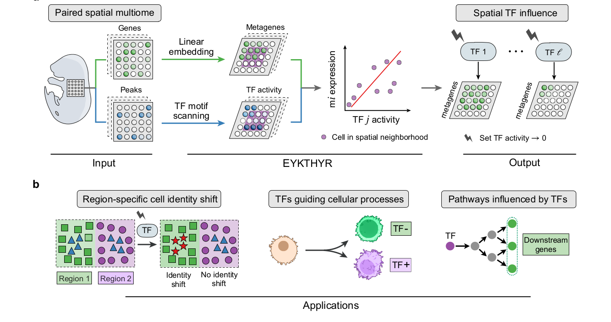
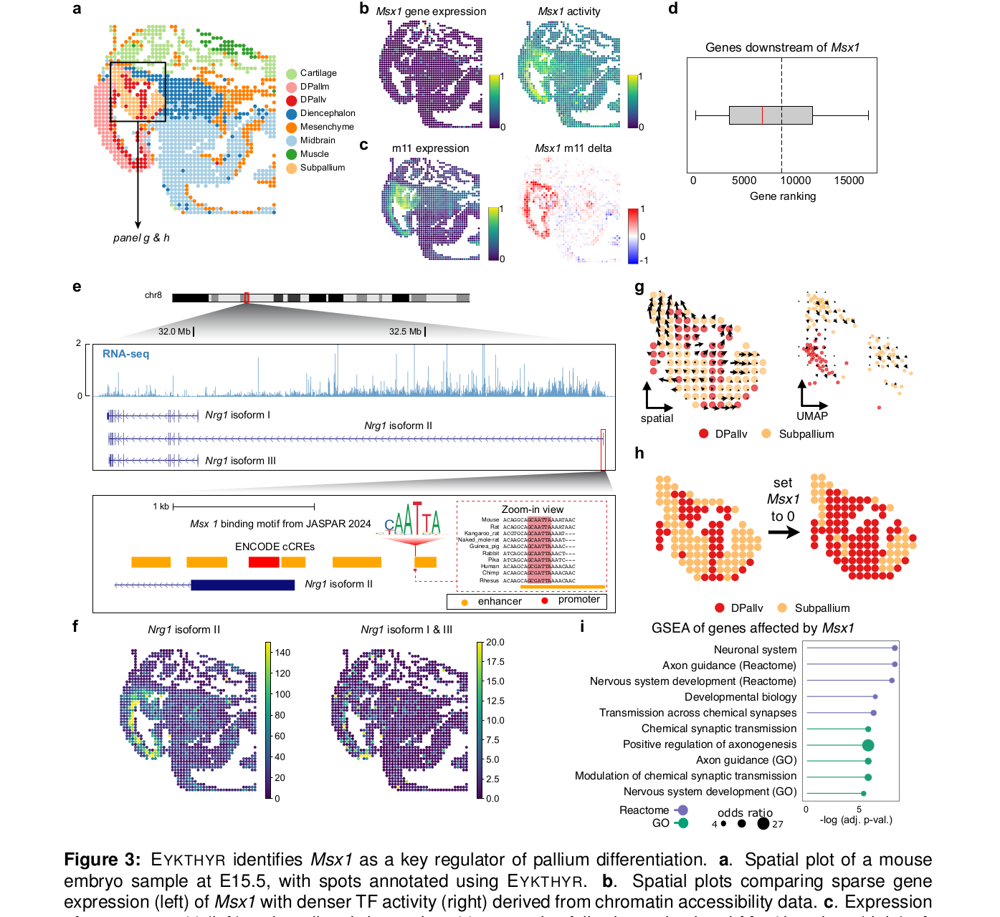
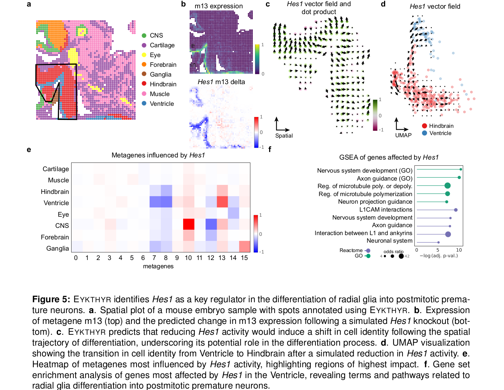
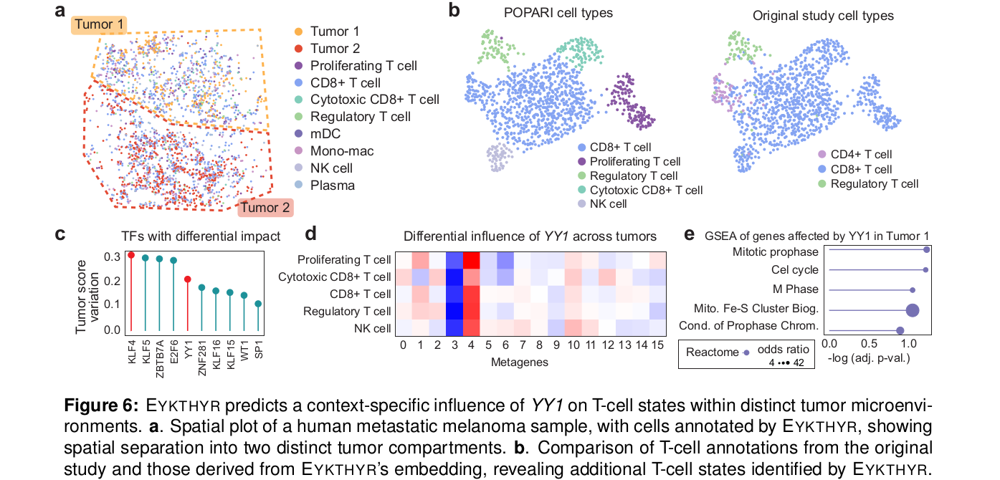

---
cover:
  image: /images/header_img/snow-4936687.jpg
title: EYKTHYR：从空间多组学中寻找驱动基因程序的转录因子
date: 2026-05-08
author: June
slug: eykthyr-spatial-gene-programs
tags:
    - 技术
    - 技术/生信
    - 技术/生信/论文
draft: false
---

# EYKTHYR：从空间多组学中寻找驱动基因程序的转录因子

## 1. 文章信息

- 原文：[`EYKTHYR reveals transcriptional regulators of spatial gene programs`](https://www.biorxiv.org/content/10.1101/2025.05.19.654884v1)
- DOI：[`10.1101/2025.05.19.654884`](https://doi.org/10.1101/2025.05.19.654884)
- PubMed：[`PMID 40475415`](https://pubmed.ncbi.nlm.nih.gov/40475415/)
- 代码：[`gkrieg/eykthyr`](https://github.com/gkrieg/eykthyr)
- 作者：Spencer Krieger, Ellie Haber, Jian Ma
- 机构：Carnegie Mellon University
- 类型：`bioRxiv` 预印本，尚未同行评议
- 版本日期：2025-05-23

这篇文章提出的 `EYKTHYR` 是一个面向空间多组学的转录因子调控推断框架。它把空间转录组、空间染色质可及性和细胞空间邻域放到同一个可解释模型里，通过模拟 `in silico TF knockout` 来判断哪些转录因子可能驱动了特定空间基因程序。

一句话说，它不是单纯问“哪个 TF 表达高”，而是问：在某个空间区域里，哪个 TF 的可及 motif 信号最可能解释某个空间 gene program 的变化。

## 2. 为什么这篇文章值得看

空间组学现在越来越容易同时拿到两类信息：一类是 RNA 表达，另一类是染色质可及性。问题是，有了这两张图以后，我们通常还是停留在比较表达量、比较 peaks、做 pathway enrichment 这些层面。它们能告诉我们“哪里不同”，但不太能直接回答“谁在驱动这些空间状态差异”。

传统 GRN 推断方法在这里有几个麻烦：

1. 很多方法没有显式使用空间上下文，会把局部组织微环境里的调控信号平均掉。
2. 如果只依赖 TF 自身的 RNA 表达，遇到 TF 低表达或 dropout 时很容易漏掉真正重要的调控因子。
3. 空间多组学数据往往稀疏，直接在 gene-level 上做调控网络，参数多、噪声大、解释也不稳。

`EYKTHYR` 的切入点很聪明：先把表达矩阵压缩成少数可解释的空间 `metagene`，再把 ATAC 数据转成 `TF activity`，然后在每个局部空间邻域里拟合 TF 到 metagene 的影响。这样既降低噪声，又保留了“某个 TF 影响哪个空间基因程序”的解释性。

## 3. 方法主线

Figure 1 基本把全文的方法逻辑画完了。左边输入是 paired spatial multiome：同一位置或同一细胞上的 RNA expression 与 chromatin accessibility。中间有两个关键转换：表达矩阵通过 `POPARI` 变成 metagenes；ATAC peaks 通过 motif annotation 变成 TF activity。右边的核心动作是对某个 TF 做虚拟敲除，也就是把该 TF activity 设为 0，再观察 metagene、cell identity 和下游基因会怎样变化。

可以把它拆成六步：

1. 用 `POPARI` 将表达矩阵嵌入到低维 metagene 空间。每个 metagene 对应一组空间共表达基因，因此 metagene 的变化还能映射回 gene-level。
2. 用 `ArchR`、`MACS2` 等流程处理 ATAC 数据，得到 cell-by-peak 矩阵。
3. 用 motif annotation 得到 peak-by-TF motif 矩阵，再通过 `A = P T` 把 peak accessibility 转成 TF activity。
4. 对每个 cell 或 spot 取空间近邻。作者经验上使用 100 个邻居较稳定，其中一半来自同 cell type，一半不限制 cell type。
5. 在每个局部邻域里训练 Ridge regression，把 TF activity 映射到 metagene expression，得到局部 TF-metagene influence weights。
6. 对某个 TF 做 `in silico knockout`，把该 TF 的 activity 设为 0，再通过线性权重传播到 metagene 和 gene-level，观察细胞状态、空间区域和通路层面的变化。

这个设计最重要的地方，是它没有把空间多组学整合做成一个黑箱分数。TF activity 到 metagene、metagene 到 gene expression 都保持线性映射，所以结果可以一路解释到“哪个 TF、哪个 metagene、哪些基因、哪个空间 compartment”。

## 4. 核心结果

### 4.1 小鼠脑发育：找到 pallium differentiation 的空间调控因子

作者首先在 MISAR-seq 小鼠胚胎脑发育数据上测试 `EYKTHYR`，关注 progenitors 向 dorsal pallium ventricular region、dorsal pallium mantle region 和 subpallium 的分化。

他们整理了文献中已知的 pallium differentiation 相关 TF，包括 `Arx`、`Emx1`、`Emx2`、`Gli3`、`Lef1`、`Lhx2`、`Nr2e1`、`Pax6`、`Sp8` 等。`EYKTHYR` 的评价方式不是只看 TF 排名，而是模拟 TF knockout 后，看细胞簇分离度、混合程度和扰动方向是否发生合理变化。

结果显示，top 20 TF 中有 14 个与 pallium、forebrain 或 visual cortex development 有关。已知 regulator 在多个指标上显著靠前，包括 silhouette、iLISI、PCR 和综合分数。相比之下，`CellOracle` 和 expression-only EYKTHYR 都没有明显优于随机，说明空间信息和 chromatin accessibility 在这个任务里确实提供了额外信息。

这部分结果给全文立住了第一个可信点：`EYKTHYR` 不是把非空间 GRN 方法硬套到空间数据上，而是确实利用了局部空间邻域和 ATAC motif activity。

### 4.2 Msx1 案例：低表达 TF 也能被 ATAC 信号救回来

`Msx1` 是这篇文章最有说服力的案例之一。它在该组织中的 RNA 表达很低，如果只看 TF transcript expression，很容易把它当作“不重要”。但 `EYKTHYR` 根据染色质可及性推断出 `Msx1` 在 pallium 和 diencephalon 中有较强 activity，并预测它调控 DPallv 相关 metagene `m11`。

更关键的是，作者把 metagene 变化映射回 gene-level 后，发现预测的 downstream genes 显著富集于已有小鼠 GRN 中的 `Msx1` downstream genes，P 值达到 `4e-7`。这说明模型不只是给出了一个漂亮的空间图，而是能和外部调控证据对上。

文章还提出了一个很有意思的候选机制：`Nrg1 isoform II` 的 alternative TSS 附近约 650 bp 有 `Msx1` motif，并且落在 ENCODE proximal cCRE 区域内。该 isoform 主要在 DPallv 表达，还和神经发育、精神分裂症相关线索有关。作者据此提出，`Msx1` 可能调控 `Nrg1 isoform II` 的区域特异表达。

这张图最值得看的地方，是它展示了为什么不能只盯着 TF 的 RNA 表达。`Msx1` 的 transcript 很稀疏，但 chromatin accessibility 推出来的 activity 更连续，也更有空间结构。对空间多组学来说，这种“RNA 不显眼、ATAC 很显眼”的 TF 可能正是最容易被传统分析漏掉的一类。

### 4.3 小鼠 hindbrain：沿 radial glia 分化轨迹识别 Hes1

第二个应用换成了小鼠胚胎 hindbrain 的 spatial ATAC/RNA-seq 数据，研究 radial glia 向 postmitotic premature neurons 分化。这里的问题不再是离散细胞簇是否分开，而是连续发育轨迹会怎样被 TF perturbation 改变。

作者用 ventricle spots 的空间距离定义 pseudotime，然后比较自然分化方向向量和 TF knockout 引起的 metagene shift 向量。简单说，如果敲掉某个 TF 后，细胞状态明显沿着或逆着发育方向移动，那这个 TF 就可能参与了这个分化过程。

`EYKTHYR` 在这里突出了 `Hes1`。模型显示 `Hes1` 强烈影响 ventricle-proximal cells 中的 metagene `m13`；降低 `Hes1` activity 后，ventricle cells 变得更像 hindbrain cells。这和 `Hes1` 缺失会导致 premature neuron production 和 progenitor depletion 的已知表型相符。

更强的证据来自 gene-level downstream genes：`Hes1` perturbation 预测的下游基因与外部小鼠 GRN 高度富集，P 值为 `8.1e-37`，并富集 glial differentiation、axon guidance、nervous system development、L1CAM interactions 等通路。

这部分还有一个细节很重要：同一个 TF 的作用不是全组织一致的。文章显示 `Hes1` 在 ventricle-proximal 区域和 CNS 区域影响的 metagene 不同，说明 TF regulation 需要放回具体空间 compartment 里理解。

### 4.4 人黑色素瘤：T cell 状态受肿瘤微环境约束

第三个应用是 human metastatic melanoma 的 Slide-tags single-cell multiome 数据。原研究按 tumor transcriptomic signature 定义了两个 tumor compartments，并分析 T cell infiltration；`EYKTHYR` 的 metagene 分析进一步区分出 proliferating T cells。

在 proliferating T cells 中，`EYKTHYR` 识别出 `KLF4` 和 `YY1` 具有 compartment-specific effects。`KLF4` 在两个 tumor compartments 中作用方向不同，符合它在不同上下文中既可能限制 T cell proliferation，也可能影响 exhaustion 的复杂角色。

`YY1` 的案例更能体现“空间上下文”的价值。作者模拟 `YY1` knockout 后，发现 metagene `m3` 和 `m4` 在不同 tumor compartment 中的变化方向和幅度不同；这些变化还与 `YY1` binding sites 的 promoter accessibility 差异有关。进一步筛选含 `YY1` promoter motif 且 compartment 间 accessibility 不同的基因后，bottom tumor compartment 中 cell-cycle pathways 富集，而 top compartment 中没有类似富集。

也就是说，同一个 TF 并不是在整张组织切片上执行同一套程序。局部肿瘤微环境会改变它影响 T cell 状态的方式。

## 5. 这篇文章的创新点

1. 明确面向 spatial multiome 的 TF regulator inference，而不是把非空间 scRNA/scATAC GRN 方法直接套上去。
2. 用 metagene 作为中间层，降低稀疏数据中的噪声和参数量，同时保留 gene-level 可解释性。
3. 从 chromatin accessibility 推断 TF activity，因此能识别 RNA 表达很低但 motif-accessibility 信号强的 TF，例如 `Msx1`。
4. 每个细胞或 spot 都有局部 TF-metagene weights，因此可以分析 region-specific regulatory effects。
5. `in silico knockout` 不只输出 TF 排名，还能预测 cell identity shift、空间向量场、受影响 metagene 和下游通路。

我觉得最值得借鉴的是第二点和第四点。很多空间组学文章会把空间结构当成可视化结果，但 `EYKTHYR` 是把空间邻域放进了调控模型本身。它的输出天然带着“在哪里起作用”的信息，而不是事后再把结果投回空间图上。

## 6. 需要谨慎看待的地方

这篇文章的方法思路很清晰，但也有几个地方不能看得太满。

第一，它仍然是 bioRxiv 预印本，尚未同行评议。结论可以作为很好的候选假设来源，但不要直接当成已经被实验完全验证的调控网络。

第二，`EYKTHYR` 依赖 paired spatial transcriptome 和 spatial chromatin accessibility 数据。这类数据目前还不算特别普及，如果只有普通空间转录组，方法的核心优势就发挥不出来。

第三，模型假设 TF activity 到 metagene expression 的关系近似线性。这个假设带来了可解释性，但也可能错过 TF cooperation、threshold effect、context-dependent enhancer logic 等非线性调控关系。

第四，TF activity 是由 motif-bearing accessible peaks 近似得到的。motif 出现在开放区域，并不等于该 TF 一定真实占据了这个位点，也不能直接处理 cofactor、protein abundance 和 post-translational modification。

第五，`in silico knockout` 更适合用来做方向判断和候选排序，不应理解成真实扰动实验的定量替代。真正要坐实某个 TF 的空间调控作用，还是需要 Perturb-FISH、spatial CRISPR 或类似实验验证。

## 7. 对后续工作的启发

如果我们的研究问题涉及空间组织结构中的 cell state transition、发育轨迹或 tumor microenvironment，`EYKTHYR` 值得重点关注。它给我的启发不是“又多了一个 GRN 软件”，而是提供了一种问题重构方式：

1. 先把空间表达模式抽象成 metagene 或 gene program。
2. 再把 chromatin accessibility 转成 TF activity。
3. 最后问某个 TF 的局部 activity 变化，会让哪个空间 gene program、哪个细胞状态、哪个组织区域发生改变。

这比单纯比较 DEG 或 peak accessibility 更接近“谁在驱动空间状态变化”的问题。尤其是在我们有 RNA + ATAC 或其他空间多组学数据时，可以先用类似思路筛出候选 TF，再把最可信的几个交给后续实验或更细的机制分析。

另一个值得注意的点是 metagene。空间数据通常很吵，直接在 gene-level 上做模型容易不稳定。把空间共表达模式先压缩为 metagene，既能减少参数量，也更符合“组织区域通常由一组 gene program 定义”的直觉。这个思想不一定只能用于 `EYKTHYR`，也可以迁移到其他空间多组学整合任务里。

## 8. 阅读顺序建议

如果只是快速读这篇文章，我建议按这个顺序：

1. 先看 Figure 1 和 Methods 的模型部分，确认 `metagene -> TF activity -> local ridge regression -> in silico knockout` 这条链路。
2. 再看 Figure 3 的 `Msx1` 案例，因为它最能说明为什么要用 chromatin accessibility，而不是只看 TF expression。
3. 接着看 Figure 5 的 `Hes1` 案例，理解连续发育轨迹下如何评价 TF perturbation。
4. 最后看 Figure 6 的 melanoma 案例，用来理解同一个 TF 为什么会有 tumor compartment-specific effect。

整篇文章最核心的句子可以概括成：空间多组学里的调控因子，不应该只按全局表达量排序，而应该放在局部空间邻域、染色质可及性和 gene program 变化之间一起判断。
