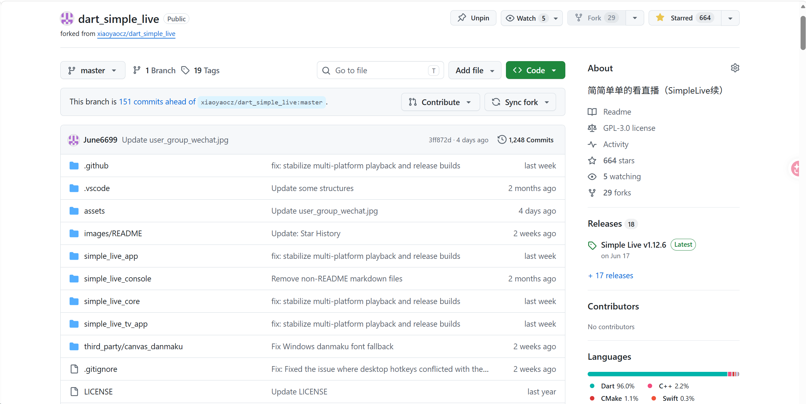

### GNU 通用公共许可证 v3.0 完全讲解

GNU 通用公共许可证第3版（GPLv3）是一份由自由软件基金会（FSF）发布的、具有**强版权保护（Copyleft）**性质的开源许可证。它的核心理念并非“免费”，而是“自由”，并利用著作权法律来保障这种自由不可被私人占有。

本篇文章供 [种田作者大战百万年薪大厂程序员事件记录 | June's Blog](https://june6699.github.io/posts/种田作者大战百万年薪大厂程序员事件记录/) 使用。

我的 [SimpleLive GPL 3.0协议](https://github.com/June6699/dart_simple_live/blob/master/LICENSE) 继承自 [上游 xiaoyaocz 仓库](https://github.com/xiaoyaocz/dart_simple_live/blob/master/LICENSE) 。

### 一、 核心理念：四种自由与Copyleft

GPLv3 的基本精神是确保软件的最终用户始终拥有以下四项基本自由：

1.  **自由0**：为任何目的运行该程序。
2.  **自由1**：研究程序如何工作，并修改它。为此，必须能获取源代码。
3.  **自由2**：重新分发副本以帮助他人。
4.  **自由3**：将修改后的版本分发给他人。这能让整个社区从你的改进中受益。

为实现这个目标，GPLv3 采用了 **Copyleft（版权左派）** 机制：==一旦你通过分发将软件传递给别人，你就必须将你获得的所有自由原封不动地传下去，并强制要求修改后的版本也必须采用 GPLv3 进行许可==。这从根本上防止了将自由软件“私有化”。

---

### 二、 关键条款详解

1.  **源代码的强制性提供（第6条）**
    当你分发GPL软件的二进制形式时，==必须同时提供完整的“对应源代码”==（Corresponding Source）。即所有生成、安装、运行及修改该程序所必需的源代码，包括接口定义、编译脚本等。提供方式可以是随附源码、书面承诺或网络下载等，但必须保证在合理时间内公开可得。

2.  **反“硬件锁定”条款（第6条，Tivoization）**
    这是GPLv3最重要的革新之一。如果你将GPL软件预装到消费类设备（如路由器、智能电视）中，并转移了该设备的所有权，你必须同时提供“安装信息”（如签名密钥、升级方法），以便用户能够将他们自己修改后的软件装回去并顺利运行。它禁止了“硬件允许自由，但厂商用加密手段阻止修改”的做法。

3.  **专利授权与防御（第11条）**
    - 每个贡献者都自动授予下游用户一份==非排他的、全球范围的免费专利许可，允许用户使用其贡献==的版本。
    - 如果你发起专利诉讼，宣称某份GPL软件侵犯了你的专利权，你将自动失去该软件的许可权。
    - ==不得与第三方达成“歧视性专利协议”，例如只在收到你的付款后才将专利许可授予你的下游用户==。这阻止了大公司通过专利合谋限制自由软件。

4.  **附加条款与禁止进一步限制（第7、10条）**
    - 你可以添加一些有限的附加许可，例如要求保留作者署名、禁止以原作者名义推广、或提供额外的免责声明等。
    - 但你不能添加任何收回下游用户自由的条款，例如“仅限非商业用途”或“分发时需额外付费”。这类条款会被视为“进一步限制”，接收者有权直接忽略或移除它们。

5.  **自动授权链条（第10条）**
    每当你将软件传递给新用户，该用户会自动从原始许可方获得一份独立的、完整的 GPLv3 许可。你无需操心每一次授权，也无需负责强制下游遵守（那是著作权持有人和社区的事）。

6.  **终止与宽容恢复（第8条）**
    违反许可证会导致权利自动终止。但 GPLv3 提供了自我修正的机会：如果你首次收到侵权通知并在30天内改正，权利将永久恢复；或者，如果著作权持有人在你停止违规后的60天内没有通知你，权利也会暂时恢复。这比之前的版本更宽容。

7.  **无担保与有限责任（第15、16条）**
    软件以“原样”提供，**没有任何担保**（包括适销性或适用性担保）。作者或修改者不对任何使用损失负责，除非法律强制或另有书面约定。这是保护贡献者的标准免责条款。

---

### 三、 实际应用答疑：我可以收钱吗？

这是一个普遍存在的误解：==“自由软件”意味着不能有任何金钱交易==。GPLv3 明确反对这种观点，它从多个角度允许你进行商业活动。

**许可证原文第4条明确写道：**

> “You may charge any price or no price for each copy that you convey, and you may offer support or warranty protection for a fee.”
> （==你可以对每份你分发的副本收取任何费用，也可以免费；并且你可以提供有偿的支持或担保服务==。）

**具体到你的场景：**

1.  **添加自愿赞助收款码**
    **完全允许。** 你在 fork 的界面上添加一个“请我喝杯咖啡”的赞助二维码，==并没有强迫用户付费才能使用、下载或获取源码==。这没有对用户施加任何“进一步限制”，只是你==个人接受捐赠==的渠道。因此它完全与 GPLv3 兼容，不属于违反协议的行为。

2.  **收取服务费（如远程协助、修复问题）**
    **完全允许且受鼓励。** 当你为特定用户提供“远程控制帮助导入cookie”或“修复程序无法运行的问题”，并收费2元，这属于你个人的**劳务服务**，而不是对软件本身加上的许可条件。软件许可只管复制、修改与分发的权利，不管你的劳动行为。上述条款中“==你可以提供有偿支持==”正是为此而设。收2元还是200元，完全由你自主决定。

---

### 四、 作为Fork开发者，你需要遵守的底线

虽然收费和服务都允许，但作为分发修改版的开发者，你仍需履行GPLv3的基本义务：

-   **显著标明修改**：在你的版本中明确声明你修改了原软件，并给出修改日期。
-   **保留原有许可信息**：原作者的版权声明、GPLv3协议全文和无担保声明都必须原样保留。
-   **整体保持GPLv3授权**：你的整个fork（包括你添加的新文件）仍必须以 GPLv3 发布，不能附加任何收回下游自由的条件。**你的赞助码绝不能写成“只有赞助后才给源码”或“未赞助者禁止商用”之类的限制。**
-   **提供源码**：如果你只分发二进制，必须同时提供完整的对应源代码。

---

### 五、 总结

GPLv3 是一份精密设计的法律文本，它通过 **Copyleft 强制传播、反硬件锁、专利防御和宽容的恢复条款**，构建了一个强大的自由软件共同体保护体系。同时，它对**商业活动极其友好**，明确区分了“软件的许可限制”和“个人的劳务与捐赠”。因此，只要你遵循上述分发义务，在你的 fork 中放置赞助码并为用户提供付费技术协助，是完全合规且正当的自由软件商业模式。

本篇文章供 [种田作者大战百万年薪大厂程序员事件记录 | June's Blog](https://june6699.github.io/posts/种田作者大战百万年薪大厂程序员事件记录/) 使用。