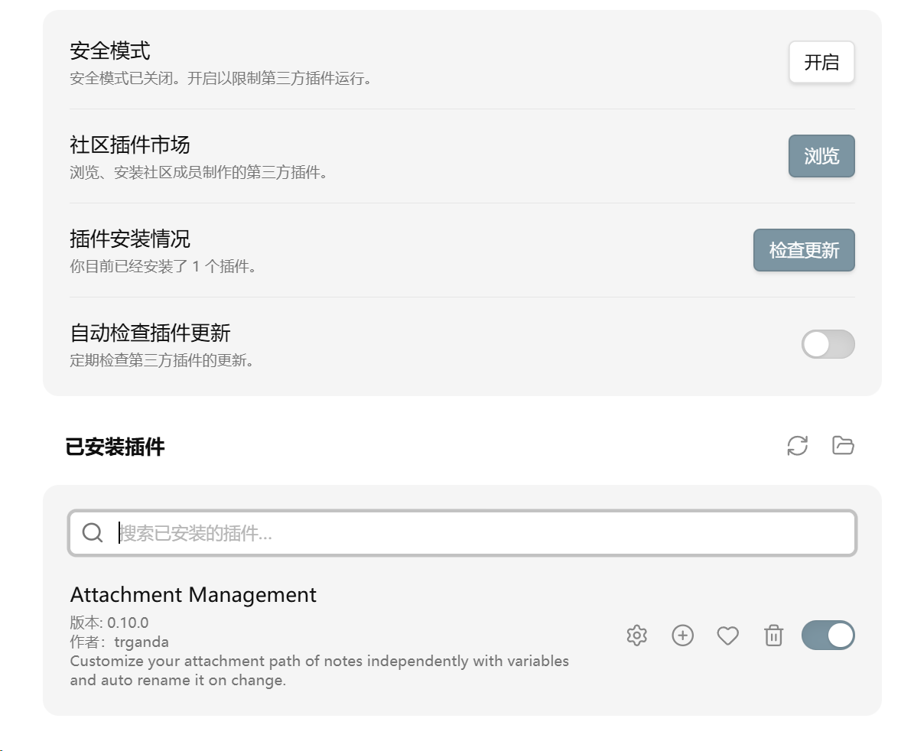
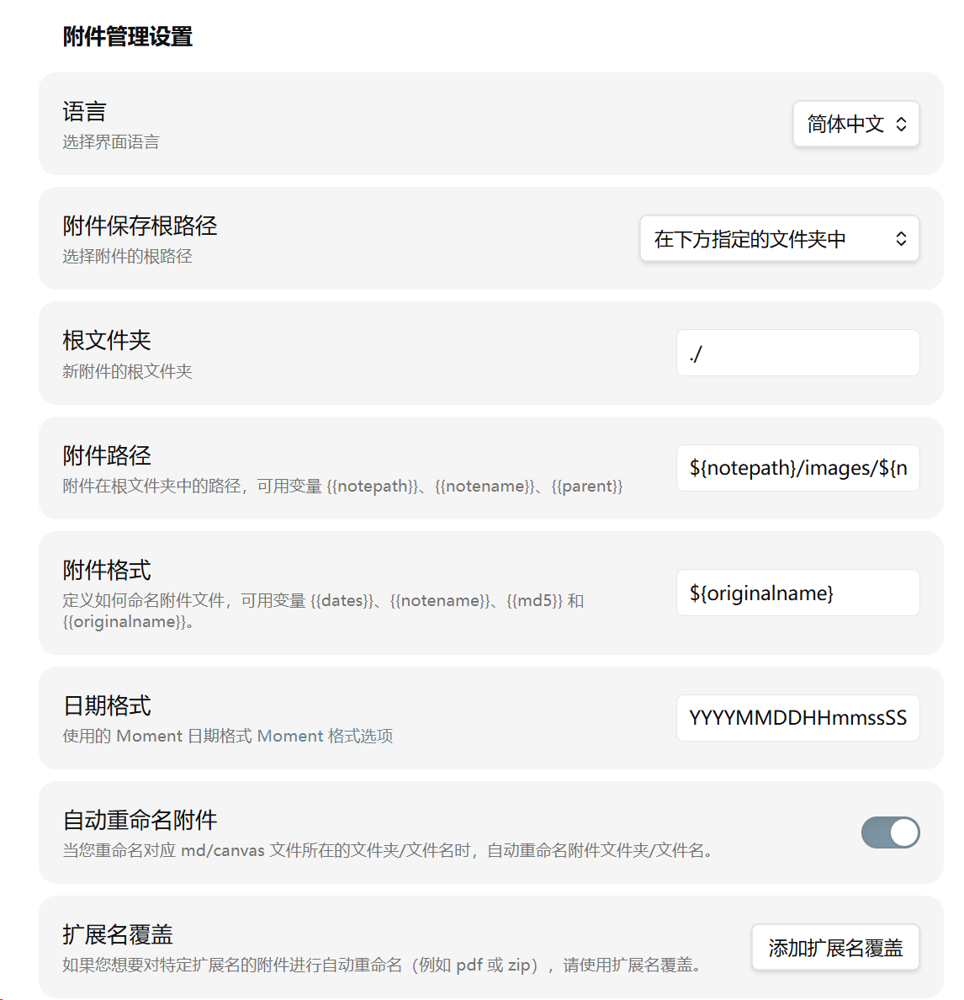
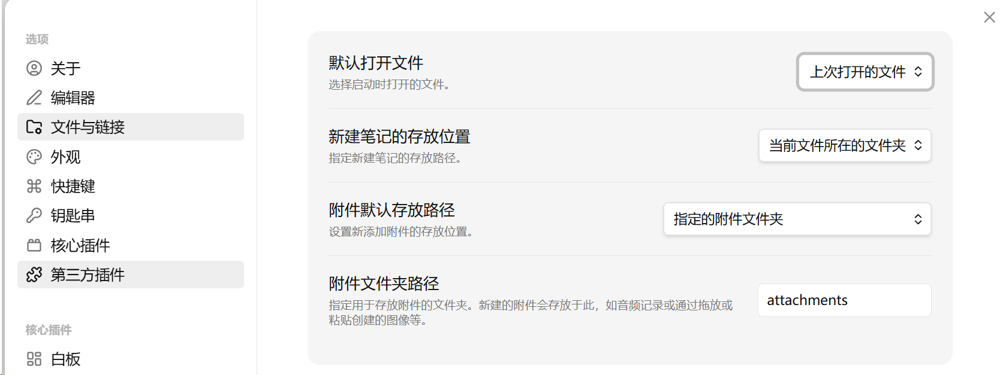
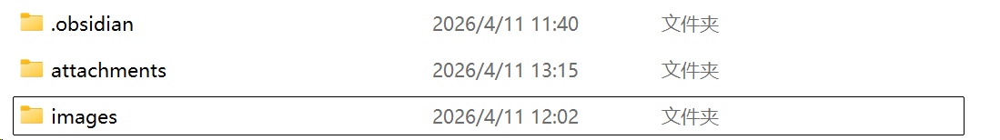

---
cover:
  image: /images/header_img/sun-family.jpg
title:      Obsidian-Typora 图片及附件位置存放兼容设置
date:       2026-04-11
author:     June & Codex
tags:
    - 技术
    - 技术/工具
---

## 0、默认

- 本教程默认你已经成功实现`Windows`的，`右键新建一个Markdown file`的功能，可见[教程](https://zhuanlan.zhihu.com/p/1890391736620151950)。
- 且你使用的`Typora`中，图片存放位置为`./images/${filename}`，否则需要略作修改，若全部看懂完全可以自行操作或联系[作者](https://june6699.github.io/about/)。

## 1 使用前先看

### 1.1 先改一个路径

如果你要使用文末“可选：右键在 Obsidian 中新建笔记”的注册表代码，请先把所有代码里的 Obsidian 安装路径替换成你自己的实际路径。

比如我的路径如下：

```text
C:\softwares\Obsidian\Obsidian.exe
```

### 1.2 本文最终目标

#### 1.2.1 最终工作流

- `.md` 文件默认仍由 Typora 打开：双击`.md`仍然是Typora；
- `Obsidian` 和 `Typora` 共用同一批 `.md` 文件：Obsidian和Typora都能打开`.md`文件；
- `Obsidian` 插入的新图片，`Typora` 也能正常显示；
- 图片保存到 `./images/{笔记名}/`：类似`Typora`的`./assets/{filename}/`；


- 其他附件保存到 `./attachments/{笔记名}/`：`Typora`这个没有，但是也用不着。


#### 1.2.2 为什么这样设置

Obsidian 更偏向知识库和 vault 工作流，Typora 更偏向普通文件编辑。要让两边兼容，关键不是人为制造两种不同的 Markdown 文件，而是统一下面三件事：

- 链接格式使用标准 Markdown
- 链接路径使用相对路径
- 附件目录使用固定规则

---

## 2 Obsidian 核心设置

### 2.1 文件与链接

打开 `设置 -> 文件与链接`，按下面设置。

#### 2.1.1 使用 Wiki 链接

- 关闭

这样 Obsidian 会生成标准 Markdown 链接，兼容 Typora。  
官方文档：<https://help.obsidian.md/Linking%20notes%20and%20files/Internal%20links>


#### 2.1.2 新链接格式

- 选择：`相对于当前文件的路径`

这样图片或文件插入后，会写成相对路径，而不是只写文件名。相对路径更适合 Typora 解析。


#### 2.1.3 新建笔记的存放位置

- 按你的习惯设置即可

这一项只影响“新建笔记放在哪里”，不影响图片和附件的保存目录。

---

## 3 第三方插件

### 3.1 关闭受限模式

打开 `设置 -> 第三方插件`：

- 关闭 `受限模式`

有些中文界面里也会把这项叫作“安全模式”。  
官方文档：<https://help.obsidian.md/community-plugins>  
插件安全说明：<https://help.obsidian.md/plugin-security>

### 3.2 安装 Attachment Management

推荐插件：`Attachment Management`

- GitHub：<https://github.com/trganda/obsidian-attachment-management>
- 也可以直接在 Obsidian 社区插件商店搜索 `Attachment Management` 安装

这个插件支持：

- `${notepath}`、`${notename}` 这类路径变量
- 按扩展名覆盖不同的附件规则
- 自动重命名附件



---

## 4 Attachment Management 推荐设置

打开 `设置 -> 第三方插件 -> Attachment Management`，按下面填写。

==注意下面是图片路径设置，是在第三方插件里面修改==

### 4.1 全局设置

#### 4.1.1 根文件夹

```text
./
```

这表示以当前 vault 中的当前路径为基准处理附件目录。

#### 4.1.2 图片的附件路径

```text
${notepath}/images/${notename}
```

这条规则可以拆开理解：

- `${notepath}`：当前笔记所在的文件夹路径
- `images`：固定的图片区目录名
- `${notename}`：当前笔记文件名，不含 `.md`

也就是说，一张图片不会直接丢在笔记旁边，而是会进入：

```text
当前笔记所在目录/images/当前笔记名/
```

例如当前笔记是：

```text
notes/部署步骤.md
```

那么图片目录就是：

```text
notes/images/部署步骤/
```

这样做的好处是：

- 每篇笔记的图片都集中在自己的子目录里
- 同名图片不容易互相冲突
- Typora 和 Obsidian 都更容易用相对路径引用

#### 4.1.3 图片的附件格式

直接原文件名==（Typora最常用）==：

```text
${originalname}
```

或保持简洁命名：

```text
IMG-${date}
```

#### 4.1.4 日期格式

```text
YYYYMMDDHHmmssSSS
```

这会生成带年月日时分秒毫秒的时间戳，基本可以避免重名。

#### 4.1.5 自动重命名附件

- 打开



### 4.2 扩展名覆盖

点击 `添加扩展名覆盖`，为非图片附件增加一条规则。

#### 4.2.1 为什么还要单独做 attachments

`images` 目录只适合存图片。  
但一篇笔记除了图片，还可能会插入这些文件：

- PDF
- Word
- Excel
- PPT
- 压缩包
- 文本附件
- 音频或视频

如果这些文件也全塞进 `images/{notename}`，目录语义就会变乱。  
所以更适合的做法是：

- 图片进入 `images/{notename}`
- 其他附件进入 `attachments/{notename}`

这样一篇笔记最终可能会变成：

```text
部署步骤.md
images/部署步骤/
attachments/部署步骤/
```

这就是 `attachments` 文件夹的意义：  
它不是第二套图片目录，而是给“非图片附件”准备的专门目录。

#### 4.2.2 扩展名正则

```text
pdf|doc|docx|xls|xlsx|ppt|pptx|zip|7z|rar|csv|txt|mp3|wav|mp4
```

这串正则的意思不是“路径替换”，而是“匹配哪些文件扩展名要走这条覆盖规则”。

可以逐项理解为：

- `pdf`：PDF 文件
- `doc|docx`：Word 文档
- `xls|xlsx`：Excel 表格
- `ppt|pptx`：PowerPoint 文件
- `zip|7z|rar`：压缩包
- `csv|txt`：文本或数据文件
- `mp3|wav|mp4`：音频、视频文件

中间的 `|` 表示“或者”。  
也就是说，只要附件扩展名命中了其中任意一个，就不再走默认的图片目录规则，而是改走下面这条专门规则。

#### 4.2.3 覆盖规则的附件路径

我按上面设置完`images`后，附件自动保存在了`${notepath}/附件/${notename}`里面，然后我发现如果你强迫症一定要放在英文名的`attachments`下，需要回到`设置——文件与链接`重新设置附件位置。



#### 4.2.4 覆盖规则的附件格式

这个格式也是默认的，就是原文件名字，无法更改。

```text
${originalname}
```

#### 4.2.5 这条覆盖规则的实际效果

默认情况下，你在全局里设置的是：

```text
${notepath}/images/${notename}
```

也就是先把“所有受插件管理的附件”默认往图片目录里放。

而扩展名覆盖会告诉插件：

- 如果扩展名命中上面那串正则
- 就不要再放进 `images`
- 改放到 `attachments`

所以这里的“替换”本质上是“规则分流”，不是文本层面的字符串替换。

#### 4.2.6 如果你常用其他附件类型

就在这串正则后面继续加，仍然用 `|` 分隔即可。  
例如你常用：

- `md`
- `epub`
- `mobi`
- `psd`

那么可以扩展成：

```text
pdf|doc|docx|xls|xlsx|ppt|pptx|zip|7z|rar|csv|txt|mp3|wav|mp4|epub|mobi|psd
```

### 4.3 排除扩展名模式

如果没有特殊需求，可以先留空。

只有当你明确不想让某些附件类型被插件处理时，再填写排除规则。

### 4.4 历史附件整理

如果需要整理已有附件，可以使用插件命令：

- `Rearrange linked attachments`
- `Rearrange all linked attachments`

这个功能在插件说明里标注为实验性功能，正式整理前建议先备份仓库。  
插件说明：<https://github.com/trganda/obsidian-attachment-management>


### 4.5 最终效果



---

## 5 Typora 兼容的关键点

### 5.1 为什么 Typora 之前不显示 Obsidian 插入的图片

问题通常不在于图片目录本身，而在于链接写法。

如果 Obsidian 生成的是这种最短链接：

```md

```

而图片实际保存在：

```text
./images/部署步骤/Pasted image 20260411120248.png
```

那么 Typora 按普通文件路径解析时，就可能找不到图。

这实际上是他们两个内部的源码不一样，你手动修改为一样的，完全可行，但是过于麻烦。

### 5.2 兼容 Typora 的两个关键设置

把 Obsidian 的这两个设置改好以后：

- `使用 Wiki 链接` 关闭
- `新链接格式` 设为 `相对于当前文件的路径`

之后新插入的图片链接会更接近下面这种形式：

```md

```

这种写法更适合 Typora 和 Obsidian 共用。

---

## 6 关于“用 Obsidian 打开某个 md 文件”

### 6.1 结论

`Obsidian` 并不像 `Typora`、`VS Code` 这类编辑器那样，把“打开一个 `.md` 文件”作为最自然的入口。它更接近“先进入一个 `vault`，再在 `vault` 里打开或创建笔记”的工作方式。

### 6.2 为什么会有这种感觉

Obsidian 启动时有“打开上次的文件”“新文件”“指定文件”“日记”等偏好选项，但通过系统文件关联或命令行去点开某个 `.md` 时，体验并不像 Typora 那样直接、稳定。很多时候，从使用感受上看，更像是“先把 Obsidian 打开了”，而不是真正像传统编辑器那样“精准打开这个文件”。

### 6.3 为什么会这样

官方文档对 Obsidian 的描述一直围绕 `vault` 展开：

- Vault 是 Obsidian 的核心工作单元
- URI 的 `open`、`new` 等能力也是围绕 vault 或 vault 内路径设计的
- `path` 这类能力的核心逻辑，也是先定位包含该路径的 vault，再处理 vault 内文件

官方文档：

- Obsidian URI：<https://help.obsidian.md/uri>
- Manage vaults：<https://help.obsidian.md/manage-vaults>
- Data storage：<https://help.obsidian.md/data-storage>

更准确地说：

- Typora 更像“打开一个独立文件”
- Obsidian 更像“打开一个知识库，再访问其中的文件”

### 6.4 最终推荐的使用方式

最终更推荐的方案是：

- `.md` 默认打开方式继续交给 Typora
- Obsidian 不承担“按文件直接打开”的主入口职责
- 需要在 Obsidian 里工作时，先打开 Obsidian
- 如果你习惯一进 Obsidian 就开始写，可以把启动后的默认行为设置成你偏好的新文件、上次文件或日记

换句话说，Obsidian 更适合当“知识库入口”，而不是 Typora 那种“点哪个文件就直接编辑哪个文件”的入口。

### 6.5 Obsidian 有没有类似 VS Code 的“在该处打开项目”

Obsidian 里最接近 VS Code “Open Folder” 的能力，其实是：

- `Open folder as vault`

官方文档：<https://help.obsidian.md/manage-vaults>

它的思路不是“打开一个文件”，而是“打开一个仓库或知识库目录”。  
所以如果你平时是按项目或笔记库组织内容，Obsidian 这个思路其实也说得通。

### 6.6 快速切换仓库是否够用

如果你已经把常用目录都建成 vault，那么 Obsidian 底部的仓库管理和切换功能，通常已经够用了。  
这也是为什么最终更推荐把 Obsidian 当作“先进入仓库，再工作”的工具来使用。

---

## 7 推荐的最终方案

### 7.1 推荐保留的内容

- `.md` 默认打开方式保持为 Typora
- Windows 右键 `新建 -> Markdown File` 保留
- Obsidian 负责知识库、双链、附件整理

### 7.2 不建议再额外区分“Obsidian 文件”

Obsidian 使用的文件本质上也是普通 `.md`。只要图片路径、链接格式和附件目录规则一致，就没有必要人为区分“Typora 的 md”和“Obsidian 的 md”。

### 7.3 为什么最后不建议保留“新建 Obsidian 笔记”

表面上看，这个功能像是在“新建一种专属于 Obsidian 的文件”，但本质上它做的事情仍然只是：

- 创建一个普通 `.md`
- 再尝试交给 Obsidian

而 `.md` 本身并不是 Obsidian 的专有格式，所以这个动作并没有创造出一种新的文件类型。

如果前面的图片路径、链接格式和附件规则已经统一好，那么“新建 Obsidian 笔记”带来的额外价值就很有限。  
从维护成本和系统整洁度考虑，更推荐的做法仍然是：

- 保留 `新建 -> Markdown File`
- Typora 继续作为默认打开方式
- Obsidian 作为知识库工具使用

---

## 8 可选：右键“在 Obsidian 中新建笔记”

- 这一部分不是必须。如果你的主工作流已经是“右键新建 Markdown，再按需用 Obsidian 打开”，可以直接跳过。

- 而且有点小BUG，跟`新建Markdown文件`功能没有任何区别。

### 8.1 这个方案与 Typora 是否冲突

不冲突。

原因很简单：

- `.md` 的默认打开方式仍然是 Typora
- 右键菜单只是额外增加一个命令
- 这个命令的作用是“新建一个普通 `.md`，然后立即用 Obsidian 打开”

### 8.2 为什么不建议强行放进“新建”子菜单

Windows 的 `新建` 子菜单本质上是按文件扩展名和 `ShellNew` 规则生成的。`.md` 只有一种文件类型，把它强行拆成“Markdown File”和“Obsidian File”两套并不自然，也更容易和默认打开方式、文件关联、右键模板互相冲突。

更稳妥的方式是：

- 保留系统原生的 `新建 -> Markdown File`
- 另外加一个顶层右键命令 `在 Obsidian 中新建笔记`

### 8.3 为什么后来又不建议保留这个命令

这个命令最大的问题不是“能不能新建文件”，而是“Obsidian 对按文件路径直接打开某个 `.md` 的支持，并不像 Typora 或 VS Code 那样自然稳定”。

换句话说，这个命令就算存在，它的本质也更接近：

- 先启动 Obsidian
- 再尝试把焦点落到对应文件

而不是传统编辑器那种非常明确的“打开这个文件”。

### 8.4 脚本内容

如果你仍然希望保留这个右键命令，可以先新建一个脚本文件，例如：

```text
C:\Users\你的用户名\Desktop\obsidian_new_note.vbs
```

把下面内容完整复制进去：

```vbscript
Option Explicit

Dim shell, fso, folderPath, noteName, fullPath, obsidianExe

obsidianExe = "C:\softwares\Obsidian\Obsidian.exe"

If WScript.Arguments.Count = 0 Then
  MsgBox "Missing target folder.", vbExclamation, "Obsidian New Note"
  WScript.Quit 1
End If

folderPath = WScript.Arguments(0)

Set shell = CreateObject("WScript.Shell")
Set fso = CreateObject("Scripting.FileSystemObject")

noteName = InputBox("Input note name (without .md):", "Obsidian New Note", "New Note")
If Trim(noteName) = "" Then
  WScript.Quit 0
End If

If LCase(Right(noteName, 3)) <> ".md" Then
  noteName = noteName & ".md"
End If

fullPath = fso.BuildPath(folderPath, noteName)

If Not fso.FileExists(fullPath) Then
  Dim fileHandle
  Set fileHandle = fso.CreateTextFile(fullPath, True)
  fileHandle.Close
End If

shell.Run Chr(34) & obsidianExe & Chr(34) & " " & Chr(34) & fullPath & Chr(34), 1, False
```

### 8.5 注册表代码

把下面内容保存成 `.reg` 文件后导入，或直接复制到注册表脚本中使用：

```reg
Windows Registry Editor Version 5.00

[HKEY_CURRENT_USER\Software\Classes\Directory\Background\shell\ObsidianNewNote]
@="在 Obsidian 中新建笔记"
"Icon"="C:\\softwares\\Obsidian\\Obsidian.exe,0"

[HKEY_CURRENT_USER\Software\Classes\Directory\Background\shell\ObsidianNewNote\command]
@="wscript.exe \"C:\\Users\\你的用户名\\Desktop\\obsidian_new_note.vbs\" \"%V\""
```

### 8.6 卸载代码

如果以后不想要这个菜单，导入下面这段即可删除：

```reg
Windows Registry Editor Version 5.00

[-HKEY_CURRENT_USER\Software\Classes\Directory\Background\shell\ObsidianNewNote]
```

---

## 9 为了以后重设，建议顺手备份哪些内容

### 9.1 这次改动里，哪些属于底层修改

这次真正涉及系统层面的修改，其实很少：

- `.md` 默认打开方式
- 可选的右键菜单注册表项

而本文的核心兼容方案，主要都不是底层 hack，而是：

- Obsidian 内部设置
- 你的 vault 内的插件设置

所以即使以后 Obsidian 更新，最核心的东西通常也不会“突然全没了”，因为它们本质上都还是配置文件。

### 9.2 最值得备份的是 `.obsidian` 文件夹

官方文档说明，vault 的配置数据存放在 `.obsidian` 目录中。  
官方文档：<https://help.obsidian.md/data-storage>

所以最推荐的做法是：

- 备份你的 vault 根目录下 `.obsidian` 整个文件夹

这通常会包含：

- Obsidian 的大部分本库设置
- 社区插件配置
- 工作区相关配置

### 9.3 如果想方便以后再次设置

建议至少保留下面三样：

- 这份说明文档
- 你的 `.obsidian` 文件夹备份
- 如果你用了右键菜单，再单独保留一份 `.reg` 代码

这样以后即使重装 Obsidian、换设备、换 vault，也能很快恢复设置。

---

## 10、最终总结

- 完成`Typora`和`Obsidian`的图片实际图片`路径级`（4.1 修改图片存放位置）和`源码级`（5.2 修改最短URL）大一统；
- 完成附件的位置自定义：4.2 4.3，与图片在同一个根目录下，一个为`images`，一个为`attachments`，名称均可自定义。图片文件夹的可个性化设置更多，附件文件夹名称在中文版中默认为`附件`。


- 可选：完成Windows用户的`使用Obsidian新建Markdown文件`的注册表注册和卸载命令，但是受限于Obsidian实际上是用`Obsidian vault`这种模式打开`Markdown`，导致每次使用该功能，实际上就是点击Obsidian而已，与`打开Obsidian的默认行为`设置有关，与你要打开的文件，没一点关系，待完善。


