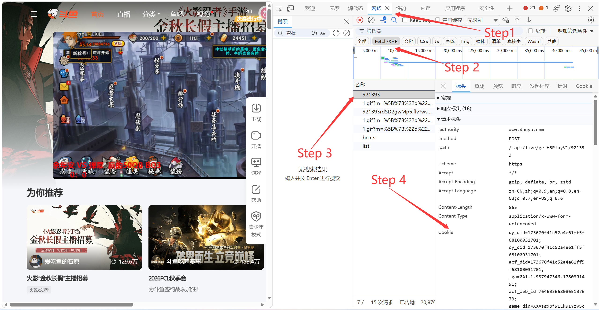

## 一、前言

本文教程供 [June6699/dart_simple_live](https://github.com/June6699/dart_simple_live) 及其其他类似项目使用，可以让他拥有抖音平台、快手平台的更多功能，如搜索、弹幕以及更高的并发上限。

Simple Live 里抖音和快手都可以配置 Cookie，但两家的用途和表现不完全一样。

- 如果对`F12`开发者工具有一些了解，请直接看第三节（抖音）、第四节（快手）。
- 如果你喜欢自己折腾一下，而且很熟悉浏览器的`扩展功能`，你可以尝试一下有没有一些扩展能帮助你直接导出cookie，目前为止尝试了几款扩展，都无法做到这一点。
  - 如果你发现了类似扩展/软件/插件，欢迎在评论区提供你的见解哦。

```text
抖音：只看直播时默认 ttwid 多数情况下可以兜底；搜索主播 / 房间建议导入完整 Cookie。
快手：非登录网页也可能看到弹幕，但验证码、代理、风控会影响稳定性；如果要让弹幕更稳定，建议导入 live.kuaishou.com 的完整 Cookie。
```

简单记：

- 抖音不要只填 `ttwid`，搜索更建议用完整 `www.douyin.com` Cookie。
- 快手不要只复制某一个字段，弹幕更建议用完整 `live.kuaishou.com` Cookie。
- 手机端不建议手动粘贴超长 Cookie，推荐保存成 txt 文件后用“从文件导入 Cookie”。
- TV 端不适合直接抓 Cookie，建议先在主 App 配好，再通过同步功能同步到 TV。

这篇教程写给不熟悉浏览器开发者工具的人。只要按步骤做，不需要懂前端。

## 二、Cookie 是什么

Cookie 可以粗略理解成“浏览器帮你保存的一串登录凭据”。

你在电脑浏览器里登录抖音或快手后，浏览器每次请求对应网站时，都会在请求头里带上一段类似这样的东西：

```text
cookie: key1=value1; key2=value2; key3=value3
```

这一整行就是我们要复制的东西。

它不等同于密码，但很接近登录凭据。拿到你的完整 Cookie 的人，有可能在一段时间内用你的登录态请求平台接口。所以不要发给别人，不要贴到公开 issue，也不要截图发群里。

## 三、抖音 Cookie 获取和导入

### 3.1 不要只复制 ttwid

这篇教程里说的抖音 Cookie，默认都指“完整 Cookie”，也就是一整串字段。

你要复制的是这种：

```text
ttwid=...; sid_guard=...; sessionid=...; passport_csrf_token=...; msToken=...
```

不要只复制这种：

```text
ttwid=...
```

### 3.2 电脑端获取抖音 Cookie

建议用电脑端 Chrome 或 Edge。下面以 Edge / Chrome 这一类 Chromium 浏览器为例。这里是手动操作的示例，后面还有一种使用浏览器扩展的方法。

1. 打开抖音网页并`登录`：

   > [!IMPORTANT]
   >
   > 一定要登录！扫码还是什么随你。

   ```text
   https://www.douyin.com/
   ```

   或者：

   ```text
   https://live.douyin.com/
   ```

2. 按 `F12` 打开开发者工具。如果没反应，可以试 `Ctrl + Shift + I`。

3. 点上方的 `Network`，或者“网络”。

4. 在 Network 面板打开的情况下，按 `Ctrl + R` 刷新页面。


5. 在请求列表里，我们可以看到名称这一列，然后我们去找名称前面几个字符就可以看到`/`的，比如`self/`、`info/`、`update/`等等。

   > [!IMPORTANT]
   >
   > 这个很重要，关系到你会不会像无头苍蝇一样乱撞却还是找不到。
   >
   > 而因为带 `/` 的通常是 "站点地址"，而 cookie 恰恰是挂在 "站点" 下的，所以这种取巧的办法就能帮我们节省时间。
6. 进去请求列表之后，我们可以看到有好几个标头，我们选择请求标头（有些用户可能是未折叠的，有些用户可能是折叠的）。

     - **折叠状态**：如图我的就是折叠状态，这个时候，打开请求标头，往下滑一小段距离，就可以看到一个`Cookie`的东西，我们把他后面的内容==全部复制==下来，注意是全部复制下来。这个就是我们要的内容，然后你就可以进入下一步`3.3`了。

     - **展开状态**：还有相当一部分用户打开之后会是展开状态，有一大堆的东西，这些标头全部展开了，怎么办呢？还是一样的，我们只需要往下滑，还是去找`Cookie`的字眼，这个东西很长，所以他在的地方，一般会很长很长。所以还是很好找的。


注意，是 `Request Headers` 里的 `cookie`。不要复制 `Response Headers` 里的 `set-cookie`。

你可以复制整行：

```text
cookie: ttwid=...; sid_guard=...; sessionid=...
```

也可以只复制冒号后面的值：

```text
ttwid=...; sid_guard=...; sessionid=...
```

Simple Live 都能识别。

---

### 3.3 抖音粘贴到 Simple Live

在 Simple Live 里打开：

```text
设置 -> 账号管理 -> 抖音直播 -> Cookie 登录
```

把刚才复制的内容粘贴进去，点确定。一般是7000多个字符，如果出现了有效期，那么说明你应该是成功了。

保存后，账号管理页会显示一个摘要。如果 Cookie 里有 `sid_guard`，应用会尝试解析一个预计有效期。这个时间只能作参考，因为退出登录、改密码、账号风控都可能让 Cookie 提前失效。

如果显示“有效期无法判断”，也不一定代表不能用，只是 Cookie 里没有能被当前逻辑解析的标准过期字段。

### 3.4 手机怎么办？

手机端也是一样的，这个`Cookie`的导入方法、使用方法都是通用的，只是一个传递的问题。大部分人可能想通过QQ微信来传播，但是QQ微信一般对于消息的长度有限制，因此，我给手机新增了一个`使用文件导入`。

只需要你把你刚才电脑上搞到的`Cookie`，保存为一个txt文件，然后保存，其他什么都不用做，直接把这个文件丢给手机，然后手机使用这个来导入就可以了。

至此，大功告成。

---

## 四、快手 Cookie 获取和导入

### 4.1 快手一定要登录才有弹幕吗

99%没有。想让 Simple Live 里快手弹幕更稳定：建议导入完整 Cookie。

---

### 4.2 快手 Cookie 要复制哪一个

快手建议复制 `live.kuaishou.com` 的完整 Cookie。

你可能会看到很多字段，例如：

```text
did=...; didv=...; userId=...; kuaishou.live.bfb1s=...; kwfv1=...
```

字段名可能会变，不需要逐个理解。重点是复制完整 Cookie，而不是只复制某一个字段。

快手弹幕还会用到一类弹幕签名 / 凭证。当前 Simple Live 会优先使用 Cookie 里的 `kwfv1` 自动生成弹幕签名；如果缺少 `kwfv1`，应用也会保存 Cookie，但可能提示：

```text
Cookie 已保存，但缺少 kwfv1，弹幕可能需要重新网页登录
```

这不是说 Cookie 一定没用，而是提醒弹幕链路可能不完整。遇到这种情况，建议重新登录快手网页并重新复制完整 Cookie。

### 4.3 电脑端获取快手 Cookie

建议用电脑端 Chrome 或 Edge。

1. 打开快手直播网页：

   ```text
   https://live.kuaishou.com/
   ```

2. 登录快手账号。如果页面弹验证码，先完成验证。手机快手打开搜索栏，搜索的左边有个摄像头打开右滑可以扫一扫登录。

3. 按 `F12` 打开开发者工具。如果没反应，可以试 `Ctrl + Shift + I`。快手的主页`https://www.kuaishou.com/`禁止了`F12`和`Ctrl + Shift + I`，但是我们仍然可以通过右上方（edge浏览器为例） `三点`——`设置`——`开发人员选项`来打开。

   > [!IMPORTANT]
   >
   > 但是快手的直播页 `https://live.kuaishou.com` 是没有这些限制的。

4. 点上方的 `Network`，中文浏览器里一般叫“网络”。如图，我们直接去这个`userFollowCount`，然后把右边的cookie整个复制下来。


你可以复制整行：

```text
cookie: did=...; didv=...; userId=...; kwfv1=...
```

也可以只复制冒号后面的值：

```text
did=...; didv=...; userId=...; kwfv1=...
```

Simple Live 会尽量从你粘贴的内容里提取 Cookie。

### 4.4 桌面端导入快手 Cookie

在 Simple Live 桌面端里打开：

```text
设置 -> 账号管理 -> 快手直播 -> 浏览器登录后粘贴 Cookie
```

应用会尝试打开系统浏览器，你登录快手后，回到 Simple Live 粘贴完整 Cookie 即可。

也可以直接打开：

```text
设置 -> 账号管理 -> 快手直播 -> Cookie 登录
```

然后手动粘贴 `live.kuaishou.com` 的完整 Cookie。

### 4.5 手机端导入快手 Cookie

手机上直接粘贴超长 Cookie 很容易失败：输入框长度、剪贴板、聊天软件转发，都可能把内容截断。

推荐流程是：

1. 在电脑上新建一个文本文件，例如：

   ```text
   kuaishou-cookie.txt
   ```

2. 把完整 Cookie 粘进去。

3. 保存文件，最好用 UTF-8。

4. 通过微信文件传输、QQ、网盘、数据线等方式传到手机。

5. 手机打开 Simple Live：

   ```text
   设置 -> 账号管理 -> 快手直播 -> 从文件导入 Cookie
   ```

6. 选择这个 txt 文件。

文件里可以是纯 Cookie，也可以是 `Cookie: xxx`，也可以是整段 Request Headers。应用会从里面提取 Cookie，并尝试读取快手弹幕需要的凭证。

### 4.6 手机端 Web 登录

移动端 Simple Live 里也提供快手 `Web登录`：

```text
设置 -> 账号管理 -> 快手直播 -> Web登录
```

这个入口会在 App 内打开快手网页，登录后自动读取 Cookie，并尝试读取本地的 `kwfv1` 凭证。

如果 Web 登录能正常完成，优先用这个方式；如果验证码、网页兼容性或网络环境导致登录不顺，再改用电脑抓 Cookie + 手机文件导入。

### 4.7 快手 Cookie 有效期为什么无法判断

快手 Cookie 的有效期不一定能像抖音那样稳定解析。

原因是：

- 手动从 `Request Headers` 复制出来的 Cookie 通常只有 `key=value`，不包含浏览器内部保存的过期时间。
- `expires` / `max-age` 这类信息通常出现在 `Set-Cookie` 或浏览器 Cookie 存储里，不一定会出现在请求头 Cookie 里。
- 快手不同字段的有效期不完全一致，风控、验证码、退出登录也可能让 Cookie 提前失效。

所以“有效期无法判断”的意思只是：

```text
应用没有拿到可可靠解析的过期时间。
```

它不等于 Cookie 不能用。只要弹幕、搜索或需要登录态的功能能正常工作，就可以继续用。等某天失效后，再重新登录并导入即可。

## 五、斗鱼 Cookie 获取和导入

我们打开 <www.douyu.com>，随便打开一个直播间，主页推荐的这个也够了。

我们到`网络`——`Fetch/XHR`——`左侧找到房间号`——`里面就有一个Cookie的标头`——`复制下来，导入到SimpleLive`，如图去做。



## 六、如果浏览器显示成两行

有些复制方式会变成这样：

```text
cookie
ttwid=...; sid_guard=...; sessionid=...
```

或者：

```text
cookie
did=...; didv=...; kwfv1=...
```

也没关系。Simple Live 做了兼容，会识别 `cookie` 下一行的内容。

也支持你把整段请求头都复制进去，例如：

```text
accept: application/json
accept-language: zh-CN,zh;q=0.9
cookie: key1=value1; key2=value2; key3=value3
referer: https://live.kuaishou.com/
user-agent: Mozilla/5.0 ...
```

应用会从里面提取 `cookie` 那一行。

## 七、TV 怎么办

TV 端不适合直接在设备上抓 Cookie。

原因很简单：TV 上网页登录体验很差，很多情况下也没法正常完成扫码、验证码、复制 Cookie 这些动作。

推荐做法是：

```text
电脑或手机主 App 获取完整 Cookie
-> 在主 App 保存
-> 通过同步功能同步到 TV
```

如果你要用抖音搜索，建议同步完整抖音 Cookie。  
如果你要让快手弹幕更稳定，建议同步完整快手 Cookie。

## 八、为什么 Android 会报 HEAD 请求失败

之前 Android 上有一个容易误导的问题：同一个抖音 Cookie，Windows 能用，Android 搜索时报：

```text
发送HEAD请求失败
```

原因是搜索前会先对抖音域名发一个 HEAD 请求，尝试补一些网页 Cookie。Android 网络环境、系统 TLS、服务端策略都有可能让这个 HEAD 请求失败。

后来 Simple Live 改了兜底逻辑：如果你本地已经保存了完整 Cookie，HEAD 失败时会继续用已保存 Cookie 请求搜索。

所以如果你还遇到类似问题，先确认自己导入的是完整 Cookie，不要只导入 `ttwid`。

## 九、Cookie 会失效吗

会。

Cookie 会过期。常见失效原因有：

- 你在浏览器里退出了账号登录。
- 修改密码或账号安全状态变化。
- 平台服务端主动让登录态过期。
- Cookie 本身过期。
- 账号触发风控，需要重新验证。
- 网络代理、验证码、人机校验导致当前 Cookie 暂时不可用。

如果某天搜索、弹幕或登录态相关功能突然不能用了，最直接的处理方式是：

```text
重新在电脑浏览器登录对应平台
-> 重新复制完整 Cookie
-> 重新粘贴或从文件导入
```

## 十、几个常见错误

### 10.1 只填 ttwid

表现：

```text
抖音播放可能还能用，搜索不稳定或提示需要登录
```

处理：

```text
重新复制完整 Request Headers Cookie
```

### 10.2 快手缺少 kwfv1

表现：

```text
Cookie 能保存，但快手弹幕仍然不稳定，或者提示缺少 kwfv1
```

处理：

```text
重新登录 live.kuaishou.com，完成验证码后重新复制完整 Cookie，或使用移动端 Web 登录
```

### 10.3 复制了 set-cookie

表现：

```text
看起来有 Cookie，但字段很少，搜索或弹幕还是失败
```

处理：

```text
去 Request Headers 里复制 cookie，不要复制 Response Headers 里的 set-cookie
```

### 10.4 复制内容被截断

表现：

```text
电脑能用，手机粘贴后不能用
```

处理：

```text
把 Cookie 保存成 txt 文件，传到手机后用“从文件导入 Cookie”
```

### 10.5 登录后没有刷新 Network

表现：

```text
Network 里看到的还是登录前请求，Cookie 不完整
```

处理：

```text
登录成功后保持开发者工具打开，再刷新一次页面
```

### 10.6 把 Cookie 发给别人测试

这个不要做。

Cookie 接近登录凭据。别人拿到后，至少在一段时间内可能可以用你的登录态请求接口。遇到问题可以描述现象，不要把完整 Cookie 发出来。

## 十一、总结

获取 Cookie 这件事，最关键的是：

```text
要登录后的完整 Cookie
要复制 Request Headers 里的 cookie
不要只复制某一个字段
```

抖音：不要只复制 `ttwid`。  
快手：优先完整 `live.kuaishou.com` Cookie，弹幕相关尽量保证有 `kwfv1`。

电脑端复制最方便，手机端建议用文件导入，TV 端建议从主 App 同步。

如果以后平台网页改版，开发者工具的位置可能会变，但原理不会变：浏览器能正常访问，是因为请求里带着登录态；Simple Live 要调用同类能力，也需要带着同一份登录态。