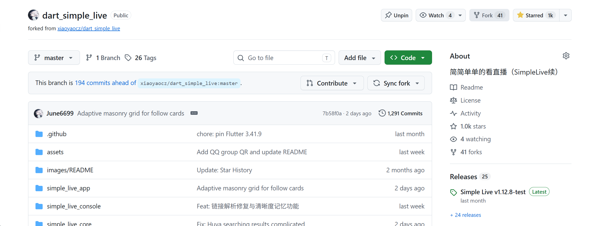
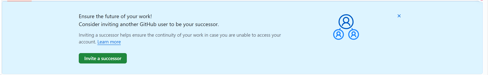

### 前言

如题，今天是2026.8.20，现在[June6699/dart_simple_live](https://github.com/June6699/dart_simple_live)有853个⭐。期待1000星的那一天。

### 故事的开始

一年前，我还在用着作者的版本，而现在我fork了自己的分支，取得了还行的成绩哈哈。命运呐

### 2026.9.14 更新

今天终于拿下了1K stars，得益于周末的帮助哈哈。

而且突然网页端收到github的一个邀请，也就是 GitHub Account Successor（账户继任者） 功能的提示，目的是：万一无法继续管理账号、账号登不上去，通过提前指定一个可信用户，后续使用那个账户继续接管这个公开仓库，保证开源项目代码不会彻底无人维护。

而且刚好只在我这个仓库里面出现，其他仓库都没有，可能是我这个仓库的stars、forks、issues达到了标准？