---
cover:
  image: /images/header_img/snow-4936687.jpg
title:      HiRES单细胞三维基因组与转录组同步解析
date:       2026-03-05
author:     June
tags:
    - 生信
    - 生信/文章

---


## 📌 ① HiRES — *Science*, 2023

https://www.science.org/doi/10.1126/science.adg3797

**Liu Z, Chen Y, Xia Q, et al. "Linking genome structures to functions by simultaneous single-cell Hi-C and RNA-seq." \*Science\* 380, 1070–1076 (2023)**

**亮点：** 这是首篇真正实现单细胞水平同时测量染色质三维构象和基因表达的方法论文。作者开发了 HiRES（Hi-C and RNA-seq Employed Simultaneously）技术，并应用于数千个小鼠发育胚胎单细胞。研究发现，**三维基因组结构在高度受细胞周期影响的同时，会随发育进程以细胞类型特异性方式逐渐分化**。通过比较染色质互作与转录的拟时序动态，他们发现了`广泛的"染色质重塑先于转录激活"现象`，证明特异性染色质互作与谱系分化过程中的转录调控密切相关。

- **组学组合**：scHi-C + scRNA-seq（同一细胞）
- **创新性**：首次实现两者同步，揭示"结构先于功能"的普遍规律
- **期刊**：*Science*（顶刊）


### 结合我们的课题

如其标题所说，他通过对单细胞同时测HIC和RNA-seq，来分析bin之间的互作与基因表达，是否有相关性（`HiRES技术`）。有研究分别做HIC和RNA-seq，然后把两个数据里面的细胞类型进行匹配，联合分析。但是因为他们不是来自于同一个细胞，所以这种整合`可能会错误的把3D基因组状态与转录路组状态关联起来`（而且发育中，3D结构变化不一定和转录组变化是同步的），这对于我们的课题有一定警示意义，我们就不是来自同一个细胞的。如把**还没变化的 3D 结构**配给了**已经变化的表达**，或者反过来。因此，在我们肾脏课题中，需要谨慎解释结果。


## 1、原理

`图1`

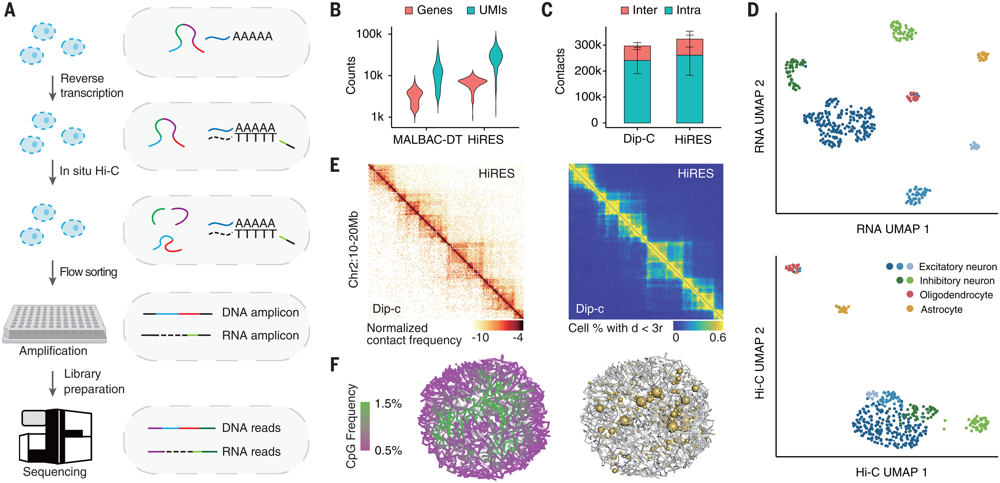

### 第一步：原位逆转录（In situ Reverse Transcription）

- 细胞**不裂解**，直接在细胞内部进行逆转录
- RNA → cDNA（互补DNA）
- 关键技巧：逆转录引物上带有**mRNA特异性标签**，这个标签后来用于计算机区分 RNA 和 DNA 的读段
- 细胞内同时存在：原始基因组 DNA + 新合成的 cDNA

### 第二步：原位 Hi-C（In situ Hi-C）

- 原理：空间上靠近的 DNA 片段会被交联、酶切、末端补平、生物素标记，再连接在一起
- 连接产物反映了细胞核内哪些基因组区域在空间上是"邻居"

### 第三步：流式分选（Flow Sorting）

- 将处理好的细胞**一个一个**分选到多孔板的每个孔里，保证每孔只有一个细胞，实现**真正的单细胞**分辨率

### 第四步：准线性扩增（Quasi-linear Amplification / MALBAC-DT 类策略）

> 这是 HiRES 的核心创新，**单个细胞的 DNA/RNA 量极少，必须扩增才能测序**

- 包含多轮退火和环状化扩增循环，相比纯指数扩增（PCR），线性扩增的**偏差更小**，覆盖更均匀（`图 1B`）

- 在**同一管反应**中同时扩增 DNA 和 cDNA，无需分管

### 第五步：计算机辅助区分 RNA vs DNA 读段

- 测序后，根据第一步引入的 **mRNA 特异性标签**，用生物信息学方法区分：
  - 带标签 → RNA 来源的读段（RNA-seq）
  - 不带标签 → 基因组 DNA 来源的读段（Hi-C）
- **无需物理分离** RNA 和 DNA！这避免了样本损失


### 可靠的结果

`图 1D`可见聚类分析，下图揭示了RNA聚类注释与HIC聚类注释结果高度一致（`图 S1-I`）。

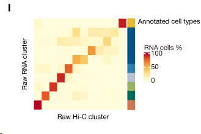

使用 HiRES 的 Hi-C 数据，对每个细胞重建结构，代表性的如`S2 A-C`，其中`染色体区域`（A）、`AB区室`（B，CpG频率高的代表转录活跃，属于A compartment，为绿色）、`径向偏好`（C，细胞核里不同的DNA区域有各自固定的"位置偏好"——活跃基因倾向待在核中心，沉默基因倾向待在核边缘）。

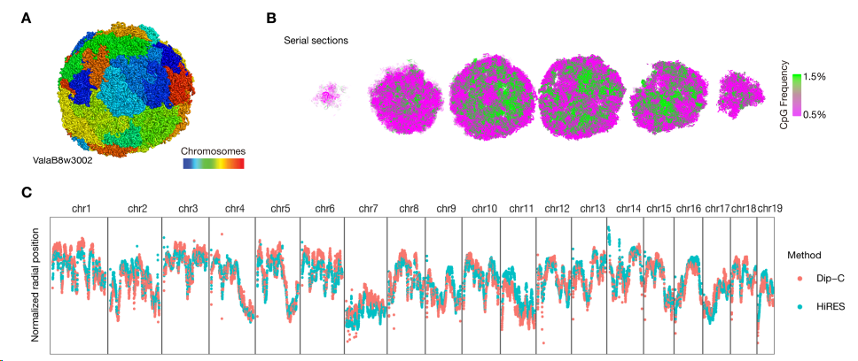


`图 1F`左右图分别展示了单细胞3D基因组结构和基因表达的关系（黄球越大表达越高），说明转录基因总喜欢在更活跃的染色质环境中。

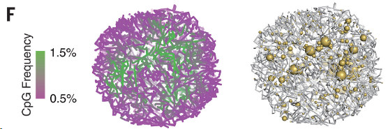


## 2、HIC数据分析

### 2.1 注释

- `图 2A`中是RNA数据的注释结果（ExE，胚外细胞；EPI，上胚层和原条；NMP，神经中胚层祖细胞；OPC，少突胶质细胞前体细胞）。
- 有四个主要细胞群，包括胚胎组织、胚外内胚层、胚外外胚层和血液，还有一个处于有丝分裂期的细胞群（Mitotic Cell）。

| 原文 | 中文翻译 | 胚层 |
------|----------|------|
| Neural ectoderm | 神经外胚层 | **外胚层** |
| NMP | 神经中胚层祖细胞 | — |
| Neural tube | 神经管 | **外胚层** |
| Radial glia | 放射状胶质细胞 | **外胚层** |
| OPC | 少突胶质前体细胞 | **外胚层** |
| Early neuron | 早期神经元 | **外胚层** |
| Early mesoderm | 早期中胚层 | **中胚层** |
| ExE mesoderm | 胚外中胚层 | **中胚层** |
| Early mesenchyme | 早期间充质 | **中胚层** |
| Intermediate mesoderm | 中间中胚层 | **中胚层** |
| Myocyte | 肌细胞 | **中胚层** |
| Mix late mesenchyme | 混合晚期间充质 | **中胚层** |

- `图 2B`是HIC包含四个细胞群的注释，且图 3C可见外胚层（蓝色）和中胚层（红色）在一开始比较混合，之后彼此分离`（E7.5-E11.5）`，证明`染色质构象作为基因表达支架的作用在早期发育中是保守的`。

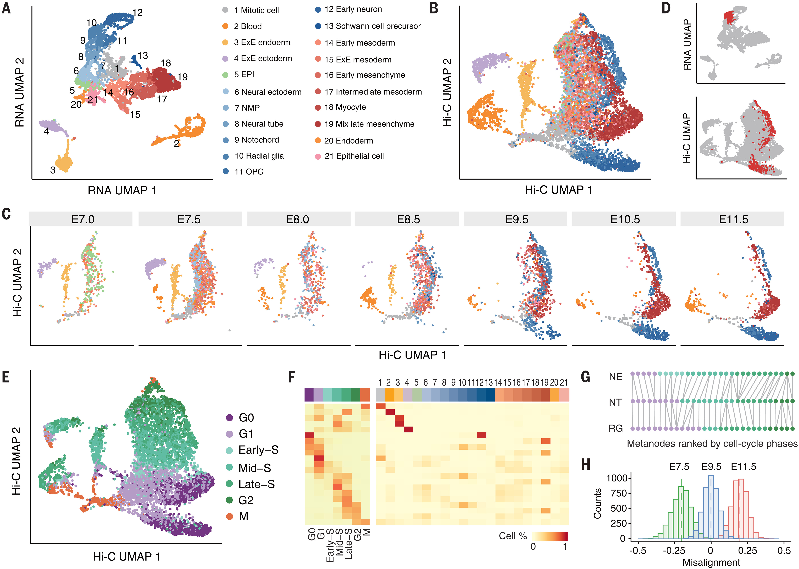


### 2.2 马鞍图展示分化中3D构象的变化

B区室是基因组中转录沉默、染色质压缩的区域（异染色质）。

- 随着胚胎发育，细胞命运逐渐确定，那些需要被永久关闭的基因所在区域会被"贴上"异染色质标记，归入B区室；这些B区室区域在细胞核内倾向于物理上聚集在一起（尤其是锚定在核膜内表面），就像油滴在水中会自发汇聚一样——这一过程由相分离驱动。
- 因此随着发育时间推进，越来越多的区域变成B区室，且这些B区室彼此靠近聚集，在Hi-C数据中就表现为B-B之间的接触频率持续升高。
- 本质上，**B-B互作增多反映的是细胞在分化过程中对"不需要的基因"进行集中封存的过程**。

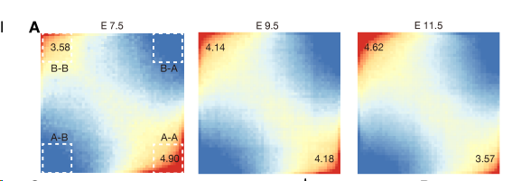


### 2.3 细胞周期对三维基因组结构的影响远大于对转录的影响

在`图2 D`中的放射状胶质细胞簇可见，上面RNA的聚类很密集，而下面HIC的聚类很分散，把下面HIC簇的细胞RNA表达数据提取并进行差异表达分析，GO显示富集到很多细胞周期通路。

- Q1：那么为什么`处在不同细胞周期的放射状胶质细胞`，其HIC接触矩阵差异很大呢？
- A1：因为不同细胞周期的染色体构象差异显著。
  - 比如`G0/G1期`需要大量转录基因、合成蛋白质等准备工作，所以`染色质需要展开以便转录因子、RNA聚合酶等接触到DNA`；
  - 而S期要局部开放，以便DNA能够有序推进，而又不至于全开导致乱成一团；
  - M期需极度压缩，如果不压缩，46条染色体（以人为例）互相缠绕，纺锤丝根本抓不住每条染色体整齐拉向两极。
- Q2：那么为什么RNA又那么整齐？
- A2：因为RNA聚类靠的是基因表达，标记的是细胞类型（细胞身份本身），而非细胞的状态，他们的RNA表达足够相似。

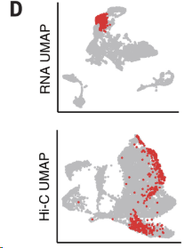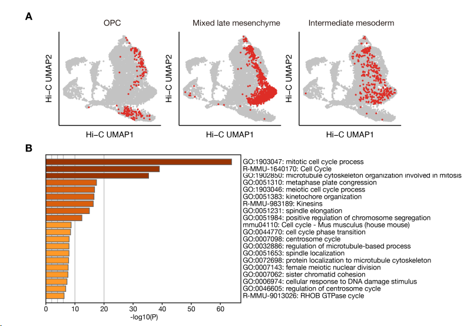

> [!IMPORTANT]
>
> 综上，研究细胞周期背景下三维基因组动态的变化非常重要。


## 3、HiRES捕获的细胞周期动态

### 3.1 HIC接触数据定义细胞周期阶段

作者团队开发了一种基于DNA和RNA数据将单细胞分配到七个细胞周期阶段的策略，每个阶段都具有独特的细胞周期基因表达、DNA复制和接触分布特征（图S6 A、B）。

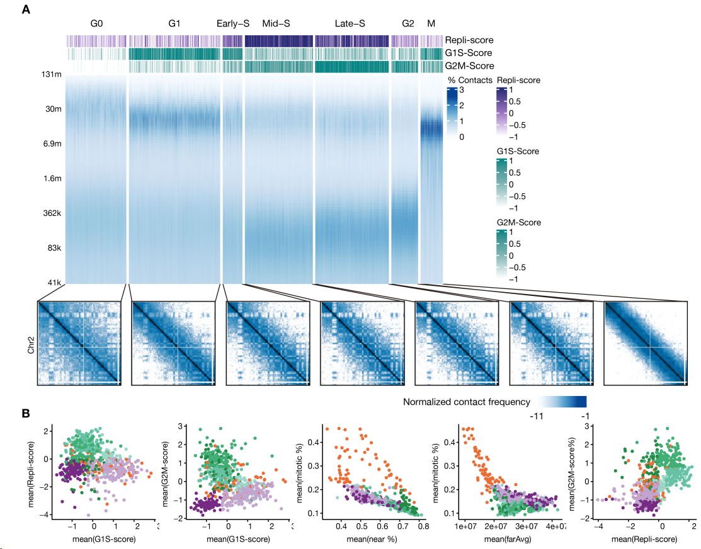


`图2 E`显示，细胞周期呈连续转换，`图2 F`显示接触定义的簇与细胞周期阶段更一致，说明`由细胞周期协调的染色质构象变化是整体三维基因组结构的主要贡献者`。

此外，每种细胞群特有的染色质组织必然在区分它们彼此之间以及与胚胎细胞群方面发挥了主导作用。因此，`细胞类型特异性和细胞周期特异性的染色质相互作用在早期发育过程中共存，并共同塑造了单细胞三维基因组`。

F：热图显示三维基因组簇中与细胞周期或RNA定义的簇重叠的细胞比例。RNA细胞类型的编号与（A）相同。

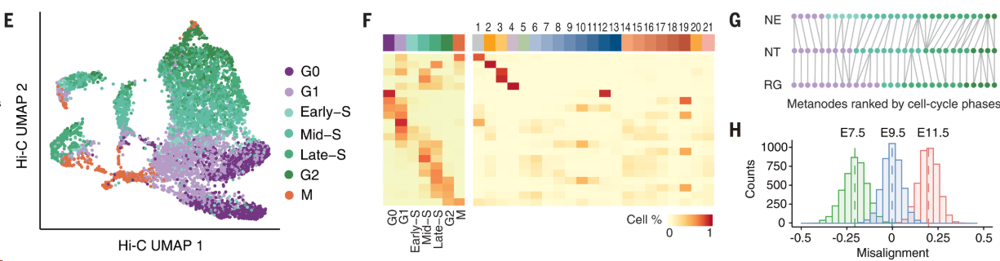


### 3.2 发育后期的细胞G1期长

发育后期的细胞不再需要快速增殖，G1期自然延长（`图S6E`显示G1期比例随发育增加）；G1期延长使染色质在有丝分裂结束后有更充足的时间重建三维结构（如TAD、长程互作），因此观察到发育后期细胞的平均长程接触更多（`图S6D`）。

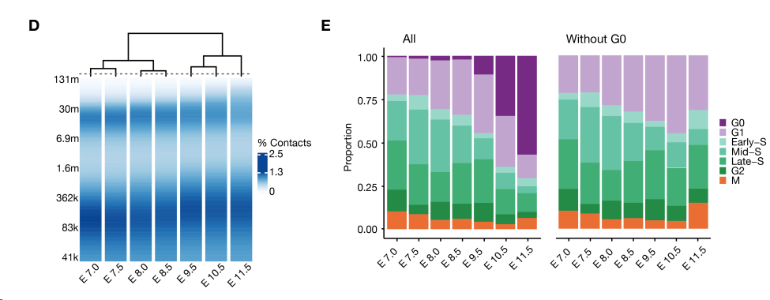


### 3.3 伪细胞周期

- 前面我们已经划分了七个细胞周期阶段，接下来，在每个细胞类型里面，我们先按这个细胞周期阶段排序分组`（G0/G1/Early-S/Mid-S/Late-S/G2/M）`。

- 在每个阶段组内继续排序，因为每个细胞有一条`contact decay曲线`，计算每两个细胞之间的曲线形状差异（最小距离），然后找到一种排列顺序使得相邻细胞之间的差异最小。

  - 关于`contact decay曲线`：Hi-C测的是基因组上任意两个位点之间的互作频率，而两个位点在基因组上距离越远，互作越少。
  - 在G1期（舒展），远距离位点处于分开状态，所以互作频率低，也就是该曲线下降很陡；
  - 相反的，在M期（极度压缩），远近都被压缩，所以下降曲线会较平且缓慢。
  - 因此通过这种曲线的对比，可以定义该细胞所处的详细细胞周期阶段。

  ```R
    互作频率
    ↑
    |█
    | █
    |  █
    |    █
    |       █
    |            █
    └─────────────────→ 两位点间的基因组距离
  ```

- 最后7组首尾相连，就得到了一个丝滑的染色质动态时间序列。


### 3.4 错位对齐

对齐之后发现了一个`错位现象`：

如神经外胚层的早期S期细胞与放射状胶质细胞的晚期G1期细胞对齐，而不是与早期S期细胞对齐。

- 早期发育细胞的周期阶段`X` ↔ 晚期发育细胞的周期阶段`X-1（滞后）`
- 反过来也成立：晚期发育细胞超前于早期发育细胞

原因：因为早期发育细胞G1期短，上次的M期刚刚结束，染色质刚刚舒展一点就进入了S期，而晚期发育细胞有充足的G1期时间。


且`这种错位在早期S期最显著，之后减弱`：

|          过程          |       驱动力       |                 作用                  |
| :--------------------: | :----------------: | :-----------------------------------: |
| ① 有丝分裂后自发解折叠 | 染色质自身物理弹性 | M期结束后染色体自然舒展，建立长程互作 |
|       ② DNA复制        |    复制机器推进    |   复制叉推进过程中积累大量短程互作    |

- G1期只有过程①，染色质缓慢舒展；
- S期开始后，过程②开始，其产生的短程互作开始主导染色质结构。
  - 而且该过程跨细胞类型保守，所以不同细胞类型的结构差异逐渐减小，`错位逐渐消失`。

> [!IMPORTANT]
>
> **综上，对于G1期较短的细胞周期，这两个过程在时间上相互重叠，共同决定了三维基因组的细胞周期动态**。


## 4、将差异性染色质相互作用与基因表达联系起来

### 4.1 细胞类型特异性差异相互作用（DI）

`HiRES`将每个细胞看做一个独立的样本，较 `bulk-Hi-C` 提高更高的统计功效，作者团队开发`SimpleDiff`流程解决`scHi-C`数据在千碱基分辨率下极其稀疏的问题。

- 补充：普通做法是，计算ab位点在A和B-celltype中各自的互作次数，并比较。
- `SimpleDiff`基本原理：
  - 先重建三维结构：我们有很多个那些点对接触的信息，相当于a-b、c-d、b-d这种信息，这样就能根据相对位置推算出一个三维结构，得到每个基因组bin在细胞核的三维坐标。
  - 有了坐标，使用欧几里得距离公式就能得到每个细胞里这两个bin的距离，这样每个细胞就都能给出一个值了，最后用Wilcoxon检验比较。

```
常规做法
A细胞类型：100个细胞里，5个检测到互作 → 频率 5%
B细胞类型：100个细胞里，3个检测到互作 → 频率 3%

SimpleDiff
A细胞类型：100个细胞的距离值 → 0.3, 0.4, 0.35, 0.28...（100个数）
B细胞类型：100个细胞的距离值 → 0.8, 0.9, 0.75, 0.85...（100个数）
```


### 4.2 DI富集特异标记基因

#### 4.2.1 测试

用成年小鼠脑内两簇兴奋性和抑制性神经元之间的差异来测试`SimpleDiff`的性能和可靠性。

`SimpleDiff`从4,849,385对20 kb基因组区间中识别出123,728个差异表达（DI），错误发现率（FDR）<5%。DI显著富集细胞类型特异性标记基因（卡方检验，*P* < 2.2 × 10⁻¹⁶），尤其是在排名靠前的DI中（图S8 C）。

C：DI锚点与顶级标记基因重叠的比值。DI组按FDR排序。误差条表示95%置信区间。

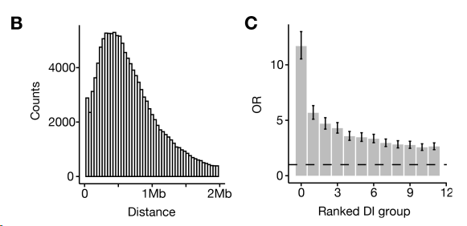


与标记基因重叠的DI在相应的细胞类型中往往表现出较弱的相互作用，这可能部分归因于近期在小鼠脑中发现的`“结构域熔解”现象`。

结构域熔解（Domain Melting）

- 正常情况下，基因组被组织成 TAD——一个区域内部互作多，边界外互作少，像一个个"隔间"。

- **结构域熔解**是指：当某个基因被高度激活转录时，它所在的TAD结构会**局部瓦解**——边界变模糊，内部互作减弱，就像固体"熔化"成液体一样失去原有结构。

- 转录时RNA聚合酶沿DNA高速移动，会产生**拓扑张力**，破坏原有的染色质折叠结构，导致局部TAD解体。


#### 4.2.2 一对多分析细胞类型DI

图 3A：小鼠胚胎细胞类型的代表性DI，其中数字表示细胞类型（与前面一样），仅取各细胞类型中前5%互作强度最高的DI；列是各细胞类型。

图 3B：从早期神经元中识别出的DI示例。白色箭头指示3D邻近图（上图）上包含DI的主要区域。圆圈表示3D差异图（下图）上的主要DI。

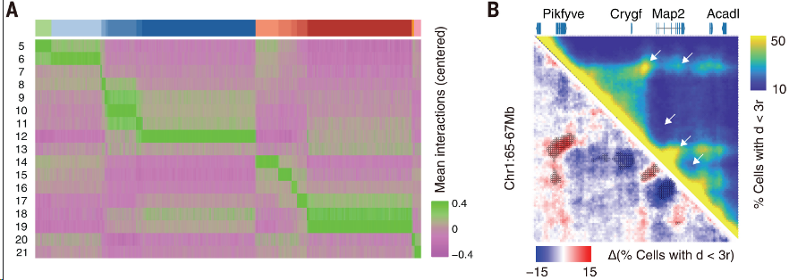


### 4.3 DI上基因的功能富集

GREAT = **Genomic Regions Enrichment of Annotations Tool**

使用细胞类型特异的DI做GREAT得到基因列表，上调最显著的DI富集了与特定细胞类型相关的基因本体论（GO）术语，例如`神经外胚层中的“神经元分化”`和`早期中胚层中的“心脏发育”`。

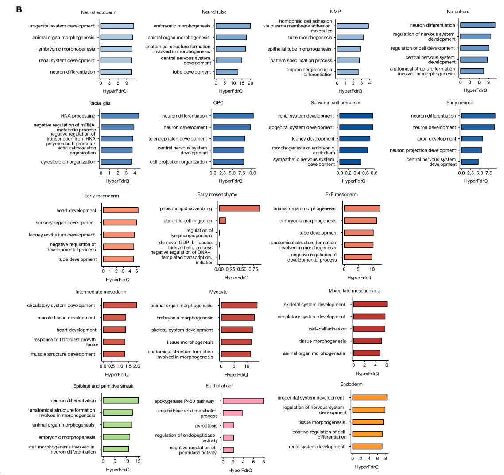

> [!IMPORTANT]
>
> 该结果表明，尽管早期发育过程中不同组织的染色质结构总体上相似，但`染色质相互作用的局部重连具有高度的细胞类型特异性，并且与细胞功能密切相关`。


### 4.2 DI谱聚类

- 有了各个细胞的DI的位置后，我们可以得到这样一个矩阵，每行是一个细胞，行内是该细胞所有DI的三维距离值。

- 使用这个矩阵，我们可以做一个UMAP聚类图，并用细胞类型（CD左）和细胞周期（CD右）分别着色。

**D图是C图仅保留G1期、G0期细胞的版本**。

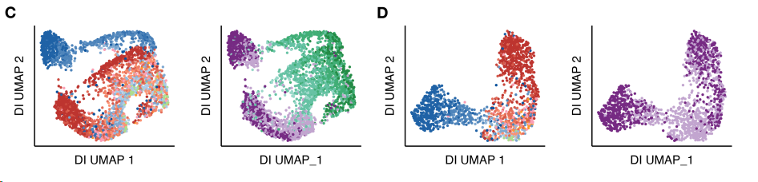

我们发现，使用最佳DI谱进行聚类仍然无法区分早期发育谱系中的细胞类型（图S9C）。作者给出了两个可能的原因：

- 三维基因组的动态特性（scHi-C是随机采样的）使得单细胞中的染色质相互作用具有极强的随机性；
- 与细胞周期相关的显著染色质重组主导了细胞类型特异性的染色质特征，即使是G1期和G0期细胞也是如此，而大多数G1期和G0期细胞在有丝分裂后仍在经历持续的染色质构象变化（图S9D）。


解决办法：

前面我们知道，RNA表达聚类注释结果比HI-C聚类注释更加可靠更加紧凑，所以这里作者将具有相似表达谱的单细胞合并成`元细胞 MetaCell`可以解决这些问题，因为细胞周期与标记基因表达变化的相关性要小得多。

图 3C：基于聚合DI谱的元细胞UMAP聚类。虚线圆圈分别表示神经外胚层（蓝色）和中胚层（橙色）谱系。

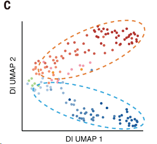

> [!IMPORTANT] 
>
> 表明可以利用单细胞RNA测序的联合分析来克服单细胞Hi-C数据的固有噪声。


### 4.3 Hi-C + RNA 

#### 4.3.1 GADI与基因的关联性

**GADI**：基因关联DI

使用相关性分析，即每个DI在每个metacell里面的距离值与每个基因在每个metacell里面的表达（metacell由RNA表达决定）。

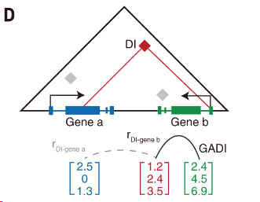

`图 S10A`：`GADI`比随机的`gene-DI`有更显著的结果，证明`GADI`的可靠性。

`图 S10B`：`GADI`富集细胞类型特异性标记基因，OR表overlap ratio。

`图 S10C`：平均每个基因与117个`GADI`有关联，大多`GADI`（61%）仅与一个基因有关联，2.6%与5个基因以上有关，其中许多来自 Hox 和原钙黏蛋白基因簇（`图 S10D`）。

- 这两个基因簇都是基因组上**密集排列的基因家族**，在三维结构上具有特殊性：
  - 几十个基因**串联排列**在一小段基因组上
  - 受同一个三维调控域（TAD）统一管控
  - 一个增强子或染色质互作可以同时影响**多个相邻Hox基因**的表达，一个关键的增强子（HS5-1）通过形成染色质环轮流激活不同的原钙黏蛋白基因

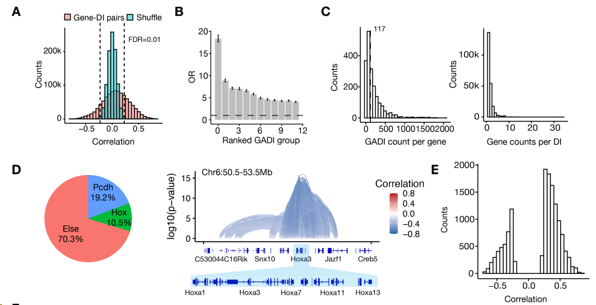


#### 4.3.2 GADI富集在TSS附近

与 DI 相比，`GADI` 在转录起始位点 (TSS) 周围高度富集（`图 3E`），而且大多数（69.5%）锚定点与 TSS 重叠的 GADI 显示出相互作用强度与基因活性之间的`正相关性（图 S10E）`。

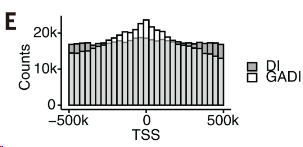

这些相互作用通常将启动子与远端调控元件（包括超级增强子）连接起来（`图 3F`）。

`图 3F`：与*Dcc*（左）或*Dlc1*（右）相连的GADI。顶部显示3D邻近图。每个GADI用连接其两个锚点的弧线表示，颜色表示其与基因表达的相关性。

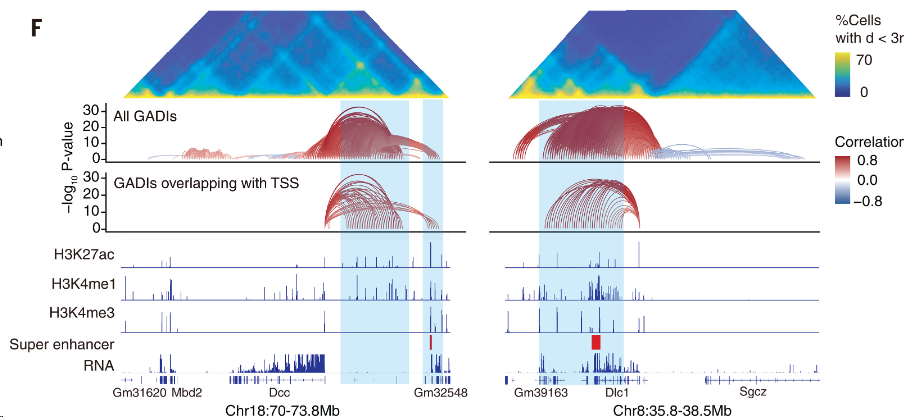


作者为了验证其结果，将结果与最近在两个不同的基因位点Zic1/Zic4和Mir9-2上的报道进行了比较，这两个位点的功能性增强子-启动子连接已在体内实验中得到验证（[*39*](https://www.science.org/doi/10.1126/science.adg3797#core-collateral-R39)）。在这两个位点上，我们都鉴定出了包含增强子-启动子相互作用的GADI，这与其他报道一致（`图 S10F`）。

`图 S10F`：类似上图。

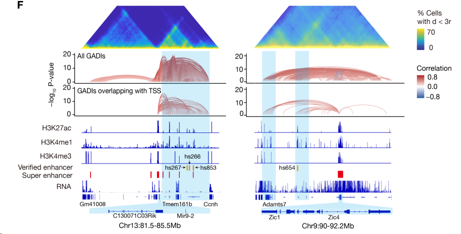


> [!IMPORTANT]
>
> **因此，GADI不仅代表与转录变化相关的染色质重连，也指示了潜在的增强子-启动子相互作用，这些相互作用是细胞类型特异性基因表达调控的基础。**


## 5、广泛的染色质相互作用在转录激活前发生重塑

#### 5.1 用残差探究GADI与RNA表达的同步变化

通过GADI将染色质相互作用与特定基因关联起来后，现在能够以高分辨率比较染色质构象的伪时间动态与转录过程。

作者首先恢复了两条胚胎分化轨迹：早期神经元轨迹和混合的晚期间充质轨迹（`图S11，A和B`）( [*43*](https://www.science.org/doi/10.1126/science.adg3797#core-collateral-R43) )。

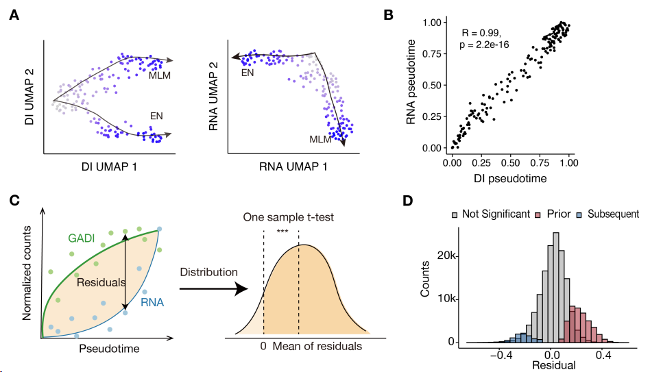

**每个GADI-基因对的“残差”**：同一元细胞中GADI相互作用强度与表达水平之差，类似于“染色质潜能”方法( [*44*](https://www.science.org/doi/10.1126/science.adg3797#core-collateral-R44) )

- 正残差：染色质互作已经建立，但基因还没开始表达 → 染色质变化超前于转录

- 负残差：基因已经在表达，但染色质互作还没建立 → 转录超前于染色质变化

- 残差≈0：染色质变化和转录同步发生

并使用轨迹上的所有元细胞进行单样本*t*检验，以确定残差是否显著偏离零（`图 S11C`）。

---

**结果：**虽然大多数染色质相互作用与基因表达同步变化，但仍有40,990个（21.6%）GADI-基因对（涵盖315个基因）的残差显著大于零，表明在转录改变之前染色质相互作用就已经发生了重连（`图 4A`）。

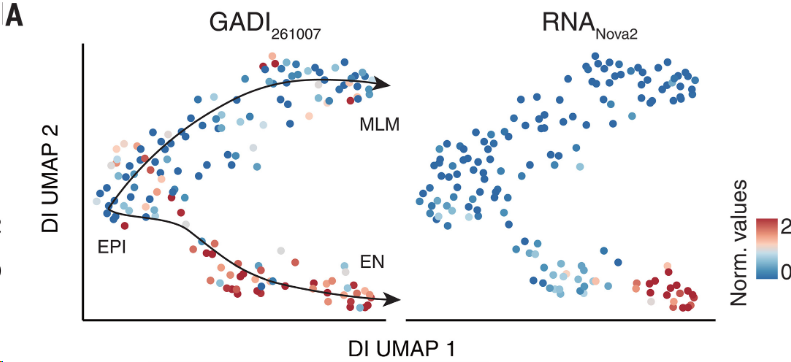


GADI的变化落后于RNA表达的例子

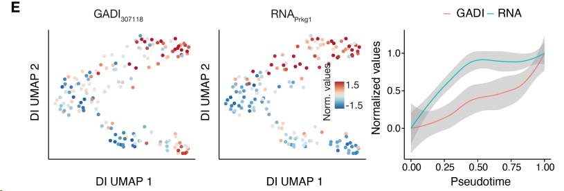


#### 5.2 机制探究

`图 4C`：包含H3K27ac信号（上图）或BB区室相互作用（下图）的GADI百分比。

- 与`混合晚期间充质`或`早期神经元`标记基因表达呈正相关或负相关的GADI分别按残差从大到小排序，分成100组：
  - 左边（0）= 残差最大 = 染色质变化远超前于基因表达（Prior，红色）
  - 中间    = 残差接近0 = 同步变化（Not significant，灰色）
  - 右边（100）= 残差最小 = 基因表达超前于染色质（Subsequent，蓝色）
  - 每组中`prior GADI`（比RNA表达先变化的GADI）的数量显示在顶部。

上图：每组GADI中，有多少比例落在H3K27ac富集区域（活性增强子标记）

下图：每组GADI中，有多少比例属于B-B区室互作

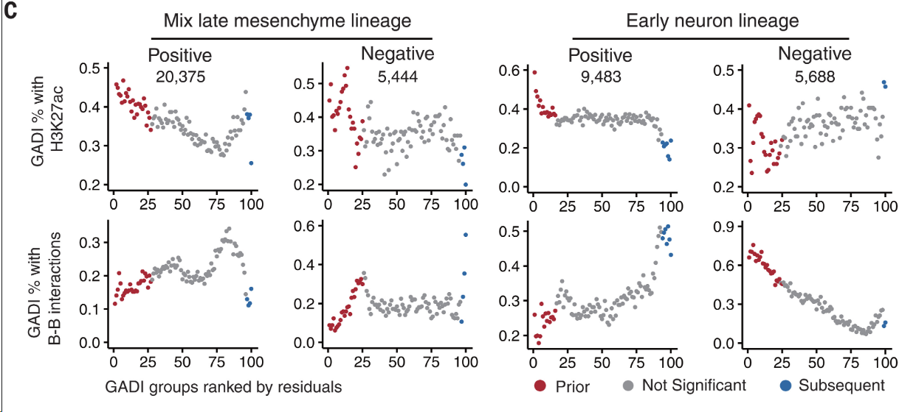

1. 在`混合的晚期间充质谱系中（左边四图）`，无论GADI相互作用强度与基因活性之间的相关性如何，基因表达前发生变化的相互作用都显著富集了活性增强子的染色质特征（上图H3K27ac强度高，这个明显；下图BB互作强度弱，即不在异染色质区）。


2. 在`早期神经元谱系中（右边四图）`，我们观察到了正相关和负相关的相反结果。

- 只有与转录呈正相关的`GADI`在基因表达前发生变化的相互作用中表现出增强子标记的类似富集。

- 相反，与转录呈负相关的`GADI`则富集异染色质标记和BB区室相互作用


解释 2 相反的结果

与`prior GADI`存在负相关的基因，的在转录起始位点（TSS）处减少，而在基因体及其侧翼区域富集（图 S13B）。

此外，我们发现相应的神经元基因（定义为具有>20个负相关的GADI的基因）通常位于更沉默的染色体环境中（图S13C和D），即PC1值更低一些。

图 S13C：各组都是负相关GADI-RNA的基因列表，即负相关Prior GADI在基因表达下降**之前**就先建立互作。

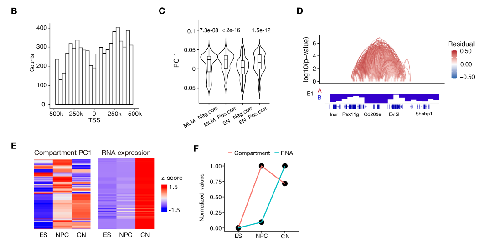


## 6、结论

基因表达前三维基因组的变化背后存在不同的染色质动力学机制（`图 4D`）。

首先，在大多数基因位点，基因表达前的染色质重连主要发生在活性染色质之间，这可能是由增强子的激活驱动的。

其次，对于位于抑制性染色质环境中的基因，转录激活前发生的是浓缩的异染色质的松弛。这两个过程并非互斥，可能同时发生在同一基因上。

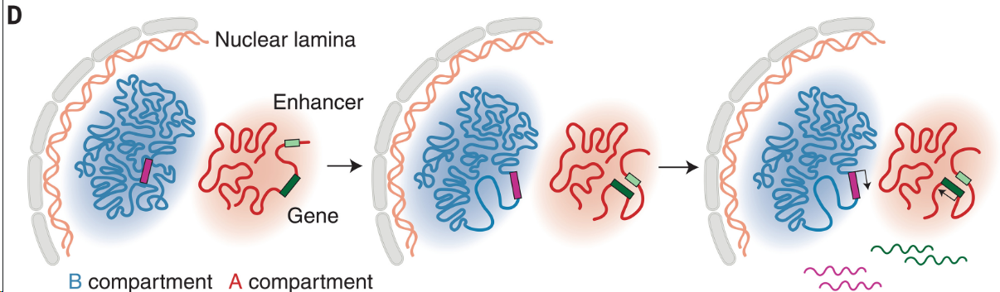
