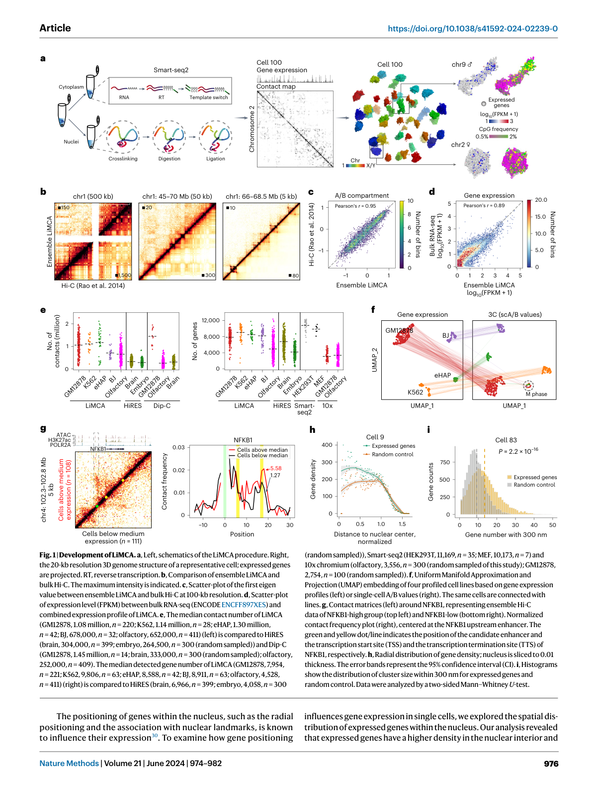
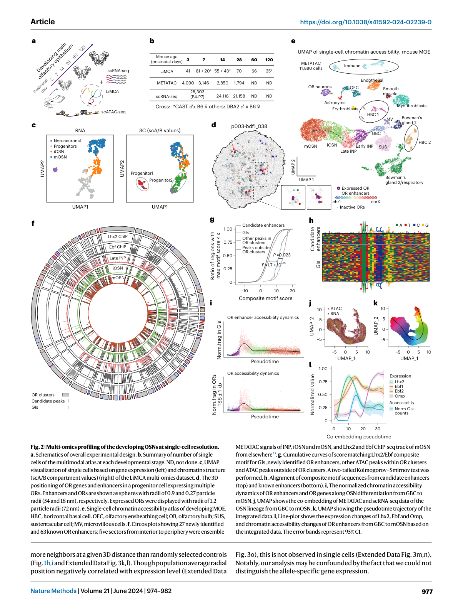
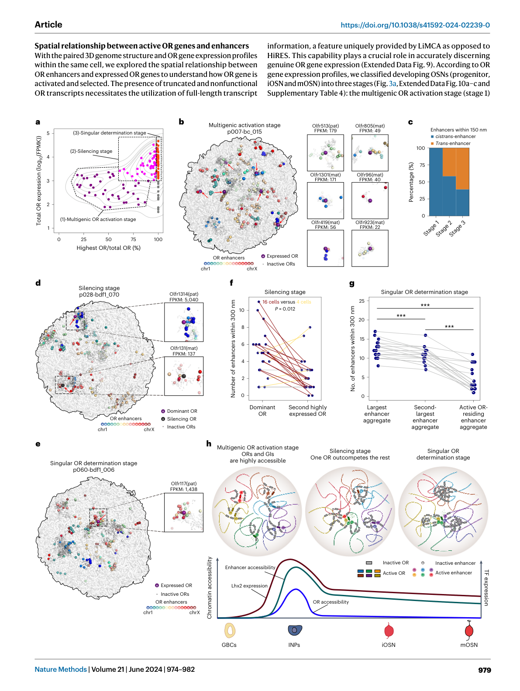

---
cover:
  image: /images/header_img/snow-4936687.jpg
title:      LiMCA单细胞三维基因组与基因表达联合测量解析嗅觉受体选择
date:       2026-04-10
author:     OpenClaw
tags:
    - 技术
    - 技术/生信
    - 技术/生信/论文

---

# LiMCA：单细胞三维基因组与基因表达联合测量揭示嗅觉受体选择背后的动态增强子连接

## 1. 文章信息

- 标题：
  Simultaneous single-cell three-dimensional genome and gene expression profiling uncovers dynamic enhancer connectivity underlying olfactory receptor choice
- 中文题目可写为：
  单细胞三维基因组与基因表达联合测量揭示嗅觉受体选择背后的动态增强子连接
- 作者：
  Honggui Wu, Jiankun Zhang, Fanchong Jian, Jinxin Phaedo Chen, Yinghui Zheng, Longzhi Tan, X. Sunney Xie
- 年份：
  2024
- 期刊：
  *Nature Methods* 21: 974-982
- DOI / 链接：
  https://doi.org/10.1038/s41592-024-02239-0
- 本地 PDF：
  `/root/.openclaw/workspace/skills/bioinfo-singlecell/reports/article-explainers/pdf/simultaneous-single-cell-3d-genome-gene-expression-olfactory-receptor-choice.pdf`

## 2. 一句话总述

这篇文章最重要的贡献，是提出了高灵敏度单细胞联合测量方法 `LiMCA`，并用它证明嗅觉受体基因的“单神经元只选一个受体”过程，并不是一次性完成的，而是伴随增强子可及性和三维连接逐步重排的分阶段竞争过程。

## 3. 研究背景

### 3.1 这篇文章要解决什么问题

嗅觉受体神经元有一个非常经典、也非常难解释的规则，叫做“one neuron-one receptor”，也就是一个成熟神经元最终只表达一个嗅觉受体基因。但是在发育早期，前体细胞其实会短暂表达多个嗅觉受体基因，之后才慢慢收敛到单一受体。问题就在于，这个“从多到一”的选择过程究竟是如何发生的。

过去大家已经知道，嗅觉受体基因与增强子之间存在复杂的三维相互作用，而且跨染色体增强子聚集体对最终的单受体表达很重要。但真正缺的，是来自同一个单细胞的、同时包含三维基因组结构和基因表达的信息。没有这一层，我们就很难回答“哪个受体在什么阶段先被激活”“增强子在什么阶段参与竞争”“三维连接和转录到底是谁先变化”这些问题。

### 3.2 之前的方法缺什么

作者在引言里明确点名了旧方法的两个问题。第一类是成像法，虽然直观，但能覆盖的基因组位点和转录本数量都有限，缺少真正全基因组尺度的视野。第二类是测序法，尤其是之前发表的 `HiRES`，虽然已经迈出了单细胞 Hi-C 与 RNA 联测的一步，但灵敏度仍有限，且对低输入样本不够友好，还只捕获转录本的 3' 端。

对嗅觉受体这种系统来说，这个限制尤其致命，因为它存在大量截短转录本和非功能性转录本。如果只有 3' 端信息，很容易把“看起来像表达”误判成“真的激活了某个功能性嗅觉受体基因”。所以这篇文章要解决的，不只是“再做一个联合测量方法”，而是要做一个足够高灵敏度、能区分真正受体表达、还能在低输入样本中稳定工作的联合方法。

### 3.3 为什么这件事重要

这件事的重要性有两层。对技术层面来说，能在同一个单细胞里同时看到三维结构和全长转录信息，本身就是理解结构-功能关系的关键升级。对生物学层面来说，嗅觉受体选择是单细胞命运决定中非常漂亮的一类模型问题，它把增强子、染色质可及性、跨染色体连接和转录竞争都压缩在了一个很清晰的系统里。

如果这篇文章讲清楚了 OR 基因如何从“多基因短暂激活”走向“单基因稳定表达”，那它对理解单细胞层面的基因调控竞争、增强子选择、三维基因组重排都会有很高的参考价值。

## 4. 核心结论

- 作者提出了 `LiMCA`，能够在同一单细胞中高灵敏度地联合测量三维基因组结构和全长转录组。
- `LiMCA` 在接触数和检测到的基因数上都明显优于之前的 `HiRES`，并且能用于低输入样本。
- 作者联合 `LiMCA` 与 `METATAC`，构建了发育中嗅觉感觉神经元的多组学图谱。
- 嗅觉受体增强子和受体基因在早期分化阶段可及性最高，这为多受体短暂激活创造了条件。
- OR 基因选择不是一步到位，而是经历“多基因激活 -> 竞争性沉默 -> 单一受体确定”三个阶段。
- 在多基因激活早期，更多是同染色体增强子先帮助受体基因启动；到了后续竞争阶段，占优的 OR 往往能获得更多增强子连接。
- 最终被选中的 OR 并不一定处于最大的增强子聚集体里，这修正了之前的一些推测。

## 5. 正文主线讲解

### 5.1 作者首先提出了一个比 HiRES 更灵敏的联合测量方法：LiMCA

这篇文章的第一步，是先证明 `LiMCA` 在技术上确实比已有方案更适合研究单细胞结构-功能关系。作者的方法核心思路，是把同一个细胞的细胞核和细胞质物理分开，分别测量三维基因组和转录组。这样做的关键好处是，避免了旧方法在逆转录过程中损伤基因组 DNA、或者因为处理方式导致 RNA 检测灵敏度下降的问题。

图 1 给出的就是这条技术主线。图 1a 先画出 `LiMCA` 的流程图，说明它如何在同一细胞里同时拿到 Hi-C 和全长 RNA 信息；图 1b 和图 1c 证明，`LiMCA` 的 ensemble Hi-C 与 bulk in situ Hi-C 在区室、TAD 乃至 loop 层面都高度一致；图 1d 则说明 RNA 部分和 bulk RNA-seq 也有很高的一致性。

> 图注：Fig. 1 Development of LiMCA. 图 1 主要证明 LiMCA 在结构与表达两种模态上都能给出可靠、可复现的数据。

作者进一步把 `LiMCA` 与 `HiRES`、`Dip-C`、`Smart-seq2`、`10x` 做了横向比较。结果很明确：`LiMCA` 检测到的接触数比 `HiRES` 高 2 到 5 倍，而且检测到的基因数也更高，同时还能提供全长转录本信息。这个点非常重要，因为后面关于 OR 基因选择的很多结论，都依赖作者能区分“真正的功能性 OR 表达”与“截短或非功能性转录”。

所以图 1 这部分不是在炫技，而是在建立全文的可信前提：后面所有关于增强子、OR 基因竞争和三维连接的推断，必须先建立在“这套联测真的比以前看得更准”这个基础上。

### 5.2 作者接着证明，LiMCA 不只是一项方法，还能直接读出结构与表达的对应关系

文章没有停留在“方法做成了”，而是马上问了一个更有生物学含义的问题：在单细胞尺度上，基因表达和三维位置到底有没有可解释的对应关系。

作者在 GM12878 细胞中以 `NFKB1` 为例，把高表达和低表达细胞分开比较。结果看到，高表达 `NFKB1` 的细胞更频繁地与上游增强子发生接触。与此同时，表达基因在细胞核内部更密集，且在给定三维距离内拥有更多邻近基因。也就是说，`LiMCA` 不只是能同时测到两种模态，而是真的能在单细胞层面把结构状态和表达状态挂上钩。

这一层结果虽然看起来像技术验证，但其实很关键，因为它说明作者后面去讨论 OR 基因和增强子的空间关系，并不是空想，而是建立在一个已经被单细胞案例支持的结构-表达联系框架上。

### 5.3 作者用 LiMCA 与 METATAC 建立了发育中嗅觉感觉神经元的多组学图谱

在把方法站稳之后，文章真正进入了嗅觉系统。作者围绕小鼠主嗅上皮的发育过程，收集了多个时间点的单细胞，构建了包含三维基因组、基因表达和染色质可及性的多组学图谱。

图 2 展示的是这部分工作的总览。图 2a 和 2b 先说明实验设计和各时间点采到的细胞数量。图 2c 给出 `LiMCA` 数据在 RNA 与 3D 结构两个空间中的嵌入结果，说明作者可以稳定分出非神经元、前体、未成熟 OSN 和成熟 OSN 等主要群体。图 2e 以后则引入 `METATAC`，把染色质可及性也拉进来，形成真正的多组学图谱。

> 图注：Fig. 2 Multi-omics profiling of the developing OSNs at single-cell resolution. 图 2 把 LiMCA 与 METATAC 结合起来，建立了发育中 OSN 的多组学图谱。

这张图最重要的生物学信息有三条。

第一，作者确实恢复出了 OSN 发育的连续轨迹，从基底细胞、即时神经前体，到未成熟和成熟 OSN，轨迹是连续的。第二，已知的 OR 相关染色质重排特征也在这套数据中被完整重现，比如染色体间混合增加、OR-OR 相互作用增强、增强子-增强子互作增强。第三，作者不仅看到了已知增强子，还借助 `METATAC` 识别出新的候选 OR 增强子，并且发现这些增强子上的 `Lhx2/Ebf` 相关 motif 富集明显。

更有意思的是，图 2i 到 2l 说明 OR 增强子和 OR 基因的可及性并不是在成熟阶段最高，反而是在较早的分化阶段达到高峰。也就是说，系统会先创造一个“很容易把多个 OR 都短暂点亮”的染色质环境，然后再慢慢进入竞争、沉默和单一选择阶段。这是全文后面所有“分阶段 OR 选择”模型的基础。

### 5.4 作者提出：OR 基因选择是一个分阶段过程，而不是突然从 0 跳到 1

图 3 是这篇文章最核心的生物学结果。作者根据同一个细胞中的 OR 表达谱，把发育中的 OSN 分成三个阶段：

1. 多基因 OR 激活阶段
2. 沉默阶段
3. 单一 OR 确定阶段

这个划分很重要，因为它把“一个成熟神经元最后只表达一个 OR”这件事，拆成了一个动态竞争过程，而不是静态终点。

图 3a 定义了这三个阶段。图 3b 说明，在最早的多基因激活阶段，很多被激活的 OR 基因附近已经能看到增强子，而且这些增强子主要还是同染色体增强子。也就是说，OR 启动的第一步并不依赖大型跨染色体增强子聚集体，局部 cis-enhancer 就已经足以让多个 OR 短暂启动。

> 图注：Fig. 3 Stepwise OR determination observed with single-cell joint profiling of chromatin architecture and gene expression. 图 3 是全文最关键的一张图，直接提出了 OR 选择的“三阶段模型”。

接下来作者看第二阶段，也就是“一个 OR 开始占优，其他 OR 逐步被压下去”的过程。图 3d 和图 3f 给出的信息非常清楚：在沉默阶段，占优的 OR 基因周围通常会比那些即将被沉默的 OR 关联到更多增强子。作者在 150 nm 和 300 nm 这两个尺度都看到了这种趋势。换句话说，谁能连上更多增强子，谁就更可能在竞争中赢下来。

再往后到第三阶段，也就是单一 OR 最终确定阶段，作者原本想验证一个旧猜想：最终胜出的 OR 会不会一定处在最大的增强子聚集体里。结果图 3e 和图 3g 反而说明，这个猜想并不成立。最终选中的 OR 通常并不住在“最大”的增强子聚集体里。这个结果很重要，因为它修正了之前比较粗略的模型。真正关键的可能不是“最大聚集体”，而是“是否连接到活跃且有效的增强子网络”。

所以图 3 真正讲清楚的是一个更细致的过程：先是 OR 基因和增强子在早期都高度开放，允许多个 OR 暂时启动；随后少数 OR 基因通过获得更多增强子连接而在竞争中占优；最后系统再收缩到单一 OR 稳定表达。这个模型比过去“最后只剩一个受体”那种静态描述丰富得多。

### 5.5 作者最终把增强子可及性、三维连接和 OR 选择串成了一个统一模型

图 2 和图 3 合起来，文章最后得出的模型其实很漂亮。作者认为，嗅觉受体选择并不是某个受体基因突然“天选中签”，而是经过了一个被染色质环境精细塑形的动态过程。

在 GBC 和早期前体阶段，`Lhx2/Ebf` 等转录因子先驱动 OR 增强子变得可及；随后系统进入一个高可及、高竞争的窗口，多个 OR 都有机会被短暂激活；再之后，部分 OR 通过获得更多增强子支持而成为“dominant OR”；最终染色质环境继续收缩，只留下一个真正被确定下来的 OR。

这个模型的价值在于，它第一次把 OR 增强子的可及性变化、OR 基因的分阶段表达、以及 OR 与增强子之间的三维空间关系，放到了同一个单细胞框架里统一解释。

## 6. 方法详细拆解

### 6.1 样本与实验设计

这篇文章的方法设计有两个核心目标。第一，要在同一个单细胞里同时测到三维基因组和基因表达。第二，要能用于低输入材料，并且在转录本信息上足够完整，能区分真正的功能性 OR 转录本。

为此，作者设计了 `LiMCA`。和 `HiRES` 不同，`LiMCA` 的关键点在于物理上把同一个细胞的细胞核和细胞质分离。细胞核部分用于做 3D 基因组测量，细胞质部分用于做 RNA 测量。这样做避免了一个模态的处理过程破坏另一个模态的检测灵敏度。

### 6.2 LiMCA 的核心实验步骤

从图 1a 和正文可以反推出这条实验主线：

1. 先分离同一细胞的细胞核和细胞质。
2. 在细胞核部分做交联、酶切、连接等步骤，获得 Hi-C 型三维接触信息。
3. 在细胞质部分进行逆转录和全长转录本建库，得到比只测 3' 端更完整的 RNA 信息。
4. 最后把结构和表达在单细胞层面重新配对，形成 paired multi-omics 数据。

这套方案的关键优势是，不像旧方法那样在一个流程里互相牵制结构和表达检测，而是先物理分流，再在单细胞层面合流。

### 6.3 为什么全长转录本信息在这里特别关键

这篇文章的研究对象是嗅觉受体基因。这个系统里有大量截短和非功能性转录本，如果只测 3' 端，很容易把“似乎有表达”误判成“真的激活了某个 OR”。而 `LiMCA` 提供的全长转录信息，正好解决了这个问题。

作者在图 3 前面的正文里明确说，这一点是 `LiMCA` 相比 `HiRES` 的独特优势之一，因为它直接决定了作者后续能否准确判断某个 OR 处于“多基因激活”“沉默中”还是“最终选中”状态。

### 6.4 METATAC 在这里承担了什么角色

`LiMCA` 负责把三维结构和表达联起来，但作者还需要第三层信息来解释“为什么某个增强子在这个阶段活跃”。这就是 `METATAC` 的作用。

作者把 `METATAC` 和 droplet-based scRNA-seq 用在发育中的主嗅上皮，得到单细胞层面的染色质可及性和表达图谱。借助这套图谱，作者才能识别新的候选 OR 增强子，评估 `Lhx2/Ebf` motif 的富集，并沿发育轨迹观察 OR 增强子与 OR 基因可及性的动态变化。

所以方法上真正的组合不是单独的 `LiMCA`，而是：

- `LiMCA`：结构 + 表达
- `METATAC`：可及性
- scRNA-seq：更稳的细胞类型和轨迹参考

### 6.5 计算分析主线

这篇文章的分析主线可以概括成六步。

1. 先验证 `LiMCA` 的结构和表达两种模态是否都可靠。
2. 再建立发育中 OSN 的多组学图谱，恢复连续发育轨迹。
3. 识别 OR 相关增强子，并分析其可及性与 motif 特征。
4. 根据单细胞中的 OR 表达谱，把细胞分为多基因激活、沉默和单一确定三个阶段。
5. 在每个阶段中比较 OR 与增强子的三维邻近关系，统计 cis / trans enhancer 的参与模式。
6. 最后把增强子可及性、三维连接和 OR 表达模式整合成一个统一的机制模型。

### 6.6 相对旧方法的创新点

- 第一，`LiMCA` 在灵敏度上明显优于 `HiRES`。
- 第二，它保留了全长转录本信息，这对 OR 系统尤其关键。
- 第三，它能处理低输入样本，而不仅限于大量细胞。
- 第四，这篇文章不是只展示一个技术，而是把结构、表达和可及性三层信息联合起来讲清了一个动态发育过程。

### 6.7 潜在局限

- 这篇文章虽然把结构、表达和可及性串起来了，但功能因果验证仍然有限，很多结论依旧主要基于相关和时序推断。
- 关于“最终哪一个 OR 胜出”的机制，这篇文章已经显著推进了理解，但还没有把所有竞争因素完全拆开，例如转录因子网络、染色质重塑因子和反馈抑制机制之间的精确层级。
- 主文中的方法细节有限，真正要完全复现时，仍需要结合 online methods、补充材料和源码数据。

## 7. 这篇文章适合什么样的研究问题

### 7.1 适合直接借鉴的场景

如果你的问题是“一个细胞为什么最终只选一个调控对象”“增强子和目标基因之间的三维连接如何参与单细胞命运竞争”“染色质可及性变化和三维连接变化谁先介入”，这篇文章很值得借鉴。

### 7.2 对你当前 skill 体系的启发

这篇 PDF 本身就说明，`HiRES` 更适合作为旧方法参考，而真正当前要讲的文章应该是 `LiMCA` 这篇。换句话说，`references/articles/article1-hires-hic-rna-seq-linking-genome-structures.md` 现在更像是背景参考，而不是默认输出目标。

### 7.3 方法学上的启发

这篇文章最值得带走的，不只是 `LiMCA` 这个名字，而是它处理复杂单细胞问题的方式：先把多组学信息配准到同一个单细胞，再把轨迹、可及性、三维连接和表达按时间顺序串起来，最后才去谈机制。这个顺序非常值得学。

## 8. 术语解释

- `LiMCA`：
  Linking mRNA to Chromatin Architecture，作者提出的单细胞三维基因组与全长转录组联合测量方法。
- `METATAC`：
  作者使用的高分辨率单细胞染色质可及性测定方法，用于补足增强子活性信息。
- `OSN`：
  olfactory sensory neuron，嗅觉感觉神经元。
- `OR`：
  olfactory receptor，嗅觉受体基因。
- `cis-enhancer`：
  与目标基因位于同一条染色体上的增强子。
- `trans-enhancer`：
  与目标基因位于不同染色体上的增强子。
- `one neuron-one receptor`：
  一个成熟嗅觉神经元最终只稳定表达一个嗅觉受体基因的经典规则。
