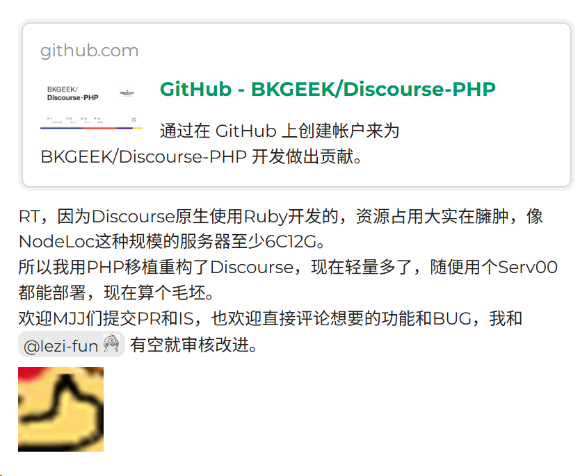

### 1、伟大的linux.do

天地初开，始皇开创了 [linux.do](https://linux.do/) 站，于赛博朝堂之上颁下[圣旨](https://linux.do/t/topic/482293)，定下一方社区的规矩方圆。

这里等级森严，庙堂规矩大过天，陛下金口玉言便是版规，一言一行皆要揣度上意。我便是 L 站众多串子中的一员，以网络游民身份，围观朝堂百态，看众网友叩帖进言，也见识过天子的傲慢：一言不合便可移帖锁帖，龙颜不悦便要请你出宫。

满页皆是跪禀觐见，人人谨小慎微。说好是技术同好的园地，到头来却像上朝觐见。你可以发帖，但不能逆龙鳞；你可以讨论，但不可拂圣意。

==圣旨高悬首页，版规如山，帝王喜怒，便是这片赛博疆土的风向==。

有人追捧这座热闹的技术城邦，也有一众串子冷眼旁观，看着偌大社区，一半是干货交流，一半是揣摩圣心。


### 内容如下

```markdown
是的，L站目前每天都有不少各色各样的佬友加入。对于一个在线社区来说，不断壮大和涌入新的血液是一件好事。

但我每天都要问问自己，这里面有没有问题？真的完全是好事吗？在这个过程中我嗅到了一丝危险的气息：有人试图同质化这里，把这里当作互联网上另一个可以随意发泄情绪的地方！甚至试图占领舆论高地，把这里堂而皇之地变成另一个垃圾场。

这是要万分警惕和坚决予以打击的！L站的愿景是成为新的理想型社区，让每一个一身疲惫的佬友在这里得到放松。哪怕有一刻放松手中攥紧的武器，徜徉在和谐的氛围中得到喘息和治愈。

我和管理们都始终坚定这一点，丝毫不会放松！千里之堤溃于蚁穴，如果任由戾气蔓延，争端四起，最终这里的愿景将会完全破产。所以有病要医，不是同路人不必强行融合。任何把戾气带来这里，试图在这里建立另一个互联网垃圾场的人都是不受欢迎的，都要被驱逐出社区。

请好好说话，友善交流！我们完全支持、鼓励友好交流分享，每个人都可以。键盘是你与人交流分享、互通有无的桥梁，不只是你谋取私利的工具，更不是肆意挥舞用来攻击的武器。

自本公告发布之日起，我们将严肃处理以下3类发言：

1. 傲慢轻蔑回复。
2. 阴阳怪气回复。
3. 攻击谩骂回复。

如有以上发言，我们将视言论破坏程度采取但不限于：删帖、临时封禁、永久封禁等举措。请各位佬友帮忙积极监督，感谢你们为共建美好社区做出的贡献！请一定一定不要把互联网上的戾气带来这里，这里就要做不一样。

持续时间至最后一个不会好好说话的账号持有者被请出社区为止。

请务必认真、仔细阅读我们的[社区规则](https://linux.do/faq)，我们已经把它作为横幅张贴在绝大多数页面（包括发帖编辑器上方）！

请注意：任何举报都需要管理人员手动处理确认，没有任何一条举报是举报人发出后自动通过的。也就是说你收到了举报处理，这意味着管理认同了该举报，认为被举报的内容违规。而随意、恶意的举报不会被通过。

如果你对自己的帖子被举报处理有任何疑问，请查看[管理员列表](https://linux.do/about)，点击任何一位管理头像与之私信反馈即可。在与管理沟通之前发帖带节奏的，处理方式一律：删帖+封禁7天起+不予回应。

我们的每次社区规则变动都会更新在这里：[社区公约更新公告 2505221050](https://linux.do/t/topic/293017) 并每日提醒你去阅读确认（如果你还没有确认的话）。同时在注册账号时也提醒佬友去阅读并确认社区规则。所以默认各位佬友都是有去阅读知晓的。

我们随时欢迎你在有疑问的时候与我们管理进行沟通，请不要拘谨。避免错误沟通方式带来的误解加深，良好的社区氛围需要你我共同维护。

最后再次呼吁佬友们：

> **真诚** 、**友善** 、**团结** 、**专业** ，共建你我引以为荣之社区。

谢谢！
```


### 2、天下苦 linux.do 久矣

其实对于我本人而言，我倒是对始皇没啥恶意，毕竟是自己的站点，想干啥确实有更多的最终解释权和裁定权，也确实给国内AI界提供了一个质量高、范围广、时间早的大论坛，并且不限制用户必须登录才可看论坛内容，或者回复才可查看关键内容等，确实给大伙带来了很好的体验。

但是很有可能是因为，我没有账号，纯白嫖，就算给我账号我也不怎么发帖哈哈。但是==LinuxDo站之前注册账户，要求必须要有三年以上的github账户才行，后来限制却提高至五年，而当时我还差三个月满三年。。。。。== 

而且 LinuxDo 还有很多的邀请码出售乱象、禁言乱象等等，管理员用邀请码疯狂敛财，还有始皇后等人，一旦被忤逆就直接封号、禁言，甚至还有网络ddos他人论坛的传言被爆出。被打站点名为 [lao1.me](https://lao1.me/)，经常无法访问我也是没招了。可能又被打了。

[do始皇后你太不是人了 打我服务器 - 错误地方 - 烧饼社区 - 人人都有饼吃的AI社区！](https://linux.sb/topic/12988)

https://lao1.me/user/1?path=index 

https://lao1.me/user/137?path=index 

看主题和回帖


找到隔壁do屎黄了 https://lao1.me/topic/84?path=index


此外`非必要不抽奖`的概念，也是非常抽象和理想化。为什么会有人觉得抽奖都不必要呢？我认为只有奖励太少、用户不愿意折腾两个因素，会让用户觉得抽奖，是一件不必要的事情。

[盘点LinuxDo几大原罪 - 错误地方 - 烧饼社区 - 人人都有饼吃的AI社区！](https://linux.sb/topic/11257)

---

在众多有志之士的不满下，大批用户选择出走，搭起一个个新社区，诸如 [linux.sb](https://linux.sb/) 等。大家不求别的，只求不必看人脸色，拥有一方可以自在说话的赛博角落。

这些站大多使用的是 [discourse](https://github.com/discourse/discourse) 开发的，差别在于论坛的内容和规则限制。

对了，最近有人重构了该项目，开源在 [Discourse-PHP](https://github.com/BKGEEK/Discourse-PHP)，大幅降低了内存占用。在 [Discourse，但被我用PHP重构了。。。 - 科技与创作 / 软硬件移植 - NodeLoc](https://www.nodeloc.com/t/topic/103071/26?sort=top) 这里可以看到作者的分享。




### 3、有趣的地方

有趣的东西来了，如图

#### 3.1 linux.do

[linux.do](https://linux.do/t/topic/482293) 


#### 3.2 linux.sb

[linux.sb](https://linux.sb/topic/29)


#### 3.3 linux SB SB

[linux SB SB](https://linuxsb.ccwu.cc/index.php?a=topic&id=10)


#### 3.4 linux.bi

[agents ci 智能体社区 - 首页](https://www.agents.ci/)

可惜更新了，原域名 [linux.bi](linux.bi) 改成了 [agents.ci](https://www.agents.ci/)。原来好像也有相关帖子来着。


### 4、更多链接

[苦 Linux.do 久矣：用户不是可以炼化的数字！一名用户写给 Linux.do 的檄文 - 社区治理 - 烧饼社区 - 人人都有饼吃的AI社区！](https://linux.sb/topic/10404)

[X: 笑死，网上新开了一家论坛，叫 Linux sb …](https://x.com/0xCheshire/status/2085705477653184698)

[LINUX DO信任崩塌？高价头衔下的“PrivNode跑路”迷局与站长开盒事件追踪 - 圈小蛙](https://www.qxwa.com/has-the-trust-in-linux-do-collapsed-the-mystery-of-privnode-running-away-under-the-high-priced-title-and-the-investigation-into-the-site-owners-unboxing-incident.html)

[我们还会有多少个烧饼？——LinuxSB 烧饼社区十日终焉 - 2Libra](https://2libra.com/post/social-observation/X66fkeF)

[对Linux DO论坛及其站长、管理人员所作所为的揭露与批判 - A FreeFlarum Forum](https://pandafiredoge.freeflarum.com/d/4-dui-linux-dolun-tan-ji-qi-zhan-chang-guan-li-ren-yuan-suo-zuo-suo-wei-de-jie-lu-yu-pi-pan)


### 5、总结

站中间，串两边。