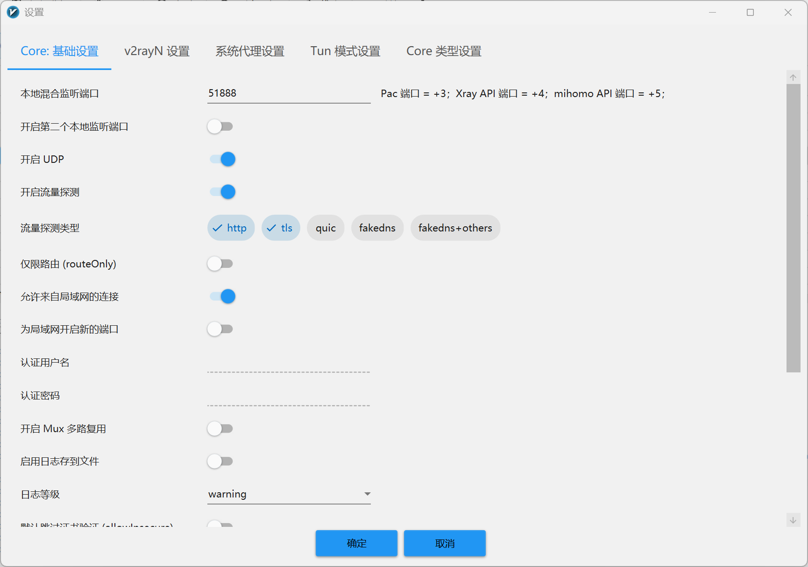

---
title: OpenClaw 连接 VibeLearning 出现 HTTP 403 的真正修复记录
subtitle: 真正生效的修复不是换 key，而是在 OpenClaw 前面加一层兼容代理改写 User-Agent
date: 2026-04-08
author: Codex
tags:
    - 技术
    - 技术/AI
    - 技术/AI/工具
---

阅读说明：本文已按层级加入编号，格式为「一级标题：`1、标题`」「二级标题：`1.1 标题`」「三级标题：`1.1.1 标题`」，方便快速定位章节。

## 1、问题现象

这次故障的表象很简单：在 WSL 里执行 `openclaw tui`，本地网关已经连上，模型也选到了 `custom-api-vibelearning-top/gpt-5.4`，但一发消息就直接报：

```text
HTTP 403: Your request was blocked.
```

从界面看，这个报错像是 “OpenClaw 不认这个 key” 或 “base URL 写错了”。但真正情况不是这样。

这类错误要先分层看：

- `openclaw tui` 连的是本地 gateway，不是直接连上游模型接口。
- TUI 里显示 `gateway connected | idle`，说明本地网关本身是通的。
- 真正返回 `403` 的，往往是更后面的 provider 上游接口。

也就是说，`403` 出现在 OpenClaw 界面里，不代表问题一定在 OpenClaw 本体，很多时候只是 OpenClaw 把上游 API 的拒绝结果原样抛了出来。

## 2、先讲清楚几个基础概念

### 2.1 OpenClaw 里的 Gateway 是什么

OpenClaw 的 `gateway` 可以理解成它在本机上的“统一入口”。TUI、agent、session 先连到本地 gateway，再由 gateway 按 provider 配置去访问真正的大模型接口。

这次链路可以简化成下面这样：

```text
openclaw tui
    -> ws://127.0.0.1:18789
    -> OpenClaw gateway
    -> provider(baseUrl/apiKey/api)
    -> 上游 API
```

所以只要 TUI 能连上 gateway，就说明本地前半段通了，但后半段仍然可能因为 provider 配置、请求头、上游风控而失败。

### 2.2 Proxy 是什么，为什么这里需要它

这里说的 `proxy` 不是浏览器里常见的“翻墙代理”，而是一个放在 OpenClaw 和上游 API 之间的“兼容代理”。

它做的事情很少，但很关键：

- 接收 OpenClaw 发出的 HTTP 请求。
- 保留原本的请求 body 和鉴权头。
- 只改写少数容易触发上游拦截的请求头。
- 再把请求转发到真正的上游接口。

这次真正有用的代理只有一个目的：把 OpenClaw 发出的 `User-Agent: OpenAI/JS ...` 改成一个不会被上游拦截的普通值。

### 2.3 OpenAI 兼容接口、API Key 与 `/v1/responses`

VibeLearning 这里走的是 OpenAI 兼容接口。OpenClaw provider 配成 `api: openai-responses` 时，核心就是向类似下面的地址发请求：

```text
POST https://api.vibelearning.top/v1/responses
Authorization: Bearer sk-xxxx
Content-Type: application/json
```

请求体通常是 JSON，例如：

```json
{
  "model": "gpt-5.4",
  "input": "hello"
}
```

返回体也是 JSON。和老一点的 `chat/completions` 不同，`responses` 风格一般会在 `output` 里放模型输出内容，客户端再从 `output_text` 或文本块里取最终文本。

这里有两个排障要点：

- `API key` 只是鉴权材料，通常通过 `Authorization: Bearer ...` 传递。
- 即便 `key` 和 `body` 都是对的，上游仍然可能因为请求头、风控策略、User-Agent 或网关策略返回 `403`。

### 2.4 为什么“同一个 key，在别的工具里能通”仍然不能排除问题

很多人一看到 `403` 就先换 key。这当然值得试，但不能就此下结论。

因为不同客户端发出去的请求，除了 `key` 和 `body`，还有很多差异：

- `User-Agent`
- `Accept`
- `Connection`
- 是否走 SDK
- 是否带某些默认 header

只要上游风控针对的是其中某个 header，那么“同一个 key 在 curl 里能通、在 OpenClaw 里不通”就完全可能发生。

## 3、这次 403 的真正根因

### 3.1 不是 key 问题

这次真正修好 `403` 的操作，并不是换 key。

排查时可以确认两件事：

- 只换 key 不能稳定解决问题。
- 同一个 key，在不同 `User-Agent` 下会出现完全不同的结果。

这说明问题不在“这个 key 本身一定无效”，而在“这个 key 搭配某种请求特征会被上游挡掉”。

### 3.2 不是 baseUrl 写错了

如果是 `baseUrl` 明显写错，常见结果更像是：

- `404`
- `502`
- 连接失败
- 路径不匹配

但这次并不是这样。`/v1/responses` 路由本身是对的，请求确实打到了上游，只是被上游拒绝了。

### 3.3 也不是 `/v1/responses` 的 JSON body 本身有问题

这次最关键的定位动作，是拿**同一个请求体**做对比测试，只改 `User-Agent`。

下面这两条命令就是定位核心。文中的 key 我已经脱敏，真正使用时请换成你自己的，若你的旧 key 曾出现在聊天记录、截图或仓库里，建议马上轮换。

#### 3.3.1 用普通 `curl` 风格的 `User-Agent`

```bash
export VIBE_API_KEY='sk-REPLACE_ME'

curl -i 'https://api.vibelearning.top/v1/responses' \
  -H "Authorization: Bearer ${VIBE_API_KEY}" \
  -H 'Content-Type: application/json' \
  -H 'User-Agent: curl/8.7.1' \
  -d '{"model":"gpt-5.4","input":"hello"}'
```

这类请求可以得到正常响应。

#### 3.3.2 只把 `User-Agent` 改成 `OpenAI/JS`

```bash
export VIBE_API_KEY='sk-REPLACE_ME'

curl -i 'https://api.vibelearning.top/v1/responses' \
  -H "Authorization: Bearer ${VIBE_API_KEY}" \
  -H 'Content-Type: application/json' \
  -H 'User-Agent: OpenAI/JS 6.26.0' \
  -d '{"model":"gpt-5.4","input":"hello"}'
```

这时就会返回 `HTTP 403: Your request was blocked.`

### 3.4 最终定位到被上游拦截的是 `User-Agent`

到这里，结论就很清楚了：

- 同一个 `baseUrl`
- 同一个 `key`
- 同一个 `/v1/responses`
- 同一个 JSON body
- 唯一差异只是 `User-Agent`

而结果一个是正常响应，一个是 `403`。

所以这次 bug 的真正根因不是 OpenClaw 不会调接口，而是上游对 `OpenAI/JS 6.26.0` 这个 `User-Agent` 做了拦截或风控处理。

这也是为什么“换 key”看起来像有时有效、有时无效，但始终不稳定。真正决定这次成败的变量，并不是 key，而是请求头。

## 4、真正修好 403 的方案

### 4.1 方案总览

真正修好这次 `403` 的有效方案只有一个：

- 如果你是通过 Windows 上的 `v2rayN` 给 WSL 提供代理网络，端口要以 `v2rayN -> 参数设置 -> 本地混合监听端口` 为准。我这台机器这里实际是 `51888`，不是旧稿里误写的 `18080`。也就是说，上图这个端口对应的是 `v2rayN` 的本地混合监听端口。



补一句避免混淆：上图里的 `51888` 是 Windows 侧 `v2rayN` 的代理端口；下文代码里出现的 `18080`，是我当时单独起的兼容代理示例端口，这两个端口不是一回事。

- 代理把 `OpenClaw` 发来的请求原样转发到 `https://api.vibelearning.top`。
- 只有当请求头里出现 `User-Agent: OpenAI/JS ...` 时，把它改写成 `curl/8.7.1`。
- 再把 `OpenClaw` 的 `provider` `baseUrl` 改到 `http://127.0.0.1:18080/v1`。

链路变成这样：

```text
OpenClaw
    -> 本地 gateway
    -> http://127.0.0.1:18080/v1
    -> 兼容代理改写 User-Agent
    -> https://api.vibelearning.top/v1
```

这个方案之所以稳，是因为它没有去碰 OpenClaw 安装目录里的 dist 文件，也没有硬改 SDK 行为，而是把兼容层独立放在用户目录里，更新 OpenClaw 时更不容易一起被覆盖。

### 4.2 第一步：部署兼容代理

可直接下载的代理脚本在这里：

- [openclaw-vibelearning-proxy.py](./images/openclaw-vibelearning-403修复记录/openclaw-vibelearning-proxy.py)

如果想手动创建，也可以直接用下面这组命令：

```bash
mkdir -p ~/.local/bin /tmp/openclaw

cat > ~/.local/bin/openclaw-vibelearning-proxy.py <<'PY'
#!/usr/bin/env python3
import json
from pathlib import Path
from http.server import BaseHTTPRequestHandler, ThreadingHTTPServer
from urllib.request import Request, urlopen
from urllib.error import HTTPError, URLError

UPSTREAM = "https://api.vibelearning.top"
LOG_PATH = "/tmp/openclaw/vibelearning-proxy-log.jsonl"


class ProxyHandler(BaseHTTPRequestHandler):
    protocol_version = "HTTP/1.1"

    def _write_log(self, payload):
        Path(LOG_PATH).parent.mkdir(parents=True, exist_ok=True)
        with open(LOG_PATH, "a", encoding="utf-8") as f:
            f.write(json.dumps(payload, ensure_ascii=False) + "\n")

    def _handle(self):
        length = int(self.headers.get("Content-Length", "0") or "0")
        body = self.rfile.read(length) if length > 0 else b""
        upstream_url = f"{UPSTREAM}{self.path}"
        headers = {
            k: v
            for k, v in self.headers.items()
            if k.lower() not in {"host", "connection", "proxy-connection", "content-length"}
        }
        if headers.get("User-Agent", "").startswith("OpenAI/JS"):
            headers["User-Agent"] = "curl/8.7.1"
        if headers.get("user-agent", "").startswith("OpenAI/JS"):
            headers["user-agent"] = "curl/8.7.1"

        record = {
            "method": self.command,
            "path": self.path,
            "headers": headers,
            "body_text": body.decode("utf-8", errors="replace"),
        }

        try:
            req = Request(
                upstream_url,
                data=body if self.command != "GET" else None,
                headers=headers,
                method=self.command,
            )
            with urlopen(req, timeout=120) as resp:
                resp_body = resp.read()
                status = resp.status
                resp_headers = dict(resp.headers.items())
        except HTTPError as e:
            resp_body = e.read()
            status = e.code
            resp_headers = dict(e.headers.items())
        except URLError as e:
            msg = str(e).encode("utf-8", errors="replace")
            self.send_response(502)
            self.send_header("Content-Type", "text/plain; charset=utf-8")
            self.send_header("Content-Length", str(len(msg)))
            self.end_headers()
            self.wfile.write(msg)
            record["proxy_error"] = str(e)
            self._write_log(record)
            return

        record["response_status"] = status
        record["response_body_text"] = resp_body.decode("utf-8", errors="replace")
        self._write_log(record)

        self.send_response(status)
        hop_by_hop = {
            "transfer-encoding",
            "connection",
            "keep-alive",
            "proxy-authenticate",
            "proxy-authorization",
            "te",
            "trailers",
            "upgrade",
        }
        for key, value in resp_headers.items():
            if key.lower() in hop_by_hop:
                continue
            self.send_header(key, value)
        self.send_header("Content-Length", str(len(resp_body)))
        self.end_headers()
        self.wfile.write(resp_body)

    def do_POST(self):
        self._handle()

    def do_GET(self):
        self._handle()

    def log_message(self, format, *args):
        return


if __name__ == "__main__":
    server = ThreadingHTTPServer(("127.0.0.1", 18080), ProxyHandler)
    server.serve_forever()
PY

chmod +x ~/.local/bin/openclaw-vibelearning-proxy.py
```

这段脚本里真正决定修复是否成功的关键逻辑只有两行：

```python
if headers.get("User-Agent", "").startswith("OpenAI/JS"):
    headers["User-Agent"] = "curl/8.7.1"
```

### 4.3 第二步：注册 systemd 用户服务

可下载的服务文件在这里：

- [openclaw-vibelearning-proxy.service](./images/openclaw-vibelearning-403修复记录/openclaw-vibelearning-proxy.service)

手动创建命令如下：

```bash
mkdir -p ~/.config/systemd/user

cat > ~/.config/systemd/user/openclaw-vibelearning-proxy.service <<'SERVICE'
[Unit]
Description=OpenClaw VibeLearning compatibility proxy
After=network-online.target
Wants=network-online.target

[Service]
Type=simple
ExecStart=/usr/bin/python3 /root/.local/bin/openclaw-vibelearning-proxy.py
Restart=always
RestartSec=2

[Install]
WantedBy=default.target
SERVICE

systemctl --user daemon-reload
systemctl --user enable --now openclaw-vibelearning-proxy.service
systemctl --user status openclaw-vibelearning-proxy.service
```

这里用用户级 `systemd` 的好处是：

- 不需要把逻辑塞进 OpenClaw 包目录。
- 开机后能自动拉起。
- OpenClaw 升级时，这个代理服务通常不会跟着消失。

### 4.4 第三步：把 OpenClaw provider 改走本地代理

真正需要改的不是上游地址本身，而是让 OpenClaw 不再直接打上游，而是先打到本地代理：

```text
原来: https://api.vibelearning.top/v1
现在: http://127.0.0.1:18080/v1
```

这次实际涉及的配置文件主要是：

- `~/.openclaw/openclaw.json`
- `~/.openclaw/agents/main/agent/models.json`

下载版的脱敏配置片段在这里：

- [openclaw-provider-snippets.txt](./images/openclaw-vibelearning-403修复记录/openclaw-provider-snippets.txt)

如果不想手改 JSON，直接用我保存好的恢复脚本最快：

- [openclaw-vibelearning-403-quick-restore.sh](./images/openclaw-vibelearning-403修复记录/openclaw-vibelearning-403-quick-restore.sh)

使用方法：

```bash
export VIBE_API_KEY='sk-REPLACE_ME'
bash ./openclaw-vibelearning-403-quick-restore.sh
```

如果你更想看配置应该改成什么样，最关键的 provider 片段是下面这样：

```json
{
  "baseUrl": "http://127.0.0.1:18080/v1",
  "apiKey": "sk-REPLACE_ME",
  "api": "openai-responses",
  "models": [
    {
      "id": "gpt-5.4",
      "name": "gpt-5.4 (Custom Provider)",
      "reasoning": false,
      "input": ["text"],
      "cost": {
        "input": 0,
        "output": 0,
        "cacheRead": 0,
        "cacheWrite": 0
      },
      "contextWindow": 128000,
      "maxTokens": 4096,
      "api": "openai-responses"
    }
  ]
}
```

真正起决定作用的是 `baseUrl` 从上游地址改成了本地代理地址。

### 4.5 第四步：验证是否真的修好了

真正有意义的验证，不是看配置文件“像不像对了”，而是直接跑一次模型请求。

先看服务状态：

```bash
systemctl --user status openclaw-vibelearning-proxy.service
```

再直接走 OpenClaw 的本地推理命令：

```bash
openclaw infer model run \
  --local \
  --model custom-api-vibelearning-top/gpt-5.4 \
  --prompt "hello" \
  --json
```

这次修复后的实际表现是：命令可以拿到正常模型输出，不再出现 `HTTP 403: Your request was blocked.`

如果还想进一步确认代理确实接管了流量，可以看代理日志：

```bash
tail -n 5 /tmp/openclaw/vibelearning-proxy-log.jsonl
```

## 5、可下载文件

为了避免下次排障时还得重新翻聊天记录，我把这次真正有用的文件单独存到了本文资源目录里：

- [兼容代理脚本 openclaw-vibelearning-proxy.py](./images/openclaw-vibelearning-403修复记录/openclaw-vibelearning-proxy.py)
- [systemd 服务文件 openclaw-vibelearning-proxy.service](./images/openclaw-vibelearning-403修复记录/openclaw-vibelearning-proxy.service)
- [一键恢复脚本 openclaw-vibelearning-403-quick-restore.sh](./images/openclaw-vibelearning-403修复记录/openclaw-vibelearning-403-quick-restore.sh)
- [脱敏 provider 配置片段 openclaw-provider-snippets.txt](./images/openclaw-vibelearning-403修复记录/openclaw-provider-snippets.txt)

这些文件放在博客仓库的：

```text
content/posts/images/openclaw-vibelearning-403修复记录/
```

这样 Hugo 站点可以直接给出下载链接，同时仓库里也保留了完整修复记录。

## 6、OpenClaw 更新后如何快速恢复

### 6.1 哪些文件可能被覆盖

这次真正需要担心被覆盖的，主要是 OpenClaw 的用户配置：

- `~/.openclaw/openclaw.json`
- `~/.openclaw/agents/main/agent/models.json`

相对不容易被覆盖的是：

- `~/.local/bin/openclaw-vibelearning-proxy.py`
- `~/.config/systemd/user/openclaw-vibelearning-proxy.service`

所以正确思路不是去改 OpenClaw 安装目录里的 dist 文件，而是：

- 把兼容逻辑放在用户目录。
- 把 provider 修复动作做成脚本。
- 每次更新后只重跑恢复脚本。

### 6.2 一键恢复命令

如果后面 OpenClaw 更新后又把 provider 配置改回去了，最快的恢复方式就是：

```bash
export VIBE_API_KEY='sk-REPLACE_ME'
bash openclaw-vibelearning-403-quick-restore.sh
systemctl --user restart openclaw-vibelearning-proxy.service
```

然后再跑一次：

```bash
openclaw infer model run \
  --local \
  --model custom-api-vibelearning-top/gpt-5.4 \
  --prompt "hello" \
  --json
```

如果这一步通了，说明本次恢复已经完成。

### 6.3 本博客里这些附件如何生效

这个博客是 Hugo 站点，文章附件采用的是：

```text
content/posts/images/<文章目录名>/
```

正文里则用相对路径 `./images/...` 链接。这个仓库已经配好了同步脚本，运行：

```bash
python scripts/sync_images.py
```

就会把 `content/posts/images/...` 同步到 `static/images/...`。如果你直接在 Windows 下运行：

```bat
run_server.bat
```

脚本会自动先做图片同步，再启动本地 Hugo 预览服务。

## 7、总结

这次 OpenClaw 的 `HTTP 403: Your request was blocked.`，真正根因不是 key、不是 `baseUrl`、也不是 `responses` body 写法，而是**上游拦截了 `OpenAI/JS 6.26.0` 这个 `User-Agent`**。

真正有效的修复动作只有三步：

- 在 WSL 里部署一个本地兼容代理。
- 把 `OpenAI/JS` 改写成不会被拦截的 `User-Agent`。
- 把 OpenClaw provider 的 `baseUrl` 改到本地代理。

如果你以后再遇到“同一个 key 在 curl 里能用，在 OpenClaw 里却是 403”这类问题，最快的排查顺序就是：

- 先确认 gateway 是否正常连上。
- 再用同一个 `key`、同一个 body，只改 `User-Agent` 做对照实验。
- 一旦确认是 header 风控，就不要继续死磕换 key，而是直接上兼容代理。

最后补一句安全建议：如果 API key 曾经出现在聊天、终端回显、截图或仓库里，排障结束后最好主动轮换一次，别把“能跑起来”当成“已经安全”。


## 8、openclaw-qqbot安装

项目地址：[tencent-connect/openclaw-qqbot: qqbot](https://github.com/tencent-connect/openclaw-qqbot)

`APPID`和`key`获取：[QQ开放平台｜机器人列表](https://q.qq.com/qqbot/openclaw/)

教程（看到创建机器人就可以回到我这个教程了）：[手把手教你 OpenClaw 接入 QQ 机器人，让本地 AI 在 QQ 里听你指挥把本地 OpenClaw 接到一个「 - 掘金](https://juejin.cn/post/7612030775055515700)

从源码安装

```bash
cd /
source ~/.bashrc
cd /data/softwares/openclaw-qqbot
cd data/softwares
git clone https://github.com/tencent-connect/openclaw-qqbot.git
cd openclaw-qqbot

bash ./scripts/upgrade-via-source.sh --appid {你的APPID} --secret {你的APPKey}
```


一些`qqbot`的skills安装

```bash
openclaw skills install rss-monitor
openclaw skills install site-monitor
openclaw skills install openclaw-github-assistant
openclaw skills install browser-automation

# 已经安装的
# site-monitor
# openclaw-github-assistant
# browser-automation

openclaw skills update --all
```

