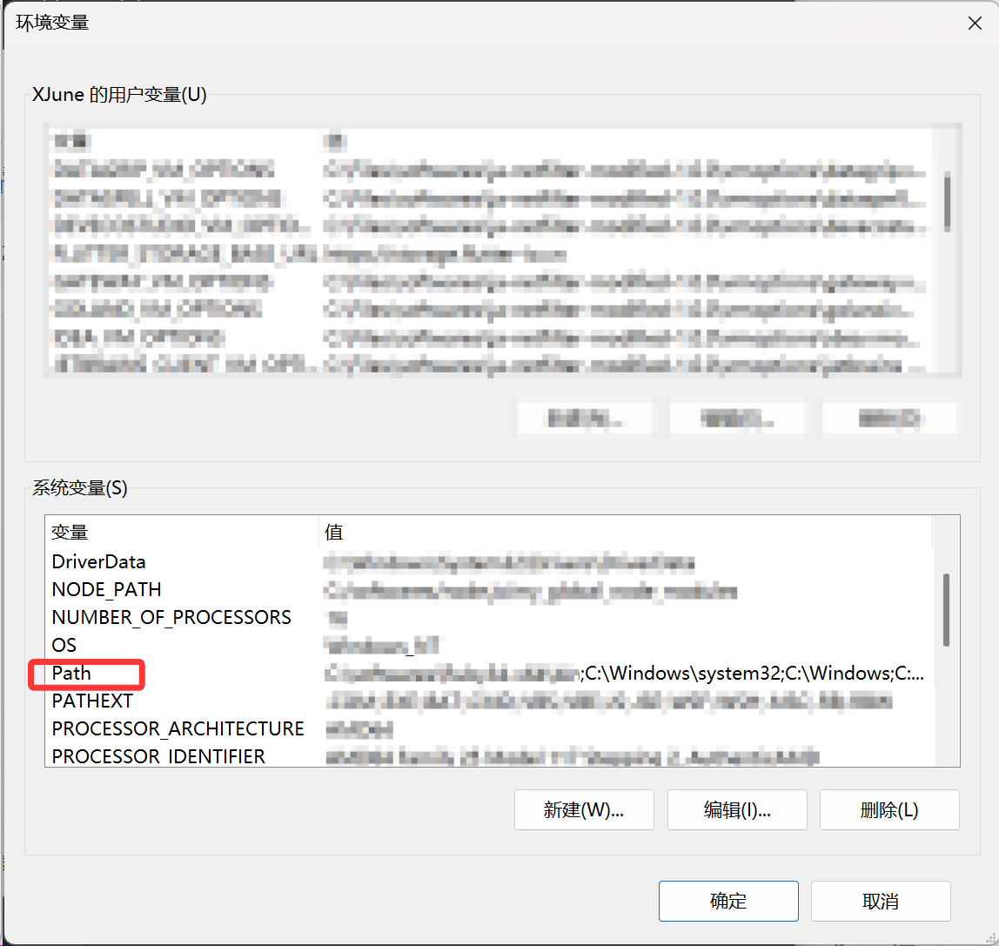
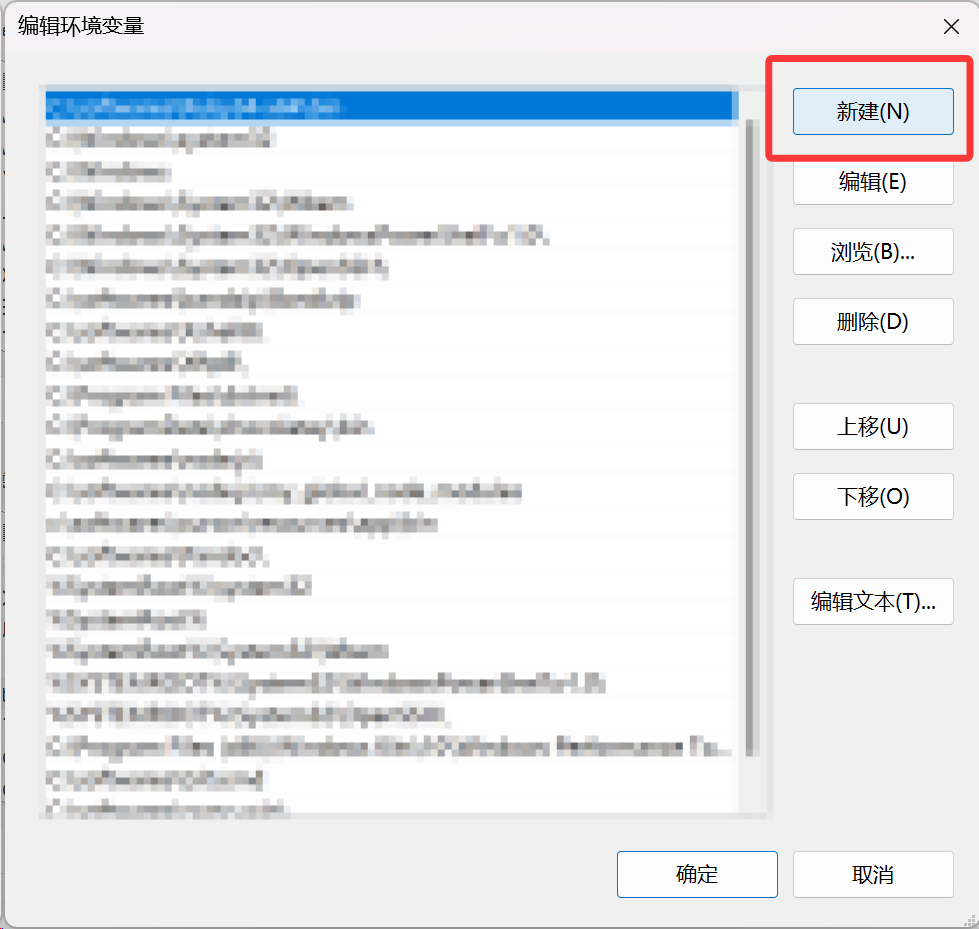

---
title:      rsync-win的安装
date:       2026-03-28
author:     June
tags:
    - 技术
    - 技术/工具
---

### 问题

最近219服务器貌似内存越来越冗余，造成往上传文件比较慢（直接复制这种很慢，scp还是速度可以的，但是scp有时候不稳定，老是断连），经过网上找了一些解决方案，最后发现了`rsync-win`版，链接在[rn7s2/rsync-win: Rsync for Windows.](https://github.com/rn7s2/rsync-win)

这是一个基于著名的 Linux 同步神器 `rsync`，专门为 Windows 环境开发的版本（通常是用 Rust 或 Go 等语言重写的开源 GitHub 项目）。

它的核心作用是**高效、增量地进行文件和目录的同步或备份**。所谓“增量”，就是它在传输前会对比源头和目标端的文件，**只传输被修改过的那部分数据**，而不是每次都把所有文件重新拷一遍，这在传大文件或大量文件时极其节省时间。

---

### 安装方法

- 下载其[release](https://github.com/rn7s2/rsync-win/releases)，整个解压到你的软件目录，如D盘。

- 在windows上搜索`编辑系统环境变量`，进入环境变量。


- 看下面的系统变量里面的`Path`，对其双击进入编辑页面，点击新建。





- 然后把你解压的rsync-win的文件夹的路径放上去，例如`C:\softwares\rsync-win\`。尽量与我保持一致，前缀就不必要一致了。


### 使用方法

```bat
rsync-win --archive --partial --progress --src "C:/Users/June/Downloads/xxx/" --dest root@10.xxx.0.xxx:/data/xxx
```


#### 1. 基本用法 (Usage)

所有的同步任务都遵循一个核心逻辑：**把源（SRC）同步到目标（DEST）**。

命令格式：

Bash

```
rsync-win [各种选项] --src <源路径> --dest <目标路径>
```

- `-s, --src`: 源文件/目录的路径。
- `-d, --dest`: 目标文件/目录的路径。

#### 2. 支持的三种路径格式 (Allowed formats)

由于跨平台的原因，**请注意路径一定要使用正斜杠 `/`**，而不是 Windows 习惯的反斜杠 `\`。

- **本地到本地 (local)**：比如把 C 盘同步到 D 盘。格式：`C:/path/to/file`
- **本地与远程服务器 (ssh)**：通过 SSH 协议传输（最常用，极其安全）。格式：`用户名@服务器IP:/远程/路径`
- **Rsync 守护进程模式 (rsync)**：连接到专门的 rsync 服务端。格式：`rsync://用户名@服务器IP:端口/路径`

#### 3. 核心功能选项参数 (Options)

为了方便理解，我把它们分成了几大类：

**🌟 核心同步控制（最常用的）**

- `-a, --archive`：**归档模式**。这是最常用的参数！它相当于打包了一系列功能：递归目录、保留文件的权限、修改时间、软链接等。一般做备份必加。
- `-r, --recursive`：**递归模式**。同步文件夹及其里面的所有子文件夹（如果你用了 `-a`，就不需要再单独写 `-r` 了）。
- `--delete`：**镜像删除**。非常强大但也**危险**！如果源端删除了某个文件，目标端也会把对应的文件删掉，保持两边一模一样。
- `--exclude <EXCLUDE>`：**排除特定文件**。比如 `--exclude "*.tmp"` 不覆盖临时文件。

**🌐 远程连接相关**

- `-i, --identity`：**指定 SSH 密钥文件**。默认去读你 Windows 用户目录下的 `id_rsa` 私钥。如果你用密钥免密登录服务器，通常不用改。
- `--ssh-port`：**指定 SSH 端口**。如果你的服务器 SSH 不是默认的 22 端口，用这个指定。
- `-4, --ipv4` / `-6, --ipv6`：强制使用 IPv4 或 IPv6 网络。

**📊 传输与显示相关**

- `-v, --verbose`：**显示详细信息**。想知道它具体传了哪些文件，加这个。
- `-q, --quiet`：**静默模式**。除了报错什么都不打印，适合写成后台自动脚本。
- `-c, --checksum`：**校验和对比**。默认情况 rsync 是通过对比文件大小和修改时间来判断文件变没变；加了这个参数，它会读取文件内容计算哈希值对比，极其严谨但**非常慢**。
- `--partial`：**断点续传**。传大文件中断了，下次可以接着传，保留未传完的临时文件。
- `--progress`：**显示进度条**。看着进度条走让人安心。
- `--bwlimit <BWLIMIT>`：**限制带宽**。怕同步把网速占满了，可以限制速度（比如设为 1000 就是 1000KB/s）。

------

## 💡 实用场景演示

**场景 1：把本地的工作目录备份到外接硬盘**

```bash
rsync-win -a -v --progress --src C:/Users/June/WorkData --dest E:/Backup/WorkData
```


**场景 2：把本地代码推送到 Linux 服务器（保持完全一致，本地删了的服务器也删）**

```bash
rsync-win -a -v --delete --progress --src C:/Users/June/MyProject --dest root@192.168.1.100:/opt/MyProject
```

