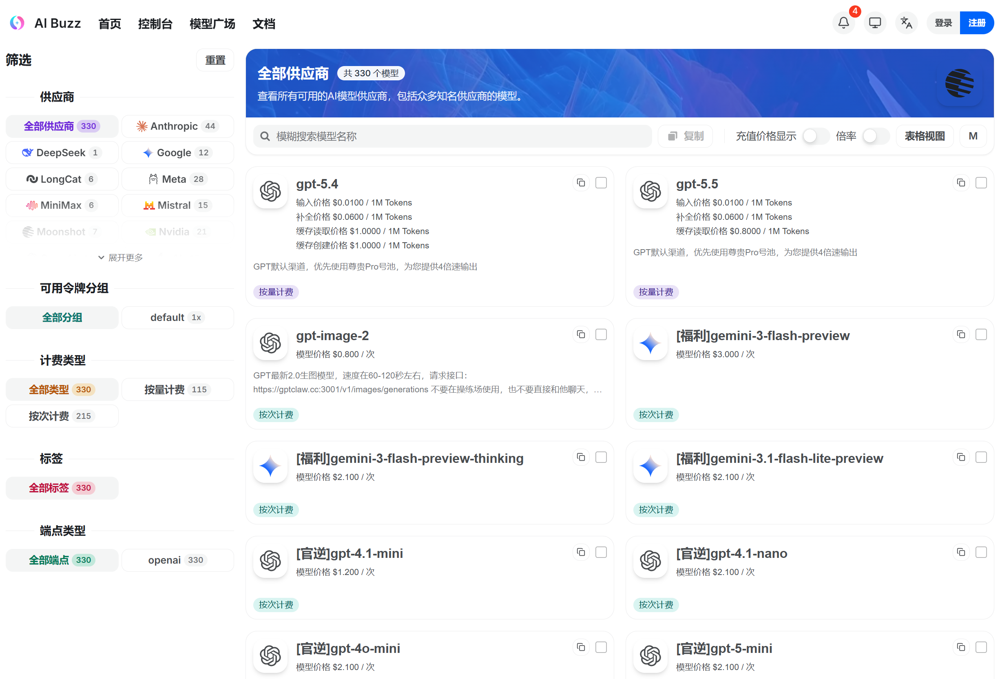
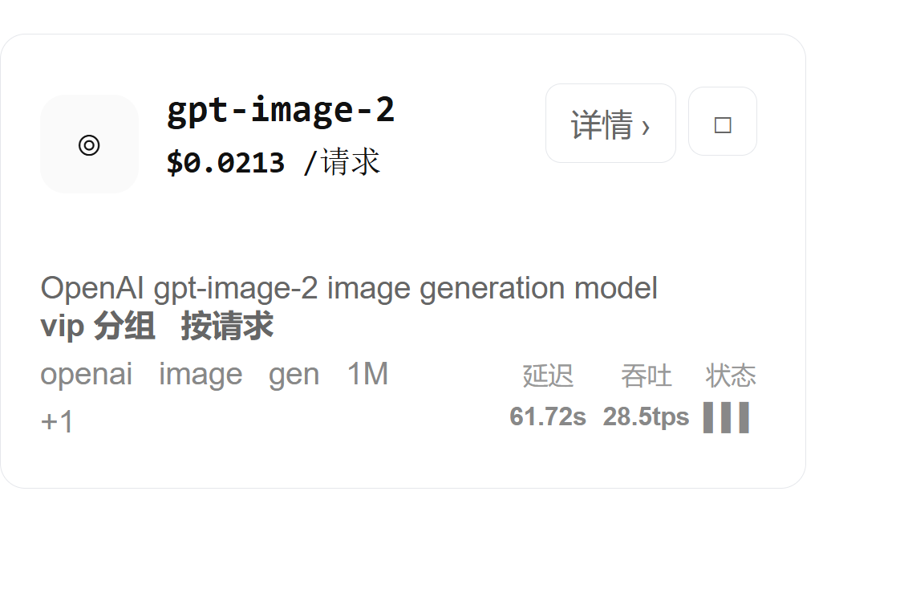
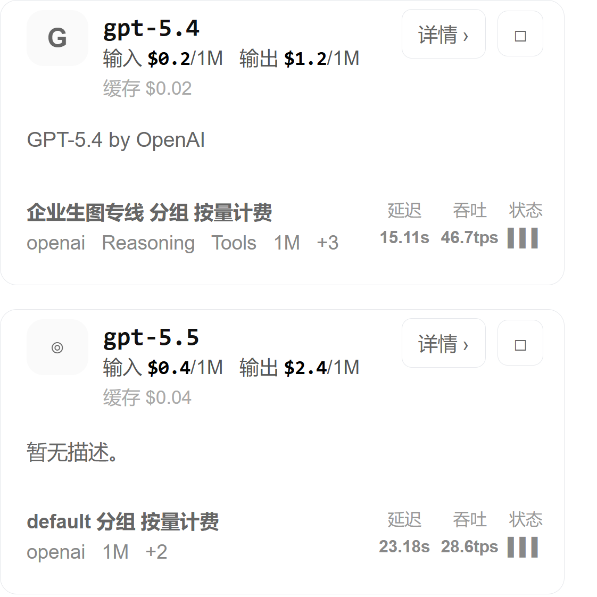
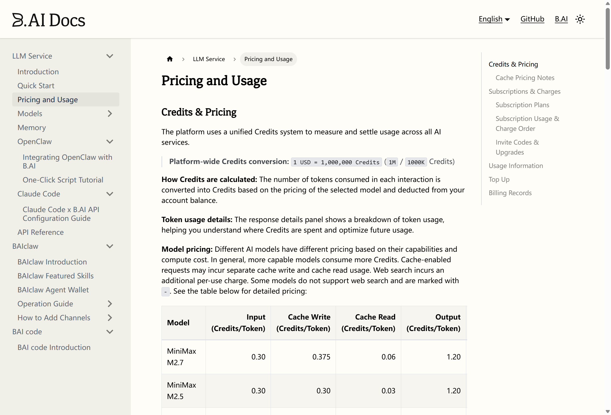

### 中转 API 站点内卷和信息茧房的现状

最近看了一圈 AI 中转 API 站点，最大的感受不是“这行真赚钱”，而是“这行真魔幻”。

同样是接 OpenAI、Claude、Gemini、各种国产模型，站点之间的价格可以差到离谱。低的低到像是在清库存，高的又高到让人怀疑是不是有人根本不知道官方价格长什么样。最有意思的是，便宜的站点未必没人用，贵的站点也照样有人买单。

所以现在这个市场很像两个东西叠在一起：一边是极致内卷，大家把价格打到地板；另一边是信息茧房，很多用户只待在自己熟悉的圈子里，被谁的教程、谁的群、谁的推荐链接带进去，就在那里一直充值。

#### 价格已经卷到很难理解

比如 [aibz.cc 的 pricing 页面](https://aibz.cc/pricing)，截图里 `gpt-5.4` 和 `gpt-5.5` 的输入价格写到 `0.0100 / 1M Tokens` 这个级别。按照普通用户的感知，这几乎就是 1M token 一分钱量级了。

这个价格放在几年前，听起来像玩笑。现在却真的出现在中转站价格表里。

当然，中转站价格不能只看一行数字。还要看它的倍率、渠道、稳定性、限速、并发、上下文、是否偷换模型、是否共享池、是否存在缓存和补全价格差异。但就算把这些因素都算进去，这种标价仍然说明一件事：低价站已经卷到不靠“模型贵”挣钱了，而是靠流量、充值沉淀、渠道套利、活动补贴，甚至靠用户懒得细算。

#### 图片接口也卷得很狠

再看 [浮生云算的 pricing 页面](https://fushengyunsuan.cn/pricing)，截图里 `gpt-image-2` 的价格低到 `0.0213 / 请求`。如果按一张图一次请求来理解，就是两分钱左右一张图。

图片生成以前给人的感觉是“贵、慢、舍不得多试”。现在一些中转站把它卖成了可以随便点几下的消耗品。对普通用户来说，这当然爽；对站点来说，这就进入了另一个游戏：谁能拿到更便宜的上游，谁能更好地做池化，谁能把失败率、延迟和售后压住，谁就能多活一阵。

但这也会带来一个问题：价格太低之后，用户反而更难判断质量。因为大家第一眼只看数字，`0.02` 比 `0.2` 香太多了，很少有人会继续问：这个图到底是不是同一个模型出的？队列是不是被挤爆？失败重试算不算钱？高峰期会不会直接降级？

低价不是原罪，低价加黑箱才麻烦。

#### GPT 也出现了明显价格分层

同一个页面里，截图三的 `gpt-5.4` 输入 `0.2 / 1M`、输出 `1.2 / 1M`，`gpt-5.5` 输入 `0.4 / 1M`、输出 `2.4 / 1M`。这已经属于比较便宜、也比较容易被开发者接受的价格带。

如果只是个人写脚本、做插件、跑一点 Agent、接一下 Codex 或 Claude Code 这类工具，这种价格会让人很容易形成一种心理：反正不贵，先用着。

也正是因为“不贵”，很多人不会再去研究官方 API、账单、区域限制、支付方式、模型差异、上游条款。他只要拿到一个 base url 和 key，就可以开工。这个便利性本身就是中转站存在的理由。

但便利性也会反过来锁住人。一个人如果最早接触 AI API 就是从某个群、某个教程、某个站长开始，他之后很可能把那个站点当成“默认世界”。只要还能用，他就不会到处比价；只要客服还在，他就觉得安全；只要群里有人说“这个稳”，他就懒得再查。

#### 贵的也有人买单

更有意思的是，便宜站卷成这样，贵站也不是活不下去。

比如 Toy's Tech Notes 上这篇《[孙宇晨涉足AI中转服务：B.ai新用户送50万积分，API价格对标官方](https://www.80aj.com/2026/05/02/ai-api-bonus-50k/)》，里面提到 B.ai 给新用户送 50 万积分，API 调用价格与 OpenAI 等官方模型保持一致。大家调侃的“孙割”一出手，打法还是熟悉的味道：送积分、做声量、先把人拉进来。

我又去翻了一下 [B.AI 官方文档的 Pricing and Usage](https://docs.b.ai/llmservice/pricing-and-usage/)。它的计价单位是 Credits，文档里写的是 `1 USD = 1,000,000 Credits`。在这套换算下，`GPT-5.4` 是输入 `2.50 Credits/Token`、输出 `15.00 Credits/Token`，也就是约 `$2.5 / 1M` 输入、`$15 / 1M` 输出；`GPT-5.5` 是输入 `5.00 Credits/Token`、输出 `30.00 Credits/Token`，也就是约 `$5 / 1M` 输入、`$30 / 1M` 输出。

这就很有意思了。前面那些中转站已经能把 `gpt-5.4` 做到输入 `0.2 / 1M`、输出 `1.2 / 1M`，甚至还有更夸张的 `0.01 / 1M` 标价；B.AI 这里按 Credits 折算下来，价格一下子回到另一个世界。

问题在于，如果一个中转站价格对标官方，甚至经过积分换算、充值门槛、汇率和损耗之后让人感觉比官方还贵，那它为什么还有人用？

原因其实也不复杂。

有人不会注册官方账号，有人不想折腾海外支付，有人只相信自己所在社群里反复出现的推荐；有人觉得“贵一点但有人教我用”很值；还有人只是被活动文案吸引，看到“送 50 万积分”就先冲进去试试。

这就不是单纯的价格问题了，而是分发问题、信任问题、信息差问题。

#### 信息茧房不是不知道便宜，而是不知道自己该比什么

很多人以为信息茧房是“用户不知道外面有更便宜的站”。但我觉得更准确一点说，是用户不知道自己应该比较什么。

他可能知道 A 站便宜、B 站贵，但他不知道应该看输入价还是输出价，不知道缓存价是什么意思，不知道图片接口按请求还是按张，不知道同名模型可能有不同渠道，不知道 `gpt-5.5` 这个名字背后到底是不是自己以为的那个东西。

所以最后就变成：谁把教程写得更顺，谁在群里回复更快，谁的控制台看起来更像那么回事，谁就更容易成交。

价格表只是表面。真正影响购买的是路径依赖。

#### 内卷和茧房会同时存在

按理说，一个市场只要足够透明，价格差就会被慢慢抹平。但 AI 中转站偏偏不是这样。

因为它不是一个完全透明的商品市场。它混合了模型调用、代理服务、支付通道、账号池、额度池、风控、售后、社群运营、教程分发。用户买的也不只是 token，而是“我能不能马上用起来”。

所以低价站会继续卷，卷到一部分人只赚流水不赚钱；贵价站也会继续活着，靠品牌、圈层、教程、活动和信息差吃饭。

这就是现在很割裂的地方：同一个模型，有人用 `0.01 / 1M` 的价格薅到飞起，也有人按接近官方甚至更贵的价格充值，还觉得自己找到了靠谱渠道。

#### 最后

我倒不是说所有中转站都不好。相反，中转站确实解决了很多现实问题：支付、网络、统一接口、模型聚合、额度管理、团队分账，这些对普通用户和小团队都很有价值。

但这个行业现在的问题也很明显：价格太乱，命名太乱，渠道太黑箱，宣传又太会包装。

以后看中转 API 站点，我觉得至少要多问几句：

1. 这个价格是输入价、输出价，还是综合价？
2. 图片生成是按请求、按张，还是失败也计费？
3. 同名模型有没有偷换渠道或降级？
4. 高峰期延迟、限速、失败率怎么样？
5. 余额、日志、用量明细能不能对得上？
6. 站点跑路时，剩余额度有没有任何保障？

便宜可以用，贵也不是一定不能用。真正怕的是自己没有比较能力，只是被某个信息流推着走。

这年头，AI API 中转站一边在内卷，一边在收割信息差。能不能省钱，很多时候不取决于谁的价格表最低，而取决于你有没有意识到：自己看到的那张价格表，可能只是一个很小的窗口。
