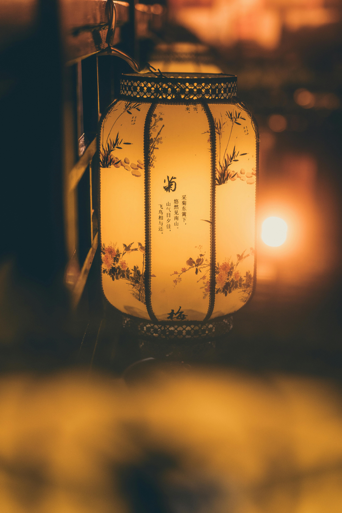

今日元宵，在此祝各位<strong>元宵快乐、阖家团圆</strong>！ 月上柳梢头，人约黄昏后

### 思越人·紫府东风放夜时

紫府东风放夜时，步莲秾李伴人归。

五更钟动笙歌散，十里月明灯火稀。

香苒苒，梦依依。天涯寒尽减春衣。

凤凰城阙知何处，寥落星河一雁飞。

宋·贺铸

东风吹起，京城元宵夜禁解除，步态轻盈、艳若桃李的游人相伴而归。五更钟声响起，笙歌散尽，十里长街明月高悬，灯火渐稀。香气袅袅，梦魂依依，天涯寒意褪尽，褪去冬衣换春衫。不知京城宫阙今在何处，只见寥落星河间，一只孤雁高飞。

### 鹧鸪天·建康上元作

客路那知岁序移，忽惊春到小桃枝。

天涯海角悲凉地，记得当年全盛时。

花弄影，月流辉。水精宫殿五云飞。

分明一觉华胥梦，回首东风泪满衣。

宋·赵鼎

漂泊在外，浑然不觉节序更迭，猛然惊觉春意已攀上桃枝。身处天涯海角这悲凉之地，犹记当年汴京全盛时的元宵盛景。花枝弄影，月光流辉，水晶宫殿上彩云飞舞。恍然一场繁华幻梦，回首东风，泪满衣襟。

### 踏莎行·元夕

拨雪寻春，烧灯续昼。暗香院落梅开后。

无端夜色欲遮春，天教月上官桥柳。

花市无尘，朱门如绣。娇云瑞雾笼星斗。

沈香火冷小妆残，半衾轻梦浓如酒。

宋·毛滂

拨开积雪寻觅春意，点灯续接白昼，梅花开后院落暗香浮动。夜色无端欲掩春色，天公却教明月照上官桥垂柳。花市纤尘不染，朱门华美如绣，柔云瑞雾笼罩星斗。沉香燃尽，妆容浅淡，半床薄被中的浅梦，浓烈如醇酒。

### 鹧鸪天·元夕有所梦

肥水东流无尽期。当初不合种相思。

梦中未比丹青见，暗里忽惊山鸟啼。

春未绿，鬓先丝。人间别久不成悲。

谁教岁岁红莲夜，两处沉吟各自知。

宋·姜夔

肥水东流永无歇止，当初真不该种下这相思情意。梦中相见犹不如画像真切，暗夜里忽被山鸟啼声惊醒。春色尚未染绿大地，双鬓已先斑白，人间别离日久，反不觉悲切。年年元宵灯夜，两地之人各自沉吟思念，唯有心知。

### 元宵

有灯无月不娱人，有月无灯不算春。

春到人间人似玉，灯烧月下月如银。

满街珠翠游村女，沸地笙歌赛社神。

不展芳尊开口笑，如何消得此良辰。

明·唐寅

有灯无月难成欢，有月无灯不成春。春到人间，人儿温润如玉；花灯映月，月华皎洁如银。满街珠翠是游赏的村女，笙歌沸地赛过社神祭典。若不举杯畅饮、开怀一笑，怎对得住这良辰美景。

### 正月十五夜

火树银花合，星桥铁锁开。

暗尘随马去，明月逐人来。

游伎皆秾李，行歌尽落梅。

金吾不禁夜，玉漏莫相催。

唐·苏味道

元宵灯火璀璨如火树银花交相辉映，宵禁解除，星桥城门洞开。马蹄过处轻尘飞扬，明月好似追着游人而来。歌女们艳若桃李，边走边唱《落梅》古曲。京城解除夜禁，计时的玉漏啊，莫要匆匆催走这良夜。

### 蝶恋花·密州上元

灯火钱塘三五夜，明月如霜，照见人如画。

帐底吹笙香吐麝，更无一点尘随马。

寂寞山城人老也！击鼓吹箫，却入农桑社。

火冷灯稀霜露下，昏昏雪意云垂野。

宋·苏轼

杭州元宵三五之夜灯火辉煌，明月如霜，映得游人美如图画。帐下吹笙，香气如麝般清雅，路上洁净无一丝尘土。而今身处寂寞山城，人也渐老，元宵唯有击鼓吹箫，走入农家桑社。灯火清冷稀疏，霜露降下，云层低垂，一片沉沉雪意笼罩原野。

### 永遇乐·落日熔金

落日熔金，暮云合璧，人在何处。

染柳烟浓，吹梅笛怨，春意知几许。

元宵佳节，融和天气，次第岂无风雨。

来相召、香车宝马，谢他酒朋诗侣。

中州盛日，闺门多暇，记得偏重三五。

铺翠冠儿，捻金雪柳，簇带争济楚。

如今憔悴，风鬟霜鬓，怕见夜间出去。

不如向、帘儿底下，听人笑语。

宋·李清照

落日如熔金，暮云如合璧，我却不知身在何处。浓烟染绿柳枝，笛声吹出梅花哀怨，春意几何？元宵佳节，天气融和，谁料不会转眼风雨。友人香车宝马相邀，我推却了酒朋诗侣。记得汴京繁盛时，闺中多暇，最重元宵三五。人人翠冠雪柳，打扮得齐整俏丽。如今憔悴不堪，鬓发斑白，怕在夜间出门，不如躲在帘儿底下，听旁人欢声笑语。

### 生查子·元夕

去年元夜时，花市灯如昼。

月上柳梢头，人约黄昏后。

今年元夜时，月与灯依旧。

不见去年人，泪湿春衫袖。

宋·欧阳修

去年元宵夜，花市灯火亮如白昼。月上柳梢，与心上人相约黄昏之后。今年元宵，月与灯依旧璀璨，却不见去年那人，泪沾春衫袖。

### 青玉案·元夕

东风夜放花千树。更吹落、星如雨。

宝马雕车香满路。凤箫声动，玉壶光转，一夜鱼龙舞。

蛾儿雪柳黄金缕。笑语盈盈暗香去。

众里寻他千百度。蓦然回首，那人却在，灯火阑珊处。

宋·辛弃疾

东风吹开元宵夜的花灯，如千树花开，又似繁星如雨飘落。宝马雕车香气满路，凤箫悠扬，玉壶流光，整夜鱼龙灯舞不息。游女们头戴蛾儿、雪柳、黄金缕，笑语盈盈，暗香远去。我在人群中千百次寻觅那人，蓦然回首，却见她立在灯火阑珊、清冷僻静之处。

〇 札记

元宵佳节，研二下学期的开端，感觉自己今天才刚刚进入状态，换句话说，刚刚从放假的状态回归，坚持学习，坚持锻炼，争取改掉许许多多的坏习惯！保持健康的身体为先，在做自己喜欢的事中学习为次。

<a href="{{ site.baseurl }}{{ year_post.url }}" class="year-end-link">→ 年终总结 · 2026</a>

