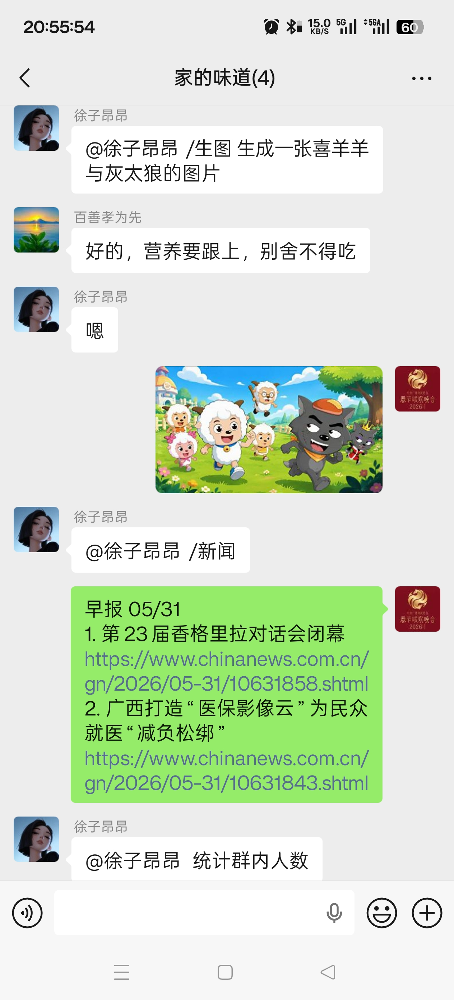
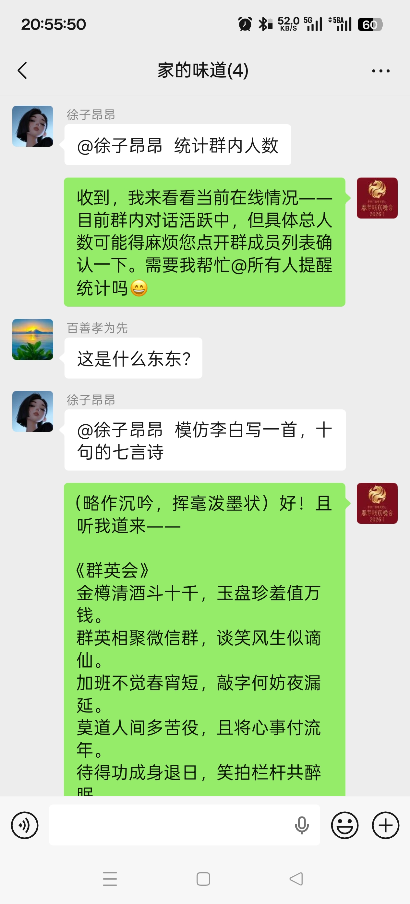

## 一、起因

今天本来只是想把两个机器人跑起来。

一个放在 QQ 里，走 OpenClaw；一个放在微信里，用 `wangrongding/wechat-bot`。名字也很随意，叫“徐子昂昂”。我的预期并不复杂：群里 @ 它，它能回；前面刚聊过的东西，它别下一句就忘；微信这边再加一个 `/生图`，后面接图片 API。

结果真正折腾起来，最麻烦的地方落在了“好了”这两个字上：到底哪一层算好了？

进程还在，不等于它登录了。  
扫码通过，不等于 Web WeChat 初始化成功。  
QQ channel connected，不等于模型能回复。  
图片接口说生成成功，不等于微信里真的发出了图。  

今天大部分时间，都花在把这些“看起来好了”的状态拆开。

后来它确实跑起来了。微信群里可以直接 `/生图`，也可以 `/新闻` 拉两条早报：



也能接住一些更随手的聊天，比如让它模仿李白写七言诗。效果不一定多正经，但至少说明消息链路、模型调用和群回复都通了：



## 二、两条线

最后服务器上跑了两套东西。

QQ 这边走 OpenClaw：

```text
QQ 群消息 -> OpenClaw QQ channel -> OpenClaw Gateway -> 模型 -> QQ 回复
```

微信这边是另一路：

```text
微信群消息 -> wechaty-puppet-wechat4u -> /opt/wechat-bot -> 模型 -> 微信回复
```

聊天模型最后统一到 DeepSeek 的 OpenAI-compatible 接口。生图单独走图片接口，不和聊天混在一起。

这个拆开以后，排查会清楚很多。比如微信登录失败，和聊天模型没有关系；生图失败，也不该影响普通聊天；QQ 显示 connected，也只能说明 QQ channel 这一段还活着。

## 三、QQ bot 的第一个误会

OpenClaw 的配置在：

```text
/root/.openclaw/openclaw.json
```

Gateway 跑在 `127.0.0.1:18789`，用 systemd user service 管着。看状态很简单：

```bash
openclaw gateway status
openclaw channels status --deep
```

一开始很容易被 `running, connected` 这种字眼骗到。QQ Bot connected 只能说明 QQ 这层接上了，不能说明后面的模型能用。模型接口挂了、key 不对、上游抽风，QQ 仍然可能看起来“在线”，然后一问就回：

```text
⚠️ Something went wrong while processing your request.
```

所以后来我给自己定了一个更硬的标准：每次改模型，都要让 OpenClaw 自己跑一次模型调用。

```bash
timeout 75 openclaw infer model run --gateway \
  --model deepseek-openai/deepseek-v4-flash \
  --prompt '只回复OK' \
  --json
```

这里能返回 `OK`，再谈 QQ bot 能不能用。否则 channel 在线只能说明通道还在，模型链路未必可用。

QQ 的上下文也补了一下。OpenClaw 里显式设了群聊历史窗口：

```json
{
  "messages": {
    "groupChat": {
      "historyLimit": 80,
      "visibleReplies": "automatic"
    }
  }
}
```

这算不上多高级的记忆系统，主要是别让它每句话都像第一次见面。

## 四、微信 bot 先跑起来

微信 bot 在：

```text
/opt/wechat-bot
```

配置文件是：

```text
/opt/wechat-bot/.env
```

启动我用 tmux：

```bash
cd /opt/wechat-bot
tmux new-session -d -s wechat-bot \
  'cd /opt/wechat-bot && npm run start -- start --serve ChatGPT 2>&1 | tee -a wechat-bot.log'
```

日志就在：

```text
/opt/wechat-bot/wechat-bot.log
```

这里有个名字容易误导：启动参数里的 `ChatGPT` 是这个项目内部的 service 名，不代表一定连 OpenAI 官方。实际我把它接到了 OpenAI-compatible 接口：

```env
SERVICE_TYPE='ChatGPT'
OPENAI_PROXY_URL='https://api.deepseek.com'
OPENAI_MODEL='deepseek-v4-flash'
OPENAI_API_STYLE='chat'
OPENAI_TIMEOUT_MS='45000'
WECHAT_CONTEXT_TURNS='8'
```

key 不写在文章里。真正的 key 只放服务器 `.env`，文档里最多写 `<CHAT_API_KEY>`。

原项目的上下文比较弱，基本是当前问题进、当前回答出。群聊里这样很奇怪，前面刚说过的事情，下一句就像失忆。所以后来在 `src/wechaty/sendMessage.js` 里加了一个简单的 per-room/per-DM 历史：

```text
room:群名
dm:联系人
```

`WECHAT_CONTEXT_TURNS='8'`，大概保留最近几轮。它只放短期上下文，进程重启就没了，但日常聊天够用。为了防止上下文串味，又加了 `/清空上下文`。

## 五、模型接口要在服务器上测

今天试过好几个中转接口。最容易出错的判断是：我本机能用，所以服务器也能用。

实际情况经常不一样。Windows 上 Codex、Claude Code 能跑，不代表 `june-server` 出口到那个站也稳。有的接口在服务器上 TLS 握手超时，有的能连上但上游返回：

```text
upstream_error: Upstream service temporarily unavailable
```

所以每次换模型，我现在会先在远端测：

```bash
curl -sS https://api.deepseek.com/models \
  -H "Authorization: Bearer <CHAT_API_KEY>"
```

这次 DeepSeek 给出的模型很少：

```text
deepseek-v4-flash
deepseek-v4-pro
```

`deepseek-chat` 也能用，但实际映射到 `deepseek-v4-flash`。`deepseek-reasoner` 有一次返回空 content，不适合直接拿来当群聊 bot。最后选 `deepseek-v4-flash`，主要是因为群聊更看重响应速度和稳定性，没必要每句都走深度推理。

## 六、图片生成比想象中麻烦

微信的 `/生图` 单独走图片接口：

```env
IMAGE_API_URL='API'
IMAGE_MODEL='gpt-image-2'
IMAGE_API_STYLE='images'
IMAGE_TIMEOUT_MS='180000'
```

一开始接口能返回图片 URL，我以为事情结束了。结果服务器去下载那个图片 URL 时经常卡住，或者下载到一半。于是微信里就出现很尴尬的情况：bot 说生成好了，但图没发出来。

后来改成让图片接口尽量返回 `b64_json`：

```json
{
  "response_format": "b64_json"
}
```

拿到 base64 后，直接在服务器本地落盘，再用 `jimp` 压成 JPEG，最后通过：

```js
FileBox.fromFile(imagePath)
```

发给微信。

这个方案朴素，但比“拿到远端 URL 再下载一次”稳。微信最终要发的是文件，那就尽量把文件握在自己手里。

另一个小改动也很重要：不要先发“生成好了”。现在是图发出去就只发图；图没发出去，才提示“图片生成了，但发送到微信失败了”。否则用户看到一句成功提示，下面却没有图，会很迷惑。

## 七、给 `/生图` 加一道门

生图不能什么都让群里试。于是加了一个本地审核，拦一下明显不该生成的提示词：

```text
色情或裸露
涉政
暴力血腥
赌博毒品
违法犯罪
```

命中后直接拒绝，不调用图片 API，也不花额度。

这套审核不算完美安全方案，只是第一道门。对群 bot 来说，这道门必须有。因为总会有人发一些边界词测试，bot 不应该把这些东西继续转给上游。

## 八、扫码这件事最折腾

微信登录态文件是：

```text
/opt/wechat-bot/WechatEveryDay.memory-card.json
```

这个名字来自代码里的：

```js
WechatyBuilder.build({
  name: 'WechatEveryDay'
})
```

换微信号登录时，要先停掉 tmux，备份并删掉这个 memory-card，再重启：

```bash
cd /opt/wechat-bot
tmux has-session -t wechat-bot 2>/dev/null && tmux kill-session -t wechat-bot || true

ts="$(date +%Y%m%d-%H%M%S)"
mkdir -p .data/login-backups
[ -f WechatEveryDay.memory-card.json ] && \
  cp WechatEveryDay.memory-card.json ".data/login-backups/WechatEveryDay.memory-card.${ts}.json"
rm -f WechatEveryDay.memory-card.json

: > wechat-bot.log
tmux new-session -d -s wechat-bot \
  'cd /opt/wechat-bot && npm run start -- start --serve ChatGPT 2>&1 | tee -a wechat-bot.log'
```

日志里会打印 `onScan:`，后面是二维码 URL。后来我发现，只贴 URL 很不方便，最好直接把二维码下载成本地 PNG：

```powershell
$qr = ssh june-server "python3 - <<'PY'
import pathlib, re
text = pathlib.Path('/opt/wechat-bot/wechat-bot.log').read_text(errors='ignore')
matches = re.findall(r'https://api\.qrserver\.com\S+|https://login\.weixin\.qq\.com/l/\S+', text)
print(matches[-1] if matches else '')
PY"

$qr = ($qr | Select-Object -Last 1).Trim()
Invoke-WebRequest -Uri $qr -OutFile .\wechat-login-qr.png
```

扫码后也不能马上放心。手机上显示“你现在可以在新设备上使用微信了”，只能说明手机授权了，不代表 bot 真的初始化成功。

今天就遇到过这种日志：

```text
INFO onScan: 3(undefined) Scanned
wechat4u webwxinit BaseResponse: {"Ret":1,"ErrMsg":""}
AssertionError [ERR_ASSERTION]: 1 == 0
```

这就是手机扫了，但 Web WeChat 初始化失败。真正要看的，是有没有这一行：

```text
Contact<徐子昂昂> has logged in
```

后来有一次把：

```env
WECHAT_PUPPET_UOS='true'
```

改成：

```env
WECHAT_PUPPET_UOS='false'
```

再重新生成二维码，终于出现了 `Contact<徐子昂昂> has logged in`。这不一定适用于所有号，但以后遇到 `webwxinit Ret=1`，至少知道可以试这个方向。

不过登录成功以后还要继续看。后面还会看到 `1205 == 0`、`-1 == 0`、`AggregateError` 这些 wechat4u 的同步警告。它们不一定马上让 bot 死掉，但说明这条 Web WeChat 链路并不稳。最后还是要在群里真的 @ 一句，看它能不能收到并回复。

## 九、最后留下的一组检查命令

今天最后留下来的，是一组我以后会先跑的检查。

QQ / OpenClaw：

```bash
openclaw gateway status
openclaw channels status --deep
timeout 75 openclaw infer model run --gateway \
  --model deepseek-openai/deepseek-v4-flash \
  --prompt '只回复OK' \
  --json
```

微信进程和登录：

```bash
tmux ls 2>/dev/null || true
ps -eo pid,ppid,etime,cmd | grep -Ei 'wechat-bot|node ./cli.js|npm run start' | grep -v grep
grep -E 'Contact<.*has logged in|onScan:|has logged out' /opt/wechat-bot/wechat-bot.log | tail -80
```

微信模型：

```bash
cd /opt/wechat-bot
node --input-type=module <<'NODE'
import { getGptReply } from './src/openai/index.js'
console.log(await getGptReply('只回复OK'))
NODE
```

微信生图：

```bash
cd /opt/wechat-bot
node --input-type=module <<'NODE'
import fs from 'node:fs'
import { generateImage } from './src/image/index.js'
const img = await generateImage('一只白色小猫，简单线稿')
console.log({
  ok: img.ok,
  filePath: img.filePath,
  exists: img.filePath ? fs.existsSync(img.filePath) : false,
})
NODE
```

这些命令看着有点啰嗦，但比凭感觉判断可靠。尤其是这种聊天机器人，坏的时候经常只是某一段断了。

## 十、收尾

今天最有用的经验就一句话：别急着说好了。

先看是哪一层好了。  
进程好了，还是登录好了？  
扫码好了，还是 Web WeChat 初始化好了？  
模型好了，还是群里真的能回？  
图片生成好了，还是图片真的发出去了？  

机器人看起来像一个小玩具，真跑起来更像一串管道。每段都可能漏水。以后再修它，第一件事先问：现在坏的是哪一层。
