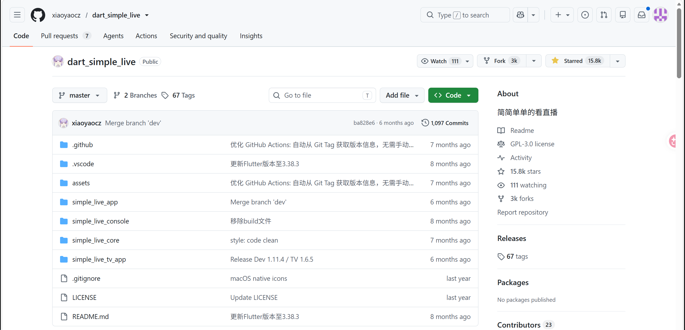

2026.7.19，我fork自 [xiaoyaocz/dart_simple_live](https://github.com/xiaoyaocz/dart_simple_live) 二次开发的 [June6699/dart_simple_live](https://github.com/June6699/dart_simple_live) 所属的`SimpleLive`用户群，迎来了一位==大厂程序员==！蓬荜生辉！

期间该“大神”，与我和用户们发生了友好的交流。下面展示故事背景、故事经过、故事结果。

### 0、故事背景

`SimpleLive`是一个能整合虎牙、斗鱼、抖音、B站、快手的直播间的直播聚合软件，使用`flutter`开发，支持Window、Mac、IOS、Android、Android TV、linux等系统和设备端，其原作者是 [xiaoyaocz/dart_simple_live](https://github.com/xiaoyaocz/dart_simple_live)，获得了15.8k的stars。

值得注意的是，该项目使用GPL 3.0协议，该协议内容如下 [LICENSE at master · xiaoyaocz/dart_simple_live](https://github.com/xiaoyaocz/dart_simple_live/blob/master/LICENSE)。

使用 [deepseek](https://chat.deepseek.com) 总结，详情请见[GPL3.0协议的内容 | June's Blog](https://june6699.github.io/posts/gpl3.0协议的内容/)。

