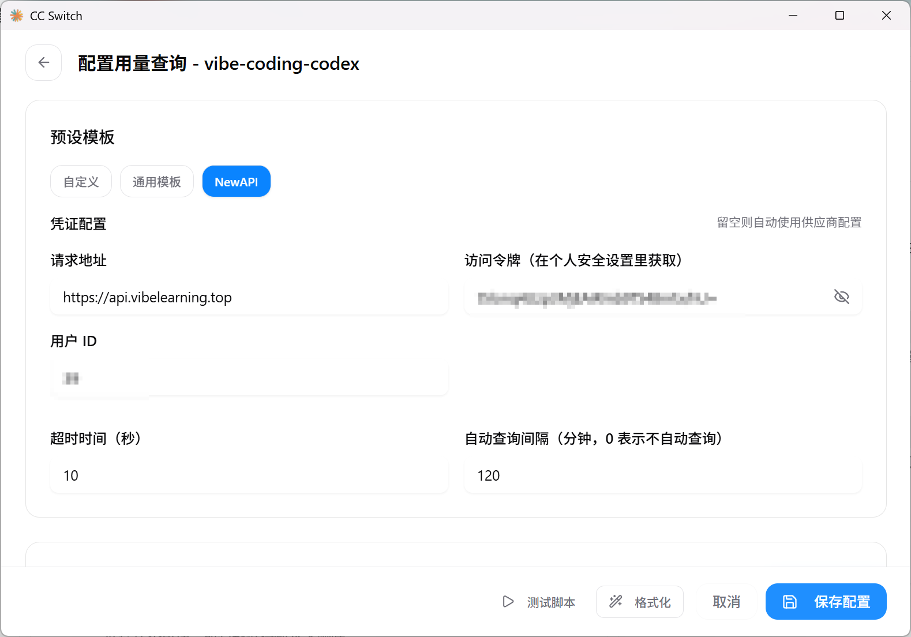
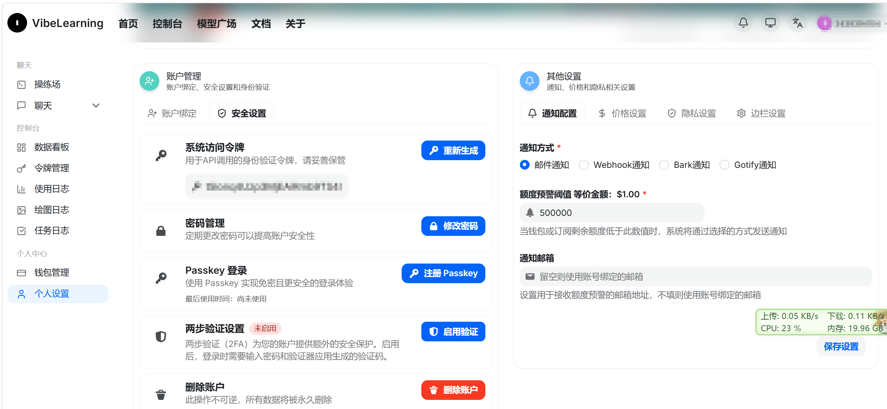

### 🚀 使用 CC Switch 配置共享 API Key 完整指南

> [!IMPORTANT]
>
> 这只是针对于`vibe-coding`供应商提供的`codex API`使用的教程，其他更加官方的站点如`ClaudeCode`、`OpenAI-codex`这些，教程更多，此处就不讲了。


站长教程：[使用文档 · VibeLearning](https://api.vibelearning.top/docs#login)

这套流程的核心逻辑是：让 **CC Switch** 在后台做“系统环境变量劫持”，把本来要发给官方服务器的请求，自动转接给群主的代理服务器（并附上群主买单的 API Key）。

**开源工具出处：**

* **CC Switch 源码与下载地址**：[https://github.com/farion1231/cc-switch](https://github.com/farion1231/cc-switch)

---

#### 第一步：安装终端 AI 工具
群主分享的是用来调 OpenAI 大模型的 Key，你需要先在电脑上全局安装 Codex 的命令行工具（确保已安装 Node.js）。
打开你的 Windows 命令提示符（CMD），运行：

```cmd
npm install -g @openai/codex
```

#### 第二步：在 CC Switch 中配置“中转站”
1. 打开 CC Switch 软件，点击添加新的供应商配置。
2. 应用类型选择 **Codex**。
3. 填写核心参数：
   * **API 端点 (Base URL)**：`https://api.vibelearning.top/v1` *(注意：Codex 必须带 `/v1` 后缀)*
   * **API 令牌 (API Key)**：填入群主分享的 `sk-` 开头的密钥。
4. 保存配置，并点击让该卡片处于 **“使用中”**（打勾状态）。
   *(此时，CC Switch 已经默默把这俩参数写进你 Windows 的系统环境变量里了。)*

#### 第三步：进入你的真实工作目录（关键！）
不要直接在默认的用户目录（`~`）下启动工具，否则 AI 会找不到你要改的代码文件。
1. **关闭之前打开的所有黑框框**（确保 CMD 能重新读取刚被 CC Switch 修改的环境变量）。
2. 打开一个全新的 CMD 窗口。
3. 使用 `cd` 命令，切换到你真正要干活的文件夹。比如你的某个单细胞数据分析目录，或是 Jekyll 博客的根目录：
   ```cmd
   cd D:\MyProjects\Bioinformatics\scRNA_Analysis
   ```

#### 第四步：唤醒 AI 开始干活
在切好目录的 CMD 中，直接输入启动命令：
```bat
codex
```
敲下回车后，耐心等待几分钟让它在后台构建沙盒（Sandbox）。一旦显示完成，你就可以直接用自然语言吩咐它去读取你目录下的 R 脚本或 Python 文件帮你写代码和 Debug 了。

---

### 💡 避坑与常识补充
* **关于查余额**：手里只有 `sk-` 开头的 Key 是**无法查余额**的，在终端里输入 `/status` 只能看到你的 Token 消耗。用量查询需要站长的“访问令牌 (Access Token)”，如果站长没发，那就放开手脚直接用，直到终端报错提示没钱为止。
* **关于切换模型**：在 Codex 交互界面里输入 `/model` 即可切换系统支持的其他模型（如 `gpt-5.4`）。
* **关于断开**：在终端里输入 `/exit` 可以安全关闭 AI 的沙盒环境，不会影响你的本地代码。

#### 第五步：配置用量查询方式



上图中的访问令牌不是`API-key`，而是在`个人设置——安全设置——系统访问令牌`中获取，如下图。



而`用户ID`是一个整数，猜测应该是注册的顺序。

配置完成后，在`CC Switch`中即可查询用量，类似网站里面的`数据看板`。