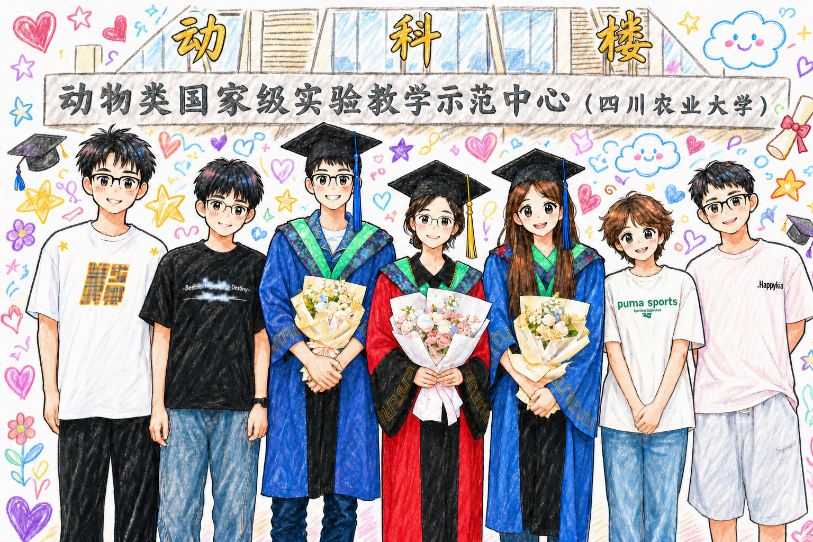

《将夜》里有一句话很适合毕业季：

> 鱼跃此时海，花开彼岸天。

短短十个字，却像是把一个人的出发、远行和抵达都写尽了。鱼从水里跃起，终于见到更大的海；花在彼岸开放，说明漫长的等待终究没有白费。它不是那种热闹的祝福，却很辽阔，很明亮，也很适合送给每一个即将离开校园的人。

毕业总是这样，一边像结束，一边又像开始。

我们收拾书桌，搬空宿舍，交还钥匙，在合照里努力笑得自然一点。那些曾经习以为常的日子，忽然都变得有了纪念意义。每天路过的教学楼，赶过无数次的早八，深夜还亮着灯的实验室，食堂里吃到有点腻的窗口，操场上吹过的晚风，原来都在不知不觉中，把我们送到了这一天。

可毕业并不只是告别。

它更像一次跃出水面的瞬间。过去的几年，我们一直在某片熟悉的水域里生长。那里有规则，有课程表，有DDL，有导师和同学，有一个相对确定的明天。即使偶尔迷茫，也知道自己大概该往哪里去。可是从毕业这一刻开始，许多人要去新的城市，新的学校，新的岗位，新的生活现场。前面的海很大，大到让人兴奋，也大到让人害怕。

所以“鱼跃此时海”里的“此时”特别动人。

它不是凭空而来的好运，也不是突然拥有的勇气。这个“此时”，背后有很多无人看见的时刻：为考试复习到深夜的时候，为论文改到崩溃的时候，为实习和秋招焦虑的时候，为未来反复修改计划的时候。那些看起来普通甚至狼狈的日子，其实都在一点点把我们推向这次跃起。

当鱼终于跃入大海，它未必立刻就能风平浪静。

海里会有浪，会有暗流，会有不熟悉的方向。刚毕业的人也是这样。我们可能会遇见新的不确定，发现自己并没有想象中那么成熟；也可能会被现实敲一敲，才明白课本之外还有许多复杂的题目。可是没有关系。大海之所以是大海，正因为它不只允许顺风顺水，也容得下试错、迂回、重新出发。

愿我们都有这样的勇气：不因为害怕风浪，就一直停在原来的岸边。

“花开彼岸天”则更像是一种温柔的相信。

每个人的彼岸都不一样。有人继续读书，有人奔赴职场；有人去了远方，有人留在熟悉的城市；有人很快找到自己的节奏，也有人还在慢慢摸索。我们不必用同一把尺子衡量所有人的人生。花开有早有晚，方向也各不相同。重要的是，在属于自己的季节里，认真扎根，认真向上。

前程似锦，并不是说往后的路一定铺满鲜花。

它更像一句郑重的祝愿：愿你在复杂的世界里，仍然保有选择的能力；愿你在疲惫的时候，仍然记得自己为什么出发；愿你遇到喜欢的事，就有投入其中的热情；遇到困难的事，也有慢慢解决它的耐心。愿你不必总是赢得漂亮，但总能活得真诚、清醒、自在。

毕业之后，我们会越来越少拥有整齐划一的日程，也越来越难像从前那样轻易聚在一起。很多人会散进人海，成为彼此朋友圈里偶尔亮起的名字。可是我想，真正珍贵的关系，不会因为距离就完全失效。那些一起熬过的夜，一起赶过的路，一起说过的笑话和烦恼，都会留在各自的人生里，成为很温柔的底色。

多年以后再想起这个夏天，也许我们会发现，毕业那天最重要的并不是散场，而是出发。

我们从同一片校园走向不同的海，从同一个季节奔向不同的彼岸。有人会在很远的地方开花，有人会在很新的世界发光。也许路上会有迟疑，会有疲惫，会有偶尔想念从前的时候，但只要还愿意往前走，人生就会继续给我们新的风景。

所以，毕业快乐。

愿你此去，鱼跃入海，不惧风浪；愿你来日，花开彼岸，不负热爱。愿我们都能在各自的远方，把日子过成自己喜欢的模样。

也愿多年后重逢，我们仍能笑着说：那年盛夏的告别，原来不是结束，而是每个人都走向了更辽阔的天。
